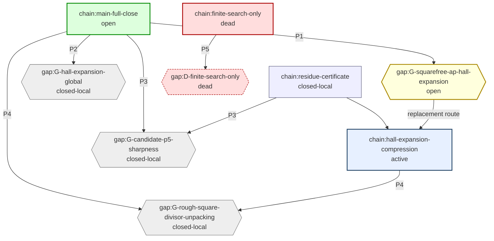

# Erdos848 -- chain DAG (Mermaid)

Source nodes = kernel axioms (squares).  Sink nodes = endpoints
(hexagons).  Cuts = whitelisted open axioms (diamonds).  Drift
axioms = unwhitelisted axioms in the closure (highlighted).


```mermaid
graph TD
  classDef kernel fill:#eef,stroke:#557
  classDef cut fill:#ffd,stroke:#a80
  classDef drift fill:#fdd,stroke:#a00,stroke-width:3px
  classDef endpoint fill:#dfd,stroke:#080
  propext{{ "propext" }}:::cut
  Erdos848_finiteOffsetMiddleCompressionEighteenTypedCreditSelfCanonicalTargetUniformDirectInjectiveSumCodeCut{{ "finiteOffsetMiddleCompressionEighteenTypedCreditSelfCanonicalTargetUniformDirectInjectiveSumCodeCut" }}:::cut
  Classical_choice{{ "choice" }}:::cut
  Quot_sound{{ "sound" }}:::cut
  Erdos848_erdos848_main>"erdos848_main"]:::endpoint
  Erdos848_erdos848_main --> Classical_choice
  Erdos848_erdos848_main --> Erdos848_finiteOffsetMiddleCompressionEighteenTypedCreditSelfCanonicalTargetUniformDirectInjectiveSumCodeCut
  Erdos848_erdos848_main --> Quot_sound
  Erdos848_erdos848_main --> propext
```


## Route Overlay (Generated)

The first graph is the endpoint/axiom trust DAG.  This overlay is generated from `researchChains` and `researchGaps`; use it to choose the next proof attack.  When `primaryGapId` and `replacementRouteId` are configured, the replacement edge is drawn explicitly and priority labels come from `gapPriority`.


