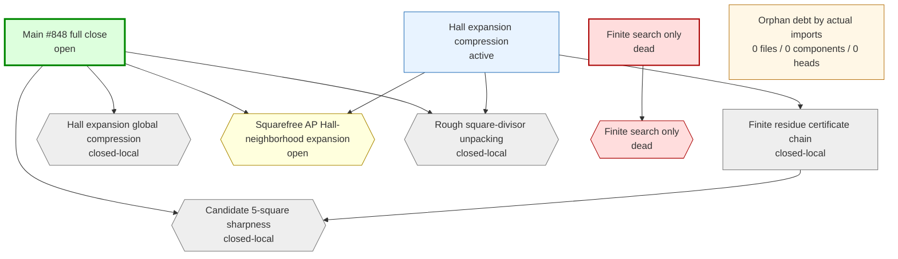

# Erdos848 -- research map

Audit-generated route map overlaid on the automatic endpoint-closure audit.  The infra output is the single research truth source: use this report to distinguish the main chain, active exploration branches, named gaps, and dead or quarantined routes.

* research chains: **4**  *  named gaps: **5**  *  endpoint count: **1**  *  orphan debt files: **0**  *  taxonomy-labelled debt files: **0**  *  rule-labelled debt files: **0**  *  connectable debt files: **0**  *  build components: **0**  *  branch heads: **0**

## Decision Summary

This is the research base view.  Endpoint closure, route labels, and route states are generated by the audit infra from the Lean import graph, file content, file names, and the route taxonomy in the audit configuration.

Open mathematical cut(s):
- `Erdos848.finiteOffsetMiddleCompressionEighteenTypedMateSplitSourceIndexTemplateWindowRepairGeneratedPrefixPairCut` at `Erdos848/Infrastructure/SquarefreeAP.lean`

Active route(s) to work on:
- `hall-expansion-compression` (active): gaps `G-squarefree-ap-hall-expansion`, `G-rough-square-divisor-unpacking`

Dead/quarantined route(s):
- `finite-search-only` (dead): gaps `D-finite-search-only`

## Route Graph

## Orphan Build Graph

This graph is derived from the actual Lean import graph restricted to off-chain debt files.  Each component is a connected build subgraph; files inside a component are listed chronologically in `orphan-debt.md`.  Owner edges are automatic route labels generated from imports, names, source text, and route taxonomy rules.

## Chains

| id | kind | status | gaps | file classes |
|----|------|--------|------|--------------|
| `main-full-close` | main | open | `G-hall-expansion-global`, `G-candidate-p5-sharpness`, `G-squarefree-ap-hall-expansion`, `G-rough-square-divisor-unpacking` | on-chain: 2 |
| `hall-expansion-compression` | replacement | active | `G-squarefree-ap-hall-expansion`, `G-rough-square-divisor-unpacking` | cut: 1, on-chain: 2 |
| `residue-certificate` | support | closed-local | `G-candidate-p5-sharpness` | on-chain: 1 |
| `finite-search-only` | dead | dead | `D-finite-search-only` | (none) |

## Gaps

| id | status | title | files |
|----|--------|-------|-------|
| `G-hall-expansion-global` | closed-local | Hall expansion global compression | on-chain: 3 |
| `G-candidate-p5-sharpness` | closed-local | Candidate 5-square sharpness | on-chain: 1 |
| `G-squarefree-ap-hall-expansion` | open | Squarefree AP Hall-neighborhood expansion | cut: 1 |
| `G-rough-square-divisor-unpacking` | closed-local | Rough square-divisor unpacking | on-chain: 1 |
| `D-finite-search-only` | dead | Finite search only | (none) |

## Off-Chain Split

Route-labelled off-chain files are assigned by the audit infra but are not consumed by an endpoint closure yet.  Unlabelled debt is grouped by actual Lean import connectivity in `orphan-debt.md`.

* taxonomy-entry off-chain files: **0**
* taxonomy-labelled debt files: **0**
* rule-labelled debt files: **0**
* unconnected debt files: **0**
* unlabelled off-chain debt files: **0**
* build-connected debt components: **0**

## Chain Details

### `main-full-close` -- Main #848 full close

Endpoint chain proving the exact #848 extremal bound and sharpness of the `7 mod 25` construction.  The `18 mod 25` residue class is retained only as support data inside the compression route.  The outer Hall compression is kernel-closed; the open endpoint input is the squarefree AP/Hall-neighborhood expansion.

Entry declarations:
- `Erdos848.erdos848_main`

Gaps: `G-hall-expansion-global`, `G-candidate-p5-sharpness`, `G-squarefree-ap-hall-expansion`, `G-rough-square-divisor-unpacking`

Files:
- `Erdos848/Basic.lean` -- on-chain
- `Erdos848/MainTheorem.lean` -- on-chain

### `hall-expansion-compression` -- Hall expansion compression

Compress any admissible set outside the `7 mod 25` candidate class back into that class.  The finite counting assembly is kernel-closed; the live obligation is nonnegative Hall defect for every compatible outside clique.

Entry declarations:
- `Erdos848.hallExpansionCut`
- `Erdos848.atMostCandidateBound_of_current_cuts`

Depends on: `residue-certificate`

Gaps: `G-squarefree-ap-hall-expansion`, `G-rough-square-divisor-unpacking`

Files:
- `Erdos848/Infrastructure/HallExpansion.lean` -- on-chain
- `Erdos848/Infrastructure/SquarefreeAP.lean` -- cut
- `Erdos848/Infrastructure/RoughSquareDivisors.lean` -- on-chain

### `residue-certificate` -- Finite residue certificate chain

Kernel-local `5^2` residue algebra proves the literal `7 mod 25` sharpness construction and records the parallel `18 mod 25` support class plus cross-pair diagnostics.  It also proves the local `70 mod 169` obstruction used to explain the current active-credit middle deficit pattern.  The broader Python `25*13^2` evidence remains diagnostic support for designing the Hall route, but the endpoint no longer consumes it as an axiom.

Entry declarations:
- `Erdos848.squareDivides_five_mul_add_one_of_candidate_seven`
- `Erdos848.squareDivides_five_mul_add_one_of_candidate_eighteen`
- `Erdos848.not_squareDivides_five_mul_add_one_of_candidate_seven_eighteen`
- `Erdos848.not_squareDivides_five_mul_add_one_of_candidate_eighteen_seven`
- `Erdos848.squareDivides_thirteen_mul_add_one_of_mod169_seventy`
- `Erdos848.not_forbiddenSquarefreeEdge_of_mod169_seventy`
- `Erdos848.residueSecondLayer`
- `Erdos848.residueCandidateSevenSharp`
- `Erdos848.residueCandidateSharp`

Gaps: `G-candidate-p5-sharpness`

Files:
- `Erdos848/Infrastructure/ResidueCertificates.lean` -- on-chain

### `finite-search-only` -- Finite search only

Bounded exact clique/Hall checks are useful diagnostics but cannot close #848 without a certificate format and unbounded analytic tail.

Gaps: `D-finite-search-only`

## Gap Details

### `G-hall-expansion-global` -- Hall expansion global compression

Kernel-closed Hall assembly: the count-level outside-clique Hall-neighborhood expansion now implies `AtMostCandidateBound`; the remaining work is proving the AP/Hall expansion input itself.

Declarations:
- `Erdos848.hallExpansionCut`
- `Erdos848.atMostCandidateBound_of_current_cuts`
- `Erdos848.erdos848_main`

Files:
- `Erdos848/Basic.lean` -- on-chain
- `Erdos848/Infrastructure/HallExpansion.lean` -- on-chain
- `Erdos848/MainTheorem.lean` -- on-chain

### `G-candidate-p5-sharpness` -- Candidate 5-square sharpness

Kernel-checked residue algebra: if both factors lie in `7 mod 25` then `5^2` divides `a*b+1`; hence the literal #848 `7 mod 25` sharpness side is no longer an axiom.  The parallel `18 mod 25` root-class fact remains support data for the compression route, and the local `70 mod 169` fact now records the active middle-region obstruction exposed by the deficit diagnostics.

Declarations:
- `Erdos848.squareDivides_five_mul_add_one_of_candidate_seven`
- `Erdos848.squareDivides_five_mul_add_one_of_candidate_eighteen`
- `Erdos848.not_squareDivides_five_mul_add_one_of_candidate_seven_eighteen`
- `Erdos848.not_squareDivides_five_mul_add_one_of_candidate_eighteen_seven`
- `Erdos848.squareDivides_thirteen_mul_add_one_of_mod169_seventy`
- `Erdos848.not_forbiddenSquarefreeEdge_of_mod169_seventy`
- `Erdos848.residueSecondLayer`
- `Erdos848.residueCandidateSevenSharp`
- `Erdos848.residueCandidateSharp`

Files:
- `Erdos848/Infrastructure/ResidueCertificates.lean` -- on-chain

### `G-squarefree-ap-hall-expansion` -- Squarefree AP Hall-neighborhood expansion

Replace finite Hall checks by one explicit typed seven-offset `18 mod 25` finite-offset middle-compression cut for the endpoint-consumed `7 mod 25` progression: compact template-window matching packaged with generated prefix-pair active-deficit allocation. Lean truncates the windows to the boxed source-count list-selector, folds the generated prefix-pair allocation into decoded squarefree-boxed compression, and derives the endpoint Hall expansion.

Declarations:
- `Erdos848.finiteOffsetMiddleCompressionEighteenTypedMateSplitSourceIndexTemplateWindowRepairGeneratedPrefixPairCut`
- `Erdos848.globalFiniteOffsetMiddleCompressionEighteenTypedMateSplitSourceIndexShiftCreditListSelectorLengthTargetCoherentBoundaryBoxGapDeficitConsecutiveSeedKeyCarrierFreeCountAdditiveUpperFreeSeedStrictMiddleTargetPrefixBoxBoundIndexedOppositeWitnessMateSourceIndexLowerBoundLengthGeneratedPrefixPairSeedValuePrefixEdgeShiftTargetNoImagePairListAllocation_of_templateWindowRepair`
- `Erdos848.finiteOffsetMiddleCompressionEighteenTypedMateSplitSourceIndexListSelectorLengthTargetCoherentBoundaryBoxGapGeneratedPrefixPairCut`
- `Erdos848.globalFiniteOffsetMiddleCompressionEighteenDecodedSquarefreeBoxed_of_sourceIndexListSelectorLengthTargetCoherentBoundaryBoxGapConsecutiveSeedKeyCarrierFreeCountAdditiveUpperFreeSeedStrictMiddleTargetPrefixBoxBoundIndexedOppositeWitnessMateSourceIndexLowerBoundLengthGeneratedPrefixPairSeedValuePrefixEdgeShiftTargetNoImagePairListAllocation`
- `Erdos848.finiteOffsetMiddleCompressionEighteenTypedMateSplitSourceIndexListSelectorLengthTargetCoherentBoundaryBoxGapMatchingCut`
- `Erdos848.GlobalFiniteOffsetMiddleCompressionEighteenTypedMateSplitSourceIndexTemplateWindowRepairCreditDeficitConsecutiveSeedKeyCarrierFreeCountAdditiveUpperFreeSeedStrictMiddleTargetPrefixBoxBoundIndexedOppositeWitnessMateSourceIndexLowerBoundLengthGeneratedPrefixPairSeedValuePrefixEdgeShiftTargetNoImagePairListAllocationCertificate`
- `Erdos848.GlobalFiniteOffsetMiddleCompressionEighteenTypedMateSplitSourceIndexShiftCreditListSelectorLengthTargetCoherentBoundaryBoxGapDeficitConsecutiveSeedKeyCarrierFreeCountAdditiveUpperFreeSeedStrictMiddleTargetPrefixBoxBoundIndexedOppositeWitnessMateSourceIndexLowerBoundLengthGeneratedPrefixPairSeedValuePrefixEdgeShiftTargetNoImagePairListAllocationCertificate`
- `Erdos848.globalFiniteOffsetMiddleCompressionEighteenTypedMateSplitSourceIndexShiftCreditListSelectorLengthTargetCoherentBoundaryBoxGapTotalDeficitReserveDominance_of_incrementalCapacity`
- `Erdos848.globalFiniteOffsetMiddleCompressionEighteenDecodedSquarefreeBoxed_of_sourceIndexListSelectorLengthTargetCoherentBoundaryBoxGapTotalReserveDominance`
- `Erdos848.globalFiniteOffsetMiddleCompressionEighteenTypedMateSplitSourceIndexShiftCreditListSelectorLengthTargetCoherentBoundaryBoxGapDeficitConsecutiveSeedKeyCarrierFreeCountAdditiveUpperFreeSeedStrictMiddleIndexedOppositeWitnessMateSourceIndexLowerBoundLengthGeneratedPrefixPairSeedValuePrefixEdgeShiftTargetNoImagePairListAllocation_of_consecutiveSeedKeyCarrierFreeCountAdditiveUpperFreeSeedStrictMiddleTargetPrefixBoxBoundIndexedOppositeWitnessMateSourceIndexLowerBoundLengthGeneratedPrefixPairSeedValuePrefixEdgeShiftTargetNoImagePairListAllocation`
- `Erdos848.globalFiniteOffsetMiddleCompressionEighteenDecodedSquarefreeBoxed_of_consecutiveSeedKeyCarrierFreeCountAdditiveUpperFreeSeedStrictMiddleTargetPrefixBoxBoundIndexedOppositeWitnessMateSourceIndexLowerBoundLengthGeneratedPrefixPairSeedValuePrefixEdgeShiftTargetNoImagePairListAllocation`
- `Erdos848.globalFiniteOffsetMiddleCompressionEighteenTypedMateSplitSourceIndexShiftCreditDeficitConsecutiveSeedKeyCarrierFreeCountAdditiveUpperFreeSeedStrictMiddleIndexedSourceWitnessMateSourceIndexLowerBoundLengthGeneratedPrefixPairSeedValuePrefixEdgeShiftTargetNoImagePairListAllocation_of_consecutiveSeedKeyCarrierFreeCountAdditiveUpperFreeSeedStrictMiddleTargetPrefixBoxBoundIndexedOppositeWitnessMateSourceIndexLowerBoundLengthGeneratedPrefixPairSeedValuePrefixEdgeShiftTargetNoImagePairListAllocation`
- `Erdos848.globalFiniteOffsetMiddleCompressionEighteenDecodedSquarefreeBoxed_of_consecutiveSeedKeyCarrierFreeCountAdditiveUpperFreeSeedStrictMiddleIndexedSourceWitnessMateSourceIndexLowerBoundLengthGeneratedPrefixPairSeedValuePrefixEdgeShiftTargetNoImagePairListAllocation`
- `Erdos848.globalFiniteOffsetMiddleCompressionEighteenTypedMateSplitSourceIndexShiftCreditDeficitConsecutiveSeedKeyCarrierFreeCountAdditiveUpperFreeSeedStrictMiddleExistsSourceWitnessMateSourceIndexLowerBoundLengthGeneratedPrefixPairSeedValuePrefixEdgeShiftTargetNoImagePairListAllocation_of_consecutiveSeedKeyCarrierFreeCountAdditiveUpperFreeSeedStrictMiddleIndexedSourceWitnessMateSourceIndexLowerBoundLengthGeneratedPrefixPairSeedValuePrefixEdgeShiftTargetNoImagePairListAllocation`
- `Erdos848.globalFiniteOffsetMiddleCompressionEighteenDecodedSquarefreeBoxed_of_consecutiveSeedKeyCarrierFreeCountAdditiveUpperFreeSeedStrictMiddleExistsSourceWitnessMateSourceIndexLowerBoundLengthGeneratedPrefixPairSeedValuePrefixEdgeShiftTargetNoImagePairListAllocation`
- `Erdos848.globalFiniteOffsetMiddleCompressionEighteenTypedMateSplitSourceIndexShiftCreditDeficitConsecutiveSeedKeyCarrierFreeCountUpperFreeSeedStrictMiddleExistsSourceWitnessMateSourceIndexLowerBoundLengthGeneratedPrefixPairSeedValuePrefixEdgeShiftTargetNoImagePairListAllocation_of_consecutiveSeedKeyCarrierFreeCountAdditiveUpperFreeSeedStrictMiddleExistsSourceWitnessMateSourceIndexLowerBoundLengthGeneratedPrefixPairSeedValuePrefixEdgeShiftTargetNoImagePairListAllocation`
- `Erdos848.globalFiniteOffsetMiddleCompressionEighteenDecodedSquarefreeBoxed_of_consecutiveSeedKeyCarrierFreeCountUpperFreeSeedStrictMiddleExistsSourceWitnessMateSourceIndexLowerBoundLengthGeneratedPrefixPairSeedValuePrefixEdgeShiftTargetNoImagePairListAllocation`
- `Erdos848.globalFiniteOffsetMiddleCompressionEighteenDecodedSquarefreeBoxed_of_sourceIndexCapacity`
- `Erdos848.globalFiniteOffsetMiddleCompressionEighteenTypedMateSplitSourceIndexShiftCreditDeficitCapacity_of_consecutiveSeedKeyCarrierFreeCountUpperFreeSeedStrictMiddleExistsSourceWitnessMateSourceIndexLowerBoundLengthGeneratedPrefixPairSeedValuePrefixEdgeShiftTargetNoImagePairListAllocation`
- `Erdos848.globalFiniteOffsetMiddleCompressionEighteenTypedMateSplitSourceIndexShiftCreditCapacity_of_splitCapacity`
- `Erdos848.globalFiniteOffsetMiddleCompressionEighteenTypedMateSplitShiftIndexCreditCapacity_of_sourceIndex`
- `Erdos848.globalOppositeFiniteOffsetEighteenTypedShiftIndexMatching_of_sourceIndex`
- `Erdos848.globalOppositeFiniteOffsetEighteenTypedSourceIndexTargetValid_of_validMatching`
- `Erdos848.globalOppositeFiniteOffsetEighteenTypedSourceIndexMateMap_of_validMatching`
- `Erdos848.globalOppositeFiniteOffsetEighteenTypedSourceIndexShiftInjective_of_validMatching`
- `Erdos848.globalFiniteOffsetMiddleCompressionEighteenTypedMateActiveCreditCapacity_of_sourceIndexMate`
- `Erdos848.globalOppositeFiniteOffsetEighteenTypedSourceIndexCodeNonUnderflow_of_targetValid`
- `Erdos848.globalOppositeFiniteOffsetEighteenTypedSourceIndexShiftTargetUpperBound_of_targetValid`
- `Erdos848.globalOppositeFiniteOffsetEighteenTypedSourceIndexTargetValueSquarefreeEdge_of_targetValid`
- `Erdos848.globalOppositeFiniteOffsetEighteenTypedSourceIndexTargetValueCoherent_of_nonUnderflow`
- `Erdos848.globalOppositeFiniteOffsetEighteenTypedSourceIndexTargetUpperBound_of_shiftTargetUpperBound`
- `Erdos848.globalOppositeFiniteOffsetEighteenTypedSourceIndexTargetIndexBox_of_upperBound`
- `Erdos848.globalOppositeFiniteOffsetEighteenTypedSourceIndexSquarefreeEdge_of_targetValue`
- `Erdos848.globalOppositeFiniteOffsetEighteenTypedSourceIndexTargetBox_of_indexBox`
- `Erdos848.oppositeFiniteOffsetCodeValue_eighteenSource_eq_sourceIndexTargetValue_of_nonUnderflow`
- `Erdos848.OppositeFiniteOffsetSourceIndexTargetValid`
- `Erdos848.OppositeFiniteOffsetSourceIndexTargetBoxValid`
- `Erdos848.OppositeFiniteOffsetSourceIndexTargetCoherent`
- `Erdos848.OppositeFiniteOffsetSourceIndexTargetCoherentBoxValid`
- `Erdos848.OppositeFiniteOffsetSourceIndexTargetCoherentEdgeValid`
- `Erdos848.oppositeFiniteOffsetSourceIndexCodeNonUnderflow_of_targetCoherent`
- `Erdos848.oppositeFiniteOffsetSourceIndexTargetBoxValid_of_targetCoherentBoxValid`
- `Erdos848.oppositeFiniteOffsetSourceIndexShiftTarget_le_index_plus_three`
- `Erdos848.oppositeFiniteOffsetSourceIndexTargetValue_le_of_shiftTarget_lt_sourceCount`
- `Erdos848.oppositeFiniteOffsetListSelectorTargetValue_le_of_nonboundary`
- `Erdos848.oppositeFiniteOffsetSourceIndexTargetValid_of_targetBoxValid`
- `Erdos848.OppositeFiniteOffsetSourceCount`
- `Erdos848.OppositeFiniteOffsetListSelector`
- `Erdos848.OppositeFiniteOffsetListSelectorCoversBox`
- `Erdos848.OppositeFiniteOffsetListSelectorTargetValid`
- `Erdos848.OppositeFiniteOffsetListSelectorShiftInjective`
- `Erdos848.OppositeFiniteOffsetListSelectorValidMatching`
- `Erdos848.OppositeFiniteOffsetListSelectorLengthValidMatching`
- `Erdos848.OppositeFiniteOffsetListSelectorLengthTargetValid`
- `Erdos848.OppositeFiniteOffsetListSelectorLengthTargetBoxValid`
- `Erdos848.OppositeFiniteOffsetListSelectorLengthTargetCoherentBoxValid`
- `Erdos848.OppositeFiniteOffsetListSelectorLengthTargetCoherentEdgeValid`
- `Erdos848.OppositeFiniteOffsetListSelectorLengthTargetBoundaryBoxValid`
- `Erdos848.OppositeFiniteOffsetListSelectorLengthShiftInjective`
- `Erdos848.OppositeFiniteOffsetListSelectorLengthLocalShiftInjective`
- `Erdos848.OppositeFiniteOffsetListSelectorLengthGapShiftInjective`
- `Erdos848.OppositeFiniteOffsetListSelectorLengthBoxFreeValidMatching`
- `Erdos848.OppositeFiniteOffsetListSelectorLengthTargetBoxValidMatching`
- `Erdos848.OppositeFiniteOffsetListSelectorLengthTargetCoherentBoxValidMatching`
- `Erdos848.OppositeFiniteOffsetListSelectorLengthTargetCoherentBoxLocalValidMatching`
- `Erdos848.OppositeFiniteOffsetListSelectorLengthTargetCoherentBoundaryBoxLocalValidMatching`
- `Erdos848.OppositeFiniteOffsetListSelectorLengthTargetCoherentBoundaryBoxGapValidMatching`
- `Erdos848.oppositeFiniteOffsetSourceIndexShiftTarget_collision_gap_le_six`
- `Erdos848.oppositeFiniteOffsetListSelectorLengthShiftInjective_of_localShiftInjective`
- `Erdos848.oppositeFiniteOffsetListSelectorLengthLocalShiftInjective_of_gapShiftInjective`
- `Erdos848.oppositeFiniteOffsetListSelectorCoversBox_of_length_sourceCount`
- `Erdos848.oppositeFiniteOffsetListSelectorValidMatching_of_lengthValidMatching`
- `Erdos848.oppositeFiniteOffsetListSelectorLengthValidMatching_of_lengthBoxFreeValidMatching`
- `Erdos848.oppositeFiniteOffsetListSelectorLengthBoxFreeValidMatching_of_targetBoxValidMatching`
- `Erdos848.oppositeFiniteOffsetListSelectorLengthTargetBoxValidMatching_of_targetCoherentBoxValidMatching`
- `Erdos848.oppositeFiniteOffsetListSelectorLengthTargetCoherentBoxValidMatching_of_localValidMatching`
- `Erdos848.oppositeFiniteOffsetListSelectorLengthTargetCoherentBoxLocalValidMatching_of_boundaryValidMatching`
- `Erdos848.oppositeFiniteOffsetListSelectorLengthTargetCoherentBoundaryBoxLocalValidMatching_of_gapValidMatching`
- `Erdos848.OppositeFiniteOffsetSourceIndexMate`
- `Erdos848.GlobalOppositeFiniteOffsetEighteenTypedSourceIndexTargetValid`
- `Erdos848.GlobalOppositeFiniteOffsetEighteenTypedSourceIndexValidMatching`
- `Erdos848.globalOppositeFiniteOffsetEighteenTypedSourceIndexValidMatching_of_listSelectorValidMatching`
- `Erdos848.ActiveStrictMiddleCreditDeficitCapacity`
- `Erdos848.ActiveStrictMiddleCreditDeficitAllocation`
- `Erdos848.ActiveStrictMiddleCreditDeficitPairListAllocation`
- `Erdos848.ActiveStrictMiddleCreditDeficitSeed`
- `Erdos848.ActiveStrictMiddleCreditDeficitSeedValue`
- `Erdos848.activeStrictMiddleCreditDeficitSeed_seedValue`
- `Erdos848.activeStrictMiddleCreditDeficitSeedValue_injective`
- `Erdos848.mod169_seventy_of_mod676_twoThirtyNine`
- `Erdos848.ActiveStrictMiddleCreditDeficitSeedPairListAllocation`
- `Erdos848.ActiveStrictMiddleCreditDeficitSeedValuePairListAllocation`
- `Erdos848.ActiveStrictMiddleCreditDeficitSeedValueReserveWitnessPairListAllocation`
- `Erdos848.ActiveStrictMiddleCreditDeficitSeedValueIndexedReserveWitnessPairListAllocation`
- `Erdos848.ActiveStrictMiddleCreditDeficitSeedValueIndexedReserveWitnessSourceIndexNoImagePairListAllocation`
- `Erdos848.ActiveStrictMiddleCreditDeficitSeedValueIndexedReserveWitnessShiftTargetNoImagePairListAllocation`
- `Erdos848.ActiveStrictMiddleCreditDeficitSeedValueIndexedReserveWitnessPrefixEdgeShiftTargetNoImagePairListAllocation`
- `Erdos848.ActiveStrictMiddleCreditDeficitSeedValuePrefixIndexedReserveWitnessPrefixEdgeShiftTargetNoImagePairListAllocation`
- `Erdos848.ActiveStrictMiddleCreditDeficitPrefixSeedValuePrefixIndexedReserveWitnessPrefixEdgeShiftTargetNoImagePairListAllocation`
- `Erdos848.ActiveStrictMiddleCreditDeficitPrefixPairSeedValuePrefixIndexedReserveWitnessPrefixEdgeShiftTargetNoImagePairListAllocation`
- `Erdos848.ActiveStrictMiddleCreditDeficitCompletePrefixPairSeedValuePrefixIndexedReserveWitnessPrefixEdgeShiftTargetNoImagePairListAllocation`
- `Erdos848.ActiveStrictMiddleCreditDeficitOrderedCompletePrefixPairSeedValuePrefixIndexedReserveWitnessPrefixEdgeShiftTargetNoImagePairListAllocation`
- `Erdos848.ActiveStrictMiddleCreditDeficitGeneratedPrefixPairs`
- `Erdos848.ActiveStrictMiddleCreditDeficitGeneratedPrefixPairSeedValuePrefixIndexedReserveWitnessPrefixEdgeShiftTargetNoImagePairListAllocation`
- `Erdos848.ActiveStrictMiddleCreditDeficitCanonicalGeneratedPrefixPairSeedValuePrefixIndexedReserveWitnessPrefixEdgeShiftTargetNoImagePairListAllocation`
- `Erdos848.ActiveStrictMiddleCreditDeficitLengthGeneratedPrefixPairSeedValuePrefixIndexedReserveWitnessPrefixEdgeShiftTargetNoImagePairListAllocation`
- `Erdos848.ActiveStrictMiddleCreditDeficitSeedNodupLengthGeneratedPrefixPairSeedValuePrefixIndexedReserveWitnessPrefixEdgeShiftTargetNoImagePairListAllocation`
- `Erdos848.ActiveStrictMiddleCreditDeficitSeedNodupCarrierFreeLengthGeneratedPrefixPairSeedValuePrefixIndexedReserveWitnessPrefixEdgeShiftTargetNoImagePairListAllocation`
- `Erdos848.ActiveStrictMiddleCreditDeficitSeedNodupCarrierFreeUpperBoundLengthGeneratedPrefixPairSeedValuePrefixIndexedReserveWitnessPrefixEdgeShiftTargetNoImagePairListAllocation`
- `Erdos848.ActiveStrictMiddleCreditDeficitSeedNodupCarrierFreeCountFreeUpperBoundLengthGeneratedPrefixPairSeedValuePrefixIndexedReserveWitnessPrefixEdgeShiftTargetNoImagePairListAllocation`
- `Erdos848.ActiveStrictMiddleCreditDeficitSeedKeyNodupCarrierFreeCountFreeUpperBoundLengthGeneratedPrefixPairSeedValuePrefixIndexedReserveWitnessPrefixEdgeShiftTargetNoImagePairListAllocation`
- `Erdos848.ActiveStrictMiddleCreditDeficitSeedKeyNodupCarrierFreeCountFreeUpperBoundWitnessMembershipLengthGeneratedPrefixPairSeedValuePrefixIndexedReserveWitnessPrefixEdgeShiftTargetNoImagePairListAllocation`
- `Erdos848.ActiveStrictMiddleCreditDeficitSeedKeyNodupCarrierFreeCountFreeUpperBoundWitnessMembershipSourceMembershipNoImageLengthGeneratedPrefixPairSeedValuePrefixIndexedReserveWitnessPrefixEdgeShiftTargetNoImagePairListAllocation`
- `Erdos848.ActiveStrictMiddleCreditDeficitSeedKeyNodupCarrierFreeCountFreeUpperBoundSeedMembershipNoOppositeWitnessMembershipSourceMembershipNoImageLengthGeneratedPrefixPairSeedValuePrefixIndexedReserveWitnessPrefixEdgeShiftTargetNoImagePairListAllocation`
- `Erdos848.ActiveStrictMiddleCreditDeficitSeedKeyNodupCarrierFreeCountFreeUpperBoundSeedMembershipKeyResidueWitnessMembershipSourceMembershipNoImageLengthGeneratedPrefixPairSeedValuePrefixIndexedReserveWitnessPrefixEdgeShiftTargetNoImagePairListAllocation`
- `Erdos848.ActiveStrictMiddleCreditDeficitSeedKeyNodupCarrierFreeCountFreeUpperBoundSeedMembershipKeyResidueWitnessMembershipBoxedSourceNoImageLengthGeneratedPrefixPairSeedValuePrefixIndexedReserveWitnessPrefixEdgeShiftTargetNoImagePairListAllocation`
- `Erdos848.ActiveStrictMiddleCreditDeficitSeedKeyNodupCarrierFreeCountFreeUpperBoundSeedMembershipKeyResidueNeighborBoxedSourceNoImageLengthGeneratedPrefixPairSeedValuePrefixEdgeShiftTargetNoImagePairListAllocation`
- `Erdos848.ActiveStrictMiddleCreditDeficitSeedKeyNodupCarrierFreeCountFreeUpperFreeSeedMembershipKeyResidueNeighborBoxedSourceNoImageLengthGeneratedPrefixPairSeedValuePrefixEdgeShiftTargetNoImagePairListAllocation`
- `Erdos848.activeStrictMiddleCreditDeficitSeedKeyNodupCarrierFreeCountFreeUpperBoundSeedMembershipKeyResidueNeighborBoxedSourceNoImageLengthGeneratedPrefixPairSeedValuePrefixEdgeShiftTargetNoImagePairListAllocation_of_seedKeyNodupCarrierFreeCountFreeUpperFreeSeedMembershipKeyResidueNeighborBoxedSourceNoImageLengthGeneratedPrefixPairSeedValuePrefixEdgeShiftTargetNoImagePairListAllocation`
- `Erdos848.ActiveStrictMiddleCreditDeficitSeedKeyNodupCarrierFreeCountFreeUpperFreeSeedMembershipKeyResidueNeighborSourceNoImageLengthGeneratedPrefixPairSeedValuePrefixEdgeShiftTargetNoImagePairListAllocation`
- `Erdos848.activeStrictMiddleCreditDeficitSeedKeyNodupCarrierFreeCountFreeUpperFreeSeedMembershipKeyResidueNeighborBoxedSourceNoImageLengthGeneratedPrefixPairSeedValuePrefixEdgeShiftTargetNoImagePairListAllocation_of_seedKeyNodupCarrierFreeCountFreeUpperFreeSeedMembershipKeyResidueNeighborSourceNoImageLengthGeneratedPrefixPairSeedValuePrefixEdgeShiftTargetNoImagePairListAllocation`
- `Erdos848.ActiveStrictMiddleCreditDeficitSeedKeyNodupCarrierFreeCountFreeUpperFreeSeedMembershipKeyResidueLastBoxedTargetEdgeSourceNoImageLengthGeneratedPrefixPairSeedValuePrefixEdgeShiftTargetNoImagePairListAllocation`
- `Erdos848.activeStrictMiddleCreditDeficitSeedKeyNodupCarrierFreeCountFreeUpperFreeSeedMembershipKeyResidueNeighborSourceNoImageLengthGeneratedPrefixPairSeedValuePrefixEdgeShiftTargetNoImagePairListAllocation_of_seedKeyNodupCarrierFreeCountFreeUpperFreeSeedMembershipKeyResidueLastBoxedTargetEdgeSourceNoImageLengthGeneratedPrefixPairSeedValuePrefixEdgeShiftTargetNoImagePairListAllocation`
- `Erdos848.ActiveStrictMiddleCreditDeficitSeedKeyNodupCarrierFreeCountFreeUpperFreeSeedMembershipKeyResidueLastBoxedTargetEdgeOppositeNoImageLengthGeneratedPrefixPairSeedValuePrefixEdgeShiftTargetNoImagePairListAllocation`
- `Erdos848.activeStrictMiddleCreditDeficitSeedKeyNodupCarrierFreeCountFreeUpperFreeSeedMembershipKeyResidueLastBoxedTargetEdgeSourceNoImageLengthGeneratedPrefixPairSeedValuePrefixEdgeShiftTargetNoImagePairListAllocation_of_seedKeyNodupCarrierFreeCountFreeUpperFreeSeedMembershipKeyResidueLastBoxedTargetEdgeOppositeNoImageLengthGeneratedPrefixPairSeedValuePrefixEdgeShiftTargetNoImagePairListAllocation`
- `Erdos848.ActiveStrictMiddleCreditDeficitSeedKeyNodupCarrierFreeCountFreeUpperFreeSeedMembershipKeyResidueLastBoxedTargetEdgeMateTargetNoImageLengthGeneratedPrefixPairSeedValuePrefixEdgeShiftTargetNoImagePairListAllocation`
- `Erdos848.ActiveStrictMiddleCreditDeficitSeedKeyNodupCarrierFreeCountFreeUpperFreeSeedMembershipKeyResidueLastTargetUpperBoundEdgeMateTargetNoImageLengthGeneratedPrefixPairSeedValuePrefixEdgeShiftTargetNoImagePairListAllocation`
- `Erdos848.ActiveStrictMiddleCreditDeficitSeedKeyNodupCarrierFreeCountFreeUpperFreeSeedMembershipKeyResidueLastTargetUpperBoundOppositeWitnessMateTargetNoImageLengthGeneratedPrefixPairSeedValuePrefixEdgeShiftTargetNoImagePairListAllocation`
- `Erdos848.ActiveStrictMiddleCreditDeficitSeedKeyNodupCarrierFreeCountFreeUpperFreeSeedMembershipKeyResidueLastTargetUpperBoundOppositeWitnessMateTargetLowerBoundLengthGeneratedPrefixPairSeedValuePrefixEdgeShiftTargetNoImagePairListAllocation`
- `Erdos848.ActiveStrictMiddleCreditDeficitSeedKeyNodupCarrierFreeCountFreeUpperFreeSeedMembershipKeyResidueLastTargetUpperBoundOppositeWitnessMateSourceIndexLowerBoundLengthGeneratedPrefixPairSeedValuePrefixEdgeShiftTargetNoImagePairListAllocation`
- `Erdos848.ActiveStrictMiddleCreditDeficitSeedKeyNodupCarrierFreeCountFreeUpperFreeSeedMembershipKeyResidueTargetPrefixBoxBoundOppositeWitnessMateSourceIndexLowerBoundLengthGeneratedPrefixPairSeedValuePrefixEdgeShiftTargetNoImagePairListAllocation`
- `Erdos848.ActiveStrictMiddleCreditDeficitSeedKeyNodupCarrierFreeCountFreeUpperFreeSeedStrictMiddleTargetPrefixBoxBoundOppositeWitnessMateSourceIndexLowerBoundLengthGeneratedPrefixPairSeedValuePrefixEdgeShiftTargetNoImagePairListAllocation`
- `Erdos848.ActiveStrictMiddleCreditDeficitSeedKeyNodupCarrierFreeCountFreeUpperFreeSeedStrictMiddleTargetPrefixBoxBoundIndexedOppositeWitnessMateSourceIndexLowerBoundLengthGeneratedPrefixPairSeedValuePrefixEdgeShiftTargetNoImagePairListAllocation`
- `Erdos848.ActiveStrictMiddleCreditDeficitSeedKeyInjectiveCarrierFreeCountFreeUpperFreeSeedStrictMiddleTargetPrefixBoxBoundIndexedOppositeWitnessMateSourceIndexLowerBoundLengthGeneratedPrefixPairSeedValuePrefixEdgeShiftTargetNoImagePairListAllocation`
- `Erdos848.ActiveStrictMiddleCreditDeficitSeedKeyInjectiveCarrierFreeCountAdditiveUpperFreeSeedStrictMiddleTargetPrefixBoxBoundIndexedOppositeWitnessMateSourceIndexLowerBoundLengthGeneratedPrefixPairSeedValuePrefixEdgeShiftTargetNoImagePairListAllocation`
- `Erdos848.ActiveStrictMiddleCreditDeficitSeedKeyStrictMonoCarrierFreeCountAdditiveUpperFreeSeedStrictMiddleTargetPrefixBoxBoundIndexedOppositeWitnessMateSourceIndexLowerBoundLengthGeneratedPrefixPairSeedValuePrefixEdgeShiftTargetNoImagePairListAllocation`
- `Erdos848.ActiveStrictMiddleCreditDeficitConsecutiveSeedKeyCarrierFreeCountAdditiveUpperFreeSeedStrictMiddleTargetPrefixBoxBoundIndexedOppositeWitnessMateSourceIndexLowerBoundLengthGeneratedPrefixPairSeedValuePrefixEdgeShiftTargetNoImagePairListAllocation`
- `Erdos848.ActiveStrictMiddleCreditDeficitConsecutiveSeedKeyCarrierFreeCountAdditiveUpperFreeSeedStrictMiddleIndexedOppositeWitnessMateSourceIndexLowerBoundLengthGeneratedPrefixPairSeedValuePrefixEdgeShiftTargetNoImagePairListAllocation`
- `Erdos848.ActiveStrictMiddleCreditDeficitConsecutiveSeedKeyCarrierFreeCountAdditiveUpperFreeSeedStrictMiddleIndexedSourceWitnessMateSourceIndexLowerBoundLengthGeneratedPrefixPairSeedValuePrefixEdgeShiftTargetNoImagePairListAllocation`
- `Erdos848.ActiveStrictMiddleCreditDeficitConsecutiveSeedKeyCarrierFreeCountAdditiveUpperFreeSeedStrictMiddleExistsSourceWitnessMateSourceIndexLowerBoundLengthGeneratedPrefixPairSeedValuePrefixEdgeShiftTargetNoImagePairListAllocation`
- `Erdos848.ActiveStrictMiddleCreditDeficitConsecutiveSeedKeyCarrierFreeCountUpperFreeSeedStrictMiddleExistsSourceWitnessMateSourceIndexLowerBoundLengthGeneratedPrefixPairSeedValuePrefixEdgeShiftTargetNoImagePairListAllocation`
- `Erdos848.ActiveStrictMiddleCreditDeficitCountUpperTargetPrefixBoundExistsSourceWitnessMateSourceIndexLowerBoundAllocation`
- `Erdos848.activeStrictMiddleCreditDeficitCountUpperTargetPrefixBoundExistsSourceWitnessMateSourceIndexLowerBoundAllocation_of_no_strictMiddle`
- `Erdos848.activeStrictMiddleCreditDeficitConsecutiveSeedKeyCarrierFreeCountUpperFreeSeedStrictMiddleExistsSourceWitnessMateSourceIndexLowerBoundLengthGeneratedPrefixPairSeedValuePrefixEdgeShiftTargetNoImagePairListAllocation_of_consecutiveSeedKeyCarrierFreeCountAdditiveUpperFreeSeedStrictMiddleExistsSourceWitnessMateSourceIndexLowerBoundLengthGeneratedPrefixPairSeedValuePrefixEdgeShiftTargetNoImagePairListAllocation`
- `Erdos848.activeStrictMiddleCreditDeficitConsecutiveSeedKeyCarrierFreeCountUpperFreeSeedStrictMiddleExistsSourceWitnessMateSourceIndexLowerBoundLengthGeneratedPrefixPairSeedValuePrefixEdgeShiftTargetNoImagePairListAllocation_of_no_strictMiddle`
- `Erdos848.activeStrictMiddleCreditDeficitCountUpperTargetPrefixBoundExistsSourceWitnessMateSourceIndexLowerBoundAllocation_of_consecutiveSeedKeyCarrierFreeCountUpperFreeSeedStrictMiddleExistsSourceWitnessMateSourceIndexLowerBoundLengthGeneratedPrefixPairSeedValuePrefixEdgeShiftTargetNoImagePairListAllocation`
- `Erdos848.ActiveStrictMiddleCreditDeficitCountUpperPrefixReserveAllocation`
- `Erdos848.activeStrictMiddleCreditDeficitCountUpperPrefixReserveAllocation_of_no_strictMiddle`
- `Erdos848.activeStrictMiddleCreditDeficitCountUpperPrefixReserveAllocation_of_countUpperTargetPrefixBoundExistsSourceWitnessMateSourceIndexLowerBoundAllocation`
- `Erdos848.ActiveStrictMiddleCreditDeficitCountUpperReserveLowerBoundAllocation`
- `Erdos848.activeStrictMiddleCreditDeficitCountUpperReserveLowerBoundAllocation_of_no_strictMiddle`
- `Erdos848.activeStrictMiddleCreditDeficitCountUpperReserveLowerBoundAllocation_of_deficitCapacity`
- `Erdos848.ActiveStrictMiddleCreditDeficitReserveDominance`
- `Erdos848.activeStrictMiddleCreditDeficitReserveDominance_of_no_strictMiddle`
- `Erdos848.activeStrictMiddleCreditDeficitReserveDominance_of_countUpperReserveLowerBoundAllocation`
- `Erdos848.activeStrictMiddleCreditDeficitSeedValue_targetPrefixBound_of_lastSeedBox`
- `Erdos848.activeStrictMiddleCreditDeficitConsecutiveSeedKeyCarrierFreeCountAdditiveUpperFreeSeedStrictMiddleIndexedSourceWitnessMateSourceIndexLowerBoundLengthGeneratedPrefixPairSeedValuePrefixEdgeShiftTargetNoImagePairListAllocation_of_consecutiveSeedKeyCarrierFreeCountAdditiveUpperFreeSeedStrictMiddleExistsSourceWitnessMateSourceIndexLowerBoundLengthGeneratedPrefixPairSeedValuePrefixEdgeShiftTargetNoImagePairListAllocation`
- `Erdos848.activeStrictMiddleCreditDeficitConsecutiveSeedKeyCarrierFreeCountAdditiveUpperFreeSeedStrictMiddleExistsSourceWitnessMateSourceIndexLowerBoundLengthGeneratedPrefixPairSeedValuePrefixEdgeShiftTargetNoImagePairListAllocation_of_consecutiveSeedKeyCarrierFreeCountAdditiveUpperFreeSeedStrictMiddleIndexedSourceWitnessMateSourceIndexLowerBoundLengthGeneratedPrefixPairSeedValuePrefixEdgeShiftTargetNoImagePairListAllocation`
- `Erdos848.activeStrictMiddleCreditDeficitConsecutiveSeedKeyCarrierFreeCountAdditiveUpperFreeSeedStrictMiddleIndexedOppositeWitnessMateSourceIndexLowerBoundLengthGeneratedPrefixPairSeedValuePrefixEdgeShiftTargetNoImagePairListAllocation_of_consecutiveSeedKeyCarrierFreeCountAdditiveUpperFreeSeedStrictMiddleIndexedSourceWitnessMateSourceIndexLowerBoundLengthGeneratedPrefixPairSeedValuePrefixEdgeShiftTargetNoImagePairListAllocation`
- `Erdos848.activeStrictMiddleCreditDeficitConsecutiveSeedKeyCarrierFreeCountAdditiveUpperFreeSeedStrictMiddleIndexedSourceWitnessMateSourceIndexLowerBoundLengthGeneratedPrefixPairSeedValuePrefixEdgeShiftTargetNoImagePairListAllocation_of_consecutiveSeedKeyCarrierFreeCountAdditiveUpperFreeSeedStrictMiddleIndexedOppositeWitnessMateSourceIndexLowerBoundLengthGeneratedPrefixPairSeedValuePrefixEdgeShiftTargetNoImagePairListAllocation`
- `Erdos848.activeStrictMiddleCreditDeficitConsecutiveSeedKeyCarrierFreeCountAdditiveUpperFreeSeedStrictMiddleIndexedOppositeWitnessMateSourceIndexLowerBoundLengthGeneratedPrefixPairSeedValuePrefixEdgeShiftTargetNoImagePairListAllocation_of_consecutiveSeedKeyCarrierFreeCountAdditiveUpperFreeSeedStrictMiddleTargetPrefixBoxBoundIndexedOppositeWitnessMateSourceIndexLowerBoundLengthGeneratedPrefixPairSeedValuePrefixEdgeShiftTargetNoImagePairListAllocation`
- `Erdos848.activeStrictMiddleCreditDeficitSeedKeyStrictMonoCarrierFreeCountAdditiveUpperFreeSeedStrictMiddleTargetPrefixBoxBoundIndexedOppositeWitnessMateSourceIndexLowerBoundLengthGeneratedPrefixPairSeedValuePrefixEdgeShiftTargetNoImagePairListAllocation_of_consecutiveSeedKeyCarrierFreeCountAdditiveUpperFreeSeedStrictMiddleTargetPrefixBoxBoundIndexedOppositeWitnessMateSourceIndexLowerBoundLengthGeneratedPrefixPairSeedValuePrefixEdgeShiftTargetNoImagePairListAllocation`
- `Erdos848.activeStrictMiddleCreditDeficitSeedKeyInjectiveCarrierFreeCountAdditiveUpperFreeSeedStrictMiddleTargetPrefixBoxBoundIndexedOppositeWitnessMateSourceIndexLowerBoundLengthGeneratedPrefixPairSeedValuePrefixEdgeShiftTargetNoImagePairListAllocation_of_seedKeyStrictMonoCarrierFreeCountAdditiveUpperFreeSeedStrictMiddleTargetPrefixBoxBoundIndexedOppositeWitnessMateSourceIndexLowerBoundLengthGeneratedPrefixPairSeedValuePrefixEdgeShiftTargetNoImagePairListAllocation`
- `Erdos848.activeStrictMiddleCreditDeficitSeedKeyInjectiveCarrierFreeCountFreeUpperFreeSeedStrictMiddleTargetPrefixBoxBoundIndexedOppositeWitnessMateSourceIndexLowerBoundLengthGeneratedPrefixPairSeedValuePrefixEdgeShiftTargetNoImagePairListAllocation_of_seedKeyInjectiveCarrierFreeCountAdditiveUpperFreeSeedStrictMiddleTargetPrefixBoxBoundIndexedOppositeWitnessMateSourceIndexLowerBoundLengthGeneratedPrefixPairSeedValuePrefixEdgeShiftTargetNoImagePairListAllocation`
- `Erdos848.activeStrictMiddleCreditDeficitSeedKeyNodupCarrierFreeCountFreeUpperFreeSeedStrictMiddleTargetPrefixBoxBoundIndexedOppositeWitnessMateSourceIndexLowerBoundLengthGeneratedPrefixPairSeedValuePrefixEdgeShiftTargetNoImagePairListAllocation_of_seedKeyInjectiveCarrierFreeCountFreeUpperFreeSeedStrictMiddleTargetPrefixBoxBoundIndexedOppositeWitnessMateSourceIndexLowerBoundLengthGeneratedPrefixPairSeedValuePrefixEdgeShiftTargetNoImagePairListAllocation`
- `Erdos848.activeStrictMiddleCreditDeficitSeedKeyNodupCarrierFreeCountFreeUpperFreeSeedStrictMiddleTargetPrefixBoxBoundOppositeWitnessMateSourceIndexLowerBoundLengthGeneratedPrefixPairSeedValuePrefixEdgeShiftTargetNoImagePairListAllocation_of_seedKeyNodupCarrierFreeCountFreeUpperFreeSeedStrictMiddleTargetPrefixBoxBoundIndexedOppositeWitnessMateSourceIndexLowerBoundLengthGeneratedPrefixPairSeedValuePrefixEdgeShiftTargetNoImagePairListAllocation`
- `Erdos848.activeStrictMiddleCreditDeficitSeedKeyNodupCarrierFreeCountFreeUpperFreeSeedMembershipKeyResidueTargetPrefixBoxBoundOppositeWitnessMateSourceIndexLowerBoundLengthGeneratedPrefixPairSeedValuePrefixEdgeShiftTargetNoImagePairListAllocation_of_seedKeyNodupCarrierFreeCountFreeUpperFreeSeedStrictMiddleTargetPrefixBoxBoundOppositeWitnessMateSourceIndexLowerBoundLengthGeneratedPrefixPairSeedValuePrefixEdgeShiftTargetNoImagePairListAllocation`
- `Erdos848.activeStrictMiddleCreditDeficitSeedKeyNodupCarrierFreeCountFreeUpperFreeSeedMembershipKeyResidueLastTargetUpperBoundOppositeWitnessMateSourceIndexLowerBoundLengthGeneratedPrefixPairSeedValuePrefixEdgeShiftTargetNoImagePairListAllocation_of_seedKeyNodupCarrierFreeCountFreeUpperFreeSeedMembershipKeyResidueTargetPrefixBoxBoundOppositeWitnessMateSourceIndexLowerBoundLengthGeneratedPrefixPairSeedValuePrefixEdgeShiftTargetNoImagePairListAllocation`
- `Erdos848.activeStrictMiddleCreditDeficitSeedKeyNodupCarrierFreeCountFreeUpperFreeSeedMembershipKeyResidueLastTargetUpperBoundOppositeWitnessMateTargetLowerBoundLengthGeneratedPrefixPairSeedValuePrefixEdgeShiftTargetNoImagePairListAllocation_of_seedKeyNodupCarrierFreeCountFreeUpperFreeSeedMembershipKeyResidueLastTargetUpperBoundOppositeWitnessMateSourceIndexLowerBoundLengthGeneratedPrefixPairSeedValuePrefixEdgeShiftTargetNoImagePairListAllocation`
- `Erdos848.activeStrictMiddleCreditDeficitSeedKeyNodupCarrierFreeCountFreeUpperFreeSeedMembershipKeyResidueLastTargetUpperBoundOppositeWitnessMateTargetNoImageLengthGeneratedPrefixPairSeedValuePrefixEdgeShiftTargetNoImagePairListAllocation_of_seedKeyNodupCarrierFreeCountFreeUpperFreeSeedMembershipKeyResidueLastTargetUpperBoundOppositeWitnessMateTargetLowerBoundLengthGeneratedPrefixPairSeedValuePrefixEdgeShiftTargetNoImagePairListAllocation`
- `Erdos848.activeStrictMiddleCreditDeficitSeedKeyNodupCarrierFreeCountFreeUpperFreeSeedMembershipKeyResidueLastTargetUpperBoundEdgeMateTargetNoImageLengthGeneratedPrefixPairSeedValuePrefixEdgeShiftTargetNoImagePairListAllocation_of_seedKeyNodupCarrierFreeCountFreeUpperFreeSeedMembershipKeyResidueLastTargetUpperBoundOppositeWitnessMateTargetNoImageLengthGeneratedPrefixPairSeedValuePrefixEdgeShiftTargetNoImagePairListAllocation`
- `Erdos848.activeStrictMiddleCreditDeficitSeedKeyNodupCarrierFreeCountFreeUpperFreeSeedMembershipKeyResidueLastBoxedTargetEdgeMateTargetNoImageLengthGeneratedPrefixPairSeedValuePrefixEdgeShiftTargetNoImagePairListAllocation_of_seedKeyNodupCarrierFreeCountFreeUpperFreeSeedMembershipKeyResidueLastTargetUpperBoundEdgeMateTargetNoImageLengthGeneratedPrefixPairSeedValuePrefixEdgeShiftTargetNoImagePairListAllocation`
- `Erdos848.activeStrictMiddleCreditDeficitSeedKeyNodupCarrierFreeCountFreeUpperFreeSeedMembershipKeyResidueLastBoxedTargetEdgeOppositeNoImageLengthGeneratedPrefixPairSeedValuePrefixEdgeShiftTargetNoImagePairListAllocation_of_seedKeyNodupCarrierFreeCountFreeUpperFreeSeedMembershipKeyResidueLastBoxedTargetEdgeMateTargetNoImageLengthGeneratedPrefixPairSeedValuePrefixEdgeShiftTargetNoImagePairListAllocation`
- `Erdos848.activeStrictMiddleCreditDeficitSeedKeyNodupCarrierFreeCountFreeUpperBoundSeedMembershipKeyResidueWitnessMembershipBoxedSourceNoImageLengthGeneratedPrefixPairSeedValuePrefixIndexedReserveWitnessPrefixEdgeShiftTargetNoImagePairListAllocation_of_seedKeyNodupCarrierFreeCountFreeUpperBoundSeedMembershipKeyResidueNeighborBoxedSourceNoImageLengthGeneratedPrefixPairSeedValuePrefixEdgeShiftTargetNoImagePairListAllocation`
- `Erdos848.activeStrictMiddleCreditDeficitSeedKeyNodupCarrierFreeCountFreeUpperBoundSeedMembershipKeyResidueWitnessMembershipSourceMembershipNoImageLengthGeneratedPrefixPairSeedValuePrefixIndexedReserveWitnessPrefixEdgeShiftTargetNoImagePairListAllocation_of_seedKeyNodupCarrierFreeCountFreeUpperBoundSeedMembershipKeyResidueWitnessMembershipBoxedSourceNoImageLengthGeneratedPrefixPairSeedValuePrefixIndexedReserveWitnessPrefixEdgeShiftTargetNoImagePairListAllocation`
- `Erdos848.activeStrictMiddleCreditDeficitSeedKeyNodupCarrierFreeCountFreeUpperBoundSeedMembershipNoOppositeWitnessMembershipSourceMembershipNoImageLengthGeneratedPrefixPairSeedValuePrefixIndexedReserveWitnessPrefixEdgeShiftTargetNoImagePairListAllocation_of_seedKeyNodupCarrierFreeCountFreeUpperBoundSeedMembershipKeyResidueWitnessMembershipSourceMembershipNoImageLengthGeneratedPrefixPairSeedValuePrefixIndexedReserveWitnessPrefixEdgeShiftTargetNoImagePairListAllocation`
- `Erdos848.activeStrictMiddleCreditDeficitSeedKeyNodupCarrierFreeCountFreeUpperBoundWitnessMembershipSourceMembershipNoImageLengthGeneratedPrefixPairSeedValuePrefixIndexedReserveWitnessPrefixEdgeShiftTargetNoImagePairListAllocation_of_seedKeyNodupCarrierFreeCountFreeUpperBoundSeedMembershipNoOppositeWitnessMembershipSourceMembershipNoImageLengthGeneratedPrefixPairSeedValuePrefixIndexedReserveWitnessPrefixEdgeShiftTargetNoImagePairListAllocation`
- `Erdos848.activeStrictMiddleCreditDeficitSeedKeyNodupCarrierFreeCountFreeUpperBoundWitnessMembershipLengthGeneratedPrefixPairSeedValuePrefixIndexedReserveWitnessPrefixEdgeShiftTargetNoImagePairListAllocation_of_seedKeyNodupCarrierFreeCountFreeUpperBoundWitnessMembershipSourceMembershipNoImageLengthGeneratedPrefixPairSeedValuePrefixIndexedReserveWitnessPrefixEdgeShiftTargetNoImagePairListAllocation`
- `Erdos848.activeStrictMiddleCreditDeficitSeedKeyNodupCarrierFreeCountFreeUpperBoundLengthGeneratedPrefixPairSeedValuePrefixIndexedReserveWitnessPrefixEdgeShiftTargetNoImagePairListAllocation_of_seedKeyNodupCarrierFreeCountFreeUpperBoundWitnessMembershipLengthGeneratedPrefixPairSeedValuePrefixIndexedReserveWitnessPrefixEdgeShiftTargetNoImagePairListAllocation`
- `Erdos848.activeStrictMiddleCreditDeficitSeedNodupCarrierFreeCountFreeUpperBoundLengthGeneratedPrefixPairSeedValuePrefixIndexedReserveWitnessPrefixEdgeShiftTargetNoImagePairListAllocation_of_seedKeyNodupCarrierFreeCountFreeUpperBoundLengthGeneratedPrefixPairSeedValuePrefixIndexedReserveWitnessPrefixEdgeShiftTargetNoImagePairListAllocation`
- `Erdos848.activeStrictMiddleCreditDeficitSeedNodupCarrierFreeUpperBoundLengthGeneratedPrefixPairSeedValuePrefixIndexedReserveWitnessPrefixEdgeShiftTargetNoImagePairListAllocation_of_seedNodupCarrierFreeCountFreeUpperBoundLengthGeneratedPrefixPairSeedValuePrefixIndexedReserveWitnessPrefixEdgeShiftTargetNoImagePairListAllocation`
- `Erdos848.activeStrictMiddleCreditDeficitSeedNodupCarrierFreeLengthGeneratedPrefixPairSeedValuePrefixIndexedReserveWitnessPrefixEdgeShiftTargetNoImagePairListAllocation_of_seedNodupCarrierFreeUpperBoundLengthGeneratedPrefixPairSeedValuePrefixIndexedReserveWitnessPrefixEdgeShiftTargetNoImagePairListAllocation`
- `Erdos848.activeStrictMiddleCreditDeficitSeedNodupLengthGeneratedPrefixPairSeedValuePrefixIndexedReserveWitnessPrefixEdgeShiftTargetNoImagePairListAllocation_of_seedNodupCarrierFreeLengthGeneratedPrefixPairSeedValuePrefixIndexedReserveWitnessPrefixEdgeShiftTargetNoImagePairListAllocation`
- `Erdos848.activeStrictMiddleCreditDeficitLengthGeneratedPrefixPairSeedValuePrefixIndexedReserveWitnessPrefixEdgeShiftTargetNoImagePairListAllocation_of_seedNodupLengthGeneratedPrefixPairSeedValuePrefixIndexedReserveWitnessPrefixEdgeShiftTargetNoImagePairListAllocation`
- `Erdos848.activeStrictMiddleCreditDeficitCanonicalGeneratedPrefixPairSeedValuePrefixIndexedReserveWitnessPrefixEdgeShiftTargetNoImagePairListAllocation_of_lengthGeneratedPrefixPairSeedValuePrefixIndexedReserveWitnessPrefixEdgeShiftTargetNoImagePairListAllocation`
- `Erdos848.activeStrictMiddleCreditDeficitGeneratedPrefixPairSeedValuePrefixIndexedReserveWitnessPrefixEdgeShiftTargetNoImagePairListAllocation_of_canonicalGeneratedPrefixPairSeedValuePrefixIndexedReserveWitnessPrefixEdgeShiftTargetNoImagePairListAllocation`
- `Erdos848.activeStrictMiddleCreditDeficitOrderedCompletePrefixPairSeedValuePrefixIndexedReserveWitnessPrefixEdgeShiftTargetNoImagePairListAllocation_of_generatedPrefixPairSeedValuePrefixIndexedReserveWitnessPrefixEdgeShiftTargetNoImagePairListAllocation`
- `Erdos848.activeStrictMiddleCreditDeficitCompletePrefixPairSeedValuePrefixIndexedReserveWitnessPrefixEdgeShiftTargetNoImagePairListAllocation_of_orderedCompletePrefixPairSeedValuePrefixIndexedReserveWitnessPrefixEdgeShiftTargetNoImagePairListAllocation`
- `Erdos848.activeStrictMiddleCreditDeficitPrefixPairSeedValuePrefixIndexedReserveWitnessPrefixEdgeShiftTargetNoImagePairListAllocation_of_completePrefixPairSeedValuePrefixIndexedReserveWitnessPrefixEdgeShiftTargetNoImagePairListAllocation`
- `Erdos848.activeStrictMiddleCreditDeficitPrefixSeedValuePrefixIndexedReserveWitnessPrefixEdgeShiftTargetNoImagePairListAllocation_of_prefixPairSeedValuePrefixIndexedReserveWitnessPrefixEdgeShiftTargetNoImagePairListAllocation`
- `Erdos848.activeStrictMiddleCreditDeficitSeedValuePrefixIndexedReserveWitnessPrefixEdgeShiftTargetNoImagePairListAllocation_of_prefixSeedValuePrefixIndexedReserveWitnessPrefixEdgeShiftTargetNoImagePairListAllocation`
- `Erdos848.activeStrictMiddleCreditDeficitSeedValueIndexedReserveWitnessPrefixEdgeShiftTargetNoImagePairListAllocation_of_prefixIndexedReserveWitnessPrefixEdgeShiftTargetNoImagePairListAllocation`
- `Erdos848.activeStrictMiddleCreditDeficitSeedValueIndexedReserveWitnessShiftTargetNoImagePairListAllocation_of_prefixEdgeShiftTargetNoImagePairListAllocation`
- `Erdos848.activeStrictMiddleCreditDeficitSeedValueIndexedReserveWitnessSourceIndexNoImagePairListAllocation_of_shiftTargetNoImagePairListAllocation`
- `Erdos848.activeStrictMiddleCreditDeficitSeedValueIndexedReserveWitnessPairListAllocation_of_sourceIndexNoImagePairListAllocation`
- `Erdos848.activeStrictMiddleCreditDeficitSeedValueReserveWitnessPairListAllocation_of_indexedReserveWitnessPairListAllocation`
- `Erdos848.activeStrictMiddleCreditDeficitSeedValuePairListAllocation_of_reserveWitnessPairListAllocation`
- `Erdos848.activeStrictMiddleCreditDeficitSeedPairListAllocation_of_seedValuePairListAllocation`
- `Erdos848.activeStrictMiddleCreditDeficitPairListAllocation_of_seedPairListAllocation`
- `Erdos848.activeStrictMiddleCreditDeficitCapacity_of_deficitAllocation`
- `Erdos848.activeStrictMiddleCreditDeficitCapacity_of_pairListAllocation`
- `Erdos848.GlobalFiniteOffsetMiddleCompressionEighteenSourceIndexMateActiveCreditCapacity`
- `Erdos848.GlobalFiniteOffsetMiddleCompressionEighteenSourceIndexMateActiveCreditDeficitCapacity`
- `Erdos848.GlobalFiniteOffsetMiddleCompressionEighteenSourceIndexMateActiveCreditDeficitAllocation`
- `Erdos848.GlobalFiniteOffsetMiddleCompressionEighteenSourceIndexMateActiveCreditDeficitPairListAllocation`
- `Erdos848.GlobalFiniteOffsetMiddleCompressionEighteenSourceIndexMateActiveCreditDeficitSeedPairListAllocation`
- `Erdos848.GlobalFiniteOffsetMiddleCompressionEighteenSourceIndexMateActiveCreditDeficitSeedValuePairListAllocation`
- `Erdos848.GlobalFiniteOffsetMiddleCompressionEighteenSourceIndexMateActiveCreditDeficitSeedValueReserveWitnessPairListAllocation`
- `Erdos848.GlobalFiniteOffsetMiddleCompressionEighteenSourceIndexMateActiveCreditDeficitSeedValueIndexedReserveWitnessPairListAllocation`
- `Erdos848.GlobalFiniteOffsetMiddleCompressionEighteenSourceIndexMateActiveCreditDeficitSeedValueIndexedReserveWitnessSourceIndexNoImagePairListAllocation`
- `Erdos848.GlobalFiniteOffsetMiddleCompressionEighteenSourceIndexMateActiveCreditDeficitSeedValueIndexedReserveWitnessShiftTargetNoImagePairListAllocation`
- `Erdos848.GlobalFiniteOffsetMiddleCompressionEighteenSourceIndexMateActiveCreditDeficitSeedValueIndexedReserveWitnessPrefixEdgeShiftTargetNoImagePairListAllocation`
- `Erdos848.GlobalFiniteOffsetMiddleCompressionEighteenSourceIndexMateActiveCreditDeficitSeedValuePrefixIndexedReserveWitnessPrefixEdgeShiftTargetNoImagePairListAllocation`
- `Erdos848.GlobalFiniteOffsetMiddleCompressionEighteenSourceIndexMateActiveCreditDeficitPrefixSeedValuePrefixIndexedReserveWitnessPrefixEdgeShiftTargetNoImagePairListAllocation`
- `Erdos848.GlobalFiniteOffsetMiddleCompressionEighteenSourceIndexMateActiveCreditDeficitPrefixPairSeedValuePrefixIndexedReserveWitnessPrefixEdgeShiftTargetNoImagePairListAllocation`
- `Erdos848.GlobalFiniteOffsetMiddleCompressionEighteenSourceIndexMateActiveCreditDeficitCompletePrefixPairSeedValuePrefixIndexedReserveWitnessPrefixEdgeShiftTargetNoImagePairListAllocation`
- `Erdos848.GlobalFiniteOffsetMiddleCompressionEighteenSourceIndexMateActiveCreditDeficitOrderedCompletePrefixPairSeedValuePrefixIndexedReserveWitnessPrefixEdgeShiftTargetNoImagePairListAllocation`
- `Erdos848.GlobalFiniteOffsetMiddleCompressionEighteenSourceIndexMateActiveCreditDeficitGeneratedPrefixPairSeedValuePrefixIndexedReserveWitnessPrefixEdgeShiftTargetNoImagePairListAllocation`
- `Erdos848.GlobalFiniteOffsetMiddleCompressionEighteenSourceIndexMateActiveCreditDeficitCanonicalGeneratedPrefixPairSeedValuePrefixIndexedReserveWitnessPrefixEdgeShiftTargetNoImagePairListAllocation`
- `Erdos848.GlobalFiniteOffsetMiddleCompressionEighteenSourceIndexMateActiveCreditDeficitLengthGeneratedPrefixPairSeedValuePrefixIndexedReserveWitnessPrefixEdgeShiftTargetNoImagePairListAllocation`
- `Erdos848.GlobalFiniteOffsetMiddleCompressionEighteenSourceIndexMateActiveCreditDeficitSeedNodupLengthGeneratedPrefixPairSeedValuePrefixIndexedReserveWitnessPrefixEdgeShiftTargetNoImagePairListAllocation`
- `Erdos848.GlobalFiniteOffsetMiddleCompressionEighteenSourceIndexMateActiveCreditDeficitSeedNodupCarrierFreeLengthGeneratedPrefixPairSeedValuePrefixIndexedReserveWitnessPrefixEdgeShiftTargetNoImagePairListAllocation`
- `Erdos848.GlobalFiniteOffsetMiddleCompressionEighteenSourceIndexMateActiveCreditDeficitSeedNodupCarrierFreeUpperBoundLengthGeneratedPrefixPairSeedValuePrefixIndexedReserveWitnessPrefixEdgeShiftTargetNoImagePairListAllocation`
- `Erdos848.GlobalFiniteOffsetMiddleCompressionEighteenSourceIndexMateActiveCreditDeficitSeedNodupCarrierFreeCountFreeUpperBoundLengthGeneratedPrefixPairSeedValuePrefixIndexedReserveWitnessPrefixEdgeShiftTargetNoImagePairListAllocation`
- `Erdos848.GlobalFiniteOffsetMiddleCompressionEighteenSourceIndexMateActiveCreditDeficitSeedKeyNodupCarrierFreeCountFreeUpperBoundLengthGeneratedPrefixPairSeedValuePrefixIndexedReserveWitnessPrefixEdgeShiftTargetNoImagePairListAllocation`
- `Erdos848.GlobalFiniteOffsetMiddleCompressionEighteenSourceIndexMateActiveCreditDeficitSeedKeyNodupCarrierFreeCountFreeUpperBoundWitnessMembershipLengthGeneratedPrefixPairSeedValuePrefixIndexedReserveWitnessPrefixEdgeShiftTargetNoImagePairListAllocation`
- `Erdos848.GlobalFiniteOffsetMiddleCompressionEighteenSourceIndexMateActiveCreditDeficitSeedKeyNodupCarrierFreeCountFreeUpperBoundWitnessMembershipSourceMembershipNoImageLengthGeneratedPrefixPairSeedValuePrefixIndexedReserveWitnessPrefixEdgeShiftTargetNoImagePairListAllocation`
- `Erdos848.GlobalFiniteOffsetMiddleCompressionEighteenSourceIndexMateActiveCreditDeficitSeedKeyNodupCarrierFreeCountFreeUpperBoundSeedMembershipNoOppositeWitnessMembershipSourceMembershipNoImageLengthGeneratedPrefixPairSeedValuePrefixIndexedReserveWitnessPrefixEdgeShiftTargetNoImagePairListAllocation`
- `Erdos848.GlobalFiniteOffsetMiddleCompressionEighteenSourceIndexMateActiveCreditDeficitSeedKeyNodupCarrierFreeCountFreeUpperBoundSeedMembershipKeyResidueWitnessMembershipSourceMembershipNoImageLengthGeneratedPrefixPairSeedValuePrefixIndexedReserveWitnessPrefixEdgeShiftTargetNoImagePairListAllocation`
- `Erdos848.GlobalFiniteOffsetMiddleCompressionEighteenSourceIndexMateActiveCreditDeficitSeedKeyNodupCarrierFreeCountFreeUpperBoundSeedMembershipKeyResidueWitnessMembershipBoxedSourceNoImageLengthGeneratedPrefixPairSeedValuePrefixIndexedReserveWitnessPrefixEdgeShiftTargetNoImagePairListAllocation`
- `Erdos848.GlobalFiniteOffsetMiddleCompressionEighteenSourceIndexMateActiveCreditDeficitSeedKeyNodupCarrierFreeCountFreeUpperBoundSeedMembershipKeyResidueNeighborBoxedSourceNoImageLengthGeneratedPrefixPairSeedValuePrefixEdgeShiftTargetNoImagePairListAllocation`
- `Erdos848.GlobalFiniteOffsetMiddleCompressionEighteenSourceIndexMateActiveCreditDeficitSeedKeyNodupCarrierFreeCountFreeUpperFreeSeedMembershipKeyResidueNeighborBoxedSourceNoImageLengthGeneratedPrefixPairSeedValuePrefixEdgeShiftTargetNoImagePairListAllocation`
- `Erdos848.GlobalFiniteOffsetMiddleCompressionEighteenSourceIndexMateActiveCreditDeficitSeedKeyNodupCarrierFreeCountFreeUpperFreeSeedMembershipKeyResidueNeighborSourceNoImageLengthGeneratedPrefixPairSeedValuePrefixEdgeShiftTargetNoImagePairListAllocation`
- `Erdos848.GlobalFiniteOffsetMiddleCompressionEighteenSourceIndexMateActiveCreditDeficitSeedKeyNodupCarrierFreeCountFreeUpperFreeSeedMembershipKeyResidueLastBoxedTargetEdgeSourceNoImageLengthGeneratedPrefixPairSeedValuePrefixEdgeShiftTargetNoImagePairListAllocation`
- `Erdos848.GlobalFiniteOffsetMiddleCompressionEighteenSourceIndexMateActiveCreditDeficitSeedKeyNodupCarrierFreeCountFreeUpperFreeSeedMembershipKeyResidueLastBoxedTargetEdgeOppositeNoImageLengthGeneratedPrefixPairSeedValuePrefixEdgeShiftTargetNoImagePairListAllocation`
- `Erdos848.GlobalFiniteOffsetMiddleCompressionEighteenSourceIndexMateActiveCreditDeficitSeedKeyNodupCarrierFreeCountFreeUpperFreeSeedMembershipKeyResidueLastBoxedTargetEdgeMateTargetNoImageLengthGeneratedPrefixPairSeedValuePrefixEdgeShiftTargetNoImagePairListAllocation`
- `Erdos848.GlobalFiniteOffsetMiddleCompressionEighteenSourceIndexMateActiveCreditDeficitSeedKeyNodupCarrierFreeCountFreeUpperFreeSeedMembershipKeyResidueLastTargetUpperBoundEdgeMateTargetNoImageLengthGeneratedPrefixPairSeedValuePrefixEdgeShiftTargetNoImagePairListAllocation`
- `Erdos848.GlobalFiniteOffsetMiddleCompressionEighteenSourceIndexMateActiveCreditDeficitSeedKeyNodupCarrierFreeCountFreeUpperFreeSeedMembershipKeyResidueLastTargetUpperBoundOppositeWitnessMateTargetNoImageLengthGeneratedPrefixPairSeedValuePrefixEdgeShiftTargetNoImagePairListAllocation`
- `Erdos848.GlobalFiniteOffsetMiddleCompressionEighteenSourceIndexMateActiveCreditDeficitSeedKeyNodupCarrierFreeCountFreeUpperFreeSeedMembershipKeyResidueLastTargetUpperBoundOppositeWitnessMateTargetLowerBoundLengthGeneratedPrefixPairSeedValuePrefixEdgeShiftTargetNoImagePairListAllocation`
- `Erdos848.GlobalFiniteOffsetMiddleCompressionEighteenSourceIndexMateActiveCreditDeficitSeedKeyNodupCarrierFreeCountFreeUpperFreeSeedMembershipKeyResidueLastTargetUpperBoundOppositeWitnessMateSourceIndexLowerBoundLengthGeneratedPrefixPairSeedValuePrefixEdgeShiftTargetNoImagePairListAllocation`
- `Erdos848.GlobalFiniteOffsetMiddleCompressionEighteenSourceIndexMateActiveCreditDeficitSeedKeyNodupCarrierFreeCountFreeUpperFreeSeedMembershipKeyResidueTargetPrefixBoxBoundOppositeWitnessMateSourceIndexLowerBoundLengthGeneratedPrefixPairSeedValuePrefixEdgeShiftTargetNoImagePairListAllocation`
- `Erdos848.GlobalFiniteOffsetMiddleCompressionEighteenSourceIndexMateActiveCreditDeficitSeedKeyNodupCarrierFreeCountFreeUpperFreeSeedStrictMiddleTargetPrefixBoxBoundOppositeWitnessMateSourceIndexLowerBoundLengthGeneratedPrefixPairSeedValuePrefixEdgeShiftTargetNoImagePairListAllocation`
- `Erdos848.GlobalFiniteOffsetMiddleCompressionEighteenSourceIndexMateActiveCreditDeficitSeedKeyNodupCarrierFreeCountFreeUpperFreeSeedStrictMiddleTargetPrefixBoxBoundIndexedOppositeWitnessMateSourceIndexLowerBoundLengthGeneratedPrefixPairSeedValuePrefixEdgeShiftTargetNoImagePairListAllocation`
- `Erdos848.GlobalFiniteOffsetMiddleCompressionEighteenSourceIndexMateActiveCreditDeficitSeedKeyInjectiveCarrierFreeCountFreeUpperFreeSeedStrictMiddleTargetPrefixBoxBoundIndexedOppositeWitnessMateSourceIndexLowerBoundLengthGeneratedPrefixPairSeedValuePrefixEdgeShiftTargetNoImagePairListAllocation`
- `Erdos848.GlobalFiniteOffsetMiddleCompressionEighteenSourceIndexMateActiveCreditDeficitSeedKeyInjectiveCarrierFreeCountAdditiveUpperFreeSeedStrictMiddleTargetPrefixBoxBoundIndexedOppositeWitnessMateSourceIndexLowerBoundLengthGeneratedPrefixPairSeedValuePrefixEdgeShiftTargetNoImagePairListAllocation`
- `Erdos848.GlobalFiniteOffsetMiddleCompressionEighteenSourceIndexMateActiveCreditDeficitSeedKeyStrictMonoCarrierFreeCountAdditiveUpperFreeSeedStrictMiddleTargetPrefixBoxBoundIndexedOppositeWitnessMateSourceIndexLowerBoundLengthGeneratedPrefixPairSeedValuePrefixEdgeShiftTargetNoImagePairListAllocation`
- `Erdos848.GlobalFiniteOffsetMiddleCompressionEighteenSourceIndexMateActiveCreditDeficitConsecutiveSeedKeyCarrierFreeCountAdditiveUpperFreeSeedStrictMiddleTargetPrefixBoxBoundIndexedOppositeWitnessMateSourceIndexLowerBoundLengthGeneratedPrefixPairSeedValuePrefixEdgeShiftTargetNoImagePairListAllocation`
- `Erdos848.GlobalFiniteOffsetMiddleCompressionEighteenSourceIndexMateActiveCreditDeficitConsecutiveSeedKeyCarrierFreeCountAdditiveUpperFreeSeedStrictMiddleIndexedOppositeWitnessMateSourceIndexLowerBoundLengthGeneratedPrefixPairSeedValuePrefixEdgeShiftTargetNoImagePairListAllocation`
- `Erdos848.GlobalFiniteOffsetMiddleCompressionEighteenSourceIndexMateActiveCreditDeficitConsecutiveSeedKeyCarrierFreeCountAdditiveUpperFreeSeedStrictMiddleIndexedSourceWitnessMateSourceIndexLowerBoundLengthGeneratedPrefixPairSeedValuePrefixEdgeShiftTargetNoImagePairListAllocation`
- `Erdos848.GlobalFiniteOffsetMiddleCompressionEighteenSourceIndexMateActiveCreditDeficitConsecutiveSeedKeyCarrierFreeCountAdditiveUpperFreeSeedStrictMiddleExistsSourceWitnessMateSourceIndexLowerBoundLengthGeneratedPrefixPairSeedValuePrefixEdgeShiftTargetNoImagePairListAllocation`
- `Erdos848.GlobalFiniteOffsetMiddleCompressionEighteenSourceIndexMateActiveCreditDeficitConsecutiveSeedKeyCarrierFreeCountUpperFreeSeedStrictMiddleExistsSourceWitnessMateSourceIndexLowerBoundLengthGeneratedPrefixPairSeedValuePrefixEdgeShiftTargetNoImagePairListAllocation`
- `Erdos848.GlobalFiniteOffsetMiddleCompressionEighteenSourceIndexMateActiveCreditDeficitCountUpperTargetPrefixBoundExistsSourceWitnessMateSourceIndexLowerBoundAllocation`
- `Erdos848.GlobalFiniteOffsetMiddleCompressionEighteenSourceIndexMateActiveCreditDeficitTotalConsecutiveSeedKeyCarrierFreeCountUpperFreeSeedStrictMiddleExistsSourceWitnessMateSourceIndexLowerBoundLengthGeneratedPrefixPairSeedValuePrefixEdgeShiftTargetNoImagePairListAllocation`
- `Erdos848.GlobalFiniteOffsetMiddleCompressionEighteenSourceIndexMateActiveCreditDeficitTotalCountUpperTargetPrefixBoundExistsSourceWitnessMateSourceIndexLowerBoundAllocation`
- `Erdos848.GlobalFiniteOffsetMiddleCompressionEighteenSourceIndexMateActiveCreditDeficitCountUpperPrefixReserveAllocation`
- `Erdos848.GlobalFiniteOffsetMiddleCompressionEighteenSourceIndexMateActiveCreditDeficitTotalCountUpperPrefixReserveAllocation`
- `Erdos848.GlobalFiniteOffsetMiddleCompressionEighteenSourceIndexMateActiveCreditDeficitCountUpperReserveLowerBoundAllocation`
- `Erdos848.GlobalFiniteOffsetMiddleCompressionEighteenSourceIndexMateActiveCreditDeficitReserveDominance`
- `Erdos848.GlobalFiniteOffsetMiddleCompressionEighteenSourceIndexMateActiveCreditDeficitTotalReserveDominance`
- `Erdos848.GlobalFiniteOffsetMiddleCompressionEighteenSourceIndexMateActiveCreditDeficitTotalCountUpperReserveLowerBoundAllocation`
- `Erdos848.globalFiniteOffsetMiddleCompressionEighteenSourceIndexMateActiveCreditDeficitTotalReserveDominance_of_reserveDominance`
- `Erdos848.globalFiniteOffsetMiddleCompressionEighteenSourceIndexMateActiveCreditDeficitReserveDominance_of_totalReserveDominance`
- `Erdos848.globalFiniteOffsetMiddleCompressionEighteenSourceIndexMateActiveCreditDeficitTotalCountUpperReserveLowerBoundAllocation_of_countUpperReserveLowerBoundAllocation`
- `Erdos848.globalFiniteOffsetMiddleCompressionEighteenSourceIndexMateActiveCreditDeficitTotalCountUpperPrefixReserveAllocation_of_countUpperPrefixReserveAllocation`
- `Erdos848.globalFiniteOffsetMiddleCompressionEighteenSourceIndexMateActiveCreditDeficitTotalCountUpperTargetPrefixBoundExistsSourceWitnessMateSourceIndexLowerBoundAllocation_of_countUpperTargetPrefixBoundExistsSourceWitnessMateSourceIndexLowerBoundAllocation`
- `Erdos848.globalFiniteOffsetMiddleCompressionEighteenSourceIndexMateActiveCreditDeficitTotalConsecutiveSeedKeyCarrierFreeCountUpperFreeSeedStrictMiddleExistsSourceWitnessMateSourceIndexLowerBoundLengthGeneratedPrefixPairSeedValuePrefixEdgeShiftTargetNoImagePairListAllocation_of_consecutiveSeedKeyCarrierFreeCountUpperFreeSeedStrictMiddleExistsSourceWitnessMateSourceIndexLowerBoundLengthGeneratedPrefixPairSeedValuePrefixEdgeShiftTargetNoImagePairListAllocation`
- `Erdos848.globalFiniteOffsetMiddleCompressionEighteenSourceIndexMateActiveCreditDeficitTotalConsecutiveSeedKeyCarrierFreeCountUpperFreeSeedStrictMiddleExistsSourceWitnessMateSourceIndexLowerBoundLengthGeneratedPrefixPairSeedValuePrefixEdgeShiftTargetNoImagePairListAllocation_of_consecutiveSeedKeyCarrierFreeCountAdditiveUpperFreeSeedStrictMiddleExistsSourceWitnessMateSourceIndexLowerBoundLengthGeneratedPrefixPairSeedValuePrefixEdgeShiftTargetNoImagePairListAllocation`
- `Erdos848.globalFiniteOffsetMiddleCompressionEighteenSourceIndexMateActiveCreditDeficitTotalCountUpperTargetPrefixBoundExistsSourceWitnessMateSourceIndexLowerBoundAllocation_of_totalConsecutiveSeedKeyCarrierFreeCountUpperFreeSeedStrictMiddleExistsSourceWitnessMateSourceIndexLowerBoundLengthGeneratedPrefixPairSeedValuePrefixEdgeShiftTargetNoImagePairListAllocation`
- `Erdos848.globalFiniteOffsetMiddleCompressionEighteenSourceIndexMateActiveCreditDeficitTotalCountUpperPrefixReserveAllocation_of_totalCountUpperTargetPrefixBoundExistsSourceWitnessMateSourceIndexLowerBoundAllocation`
- `Erdos848.globalFiniteOffsetMiddleCompressionEighteenSourceIndexMateActiveCreditDeficitTotalReserveDominance_of_totalCountUpperReserveLowerBoundAllocation`
- `Erdos848.globalFiniteOffsetMiddleCompressionEighteenSourceIndexMateActiveCreditDeficitTotalCountUpperReserveLowerBoundAllocation_of_totalReserveDominance`
- `Erdos848.globalFiniteOffsetMiddleCompressionEighteenSourceIndexMateActiveCreditDeficitTotalCountUpperReserveLowerBoundAllocation_of_totalCountUpperPrefixReserveAllocation`
- `Erdos848.globalFiniteOffsetMiddleCompressionEighteenSourceIndexMateActiveCreditDeficitConsecutiveSeedKeyCarrierFreeCountAdditiveUpperFreeSeedStrictMiddleExistsSourceWitnessMateSourceIndexLowerBoundLengthGeneratedPrefixPairSeedValuePrefixEdgeShiftTargetNoImagePairListAllocation_of_consecutiveSeedKeyCarrierFreeCountAdditiveUpperFreeSeedStrictMiddleIndexedSourceWitnessMateSourceIndexLowerBoundLengthGeneratedPrefixPairSeedValuePrefixEdgeShiftTargetNoImagePairListAllocation`
- `Erdos848.globalFiniteOffsetMiddleCompressionEighteenSourceIndexMateActiveCreditDeficitConsecutiveSeedKeyCarrierFreeCountAdditiveUpperFreeSeedStrictMiddleIndexedSourceWitnessMateSourceIndexLowerBoundLengthGeneratedPrefixPairSeedValuePrefixEdgeShiftTargetNoImagePairListAllocation_of_consecutiveSeedKeyCarrierFreeCountAdditiveUpperFreeSeedStrictMiddleIndexedOppositeWitnessMateSourceIndexLowerBoundLengthGeneratedPrefixPairSeedValuePrefixEdgeShiftTargetNoImagePairListAllocation`
- `Erdos848.globalFiniteOffsetMiddleCompressionEighteenSourceIndexMateActiveCreditDeficitConsecutiveSeedKeyCarrierFreeCountAdditiveUpperFreeSeedStrictMiddleIndexedOppositeWitnessMateSourceIndexLowerBoundLengthGeneratedPrefixPairSeedValuePrefixEdgeShiftTargetNoImagePairListAllocation_of_consecutiveSeedKeyCarrierFreeCountAdditiveUpperFreeSeedStrictMiddleTargetPrefixBoxBoundIndexedOppositeWitnessMateSourceIndexLowerBoundLengthGeneratedPrefixPairSeedValuePrefixEdgeShiftTargetNoImagePairListAllocation`
- `Erdos848.activeStrictMiddleCreditSplitCapacity_of_capacity`
- `Erdos848.activeStrictMiddleCreditDeficitReserveDominance_of_capacity`
- `Erdos848.globalFiniteOffsetMiddleCompressionEighteenSourceIndexMateActiveCreditDeficitReserveDominance_of_capacity`
- `Erdos848.globalFiniteOffsetMiddleCompressionEighteenTypedMateSplitSourceIndexSelectorCreditDeficitReserveDominance_of_capacity`
- `Erdos848.globalFiniteOffsetMiddleCompressionEighteenTypedMateSplitSourceIndexShiftCreditSelectorDeficitReserveDominance_of_selectorCapacity`
- `Erdos848.GlobalFiniteOffsetMiddleCompressionEighteenTypedMateSplitSourceIndexSelectorCreditCapacityCertificate`
- `Erdos848.GlobalFiniteOffsetMiddleCompressionEighteenTypedMateSplitSourceIndexSelectorCreditDeficitReserveDominanceCertificate`
- `Erdos848.GlobalFiniteOffsetMiddleCompressionEighteenTypedMateSplitSourceIndexListSelectorCreditDeficitReserveDominanceCertificate`
- `Erdos848.GlobalFiniteOffsetMiddleCompressionEighteenTypedMateSplitSourceIndexListSelectorLengthCreditDeficitReserveDominanceCertificate`
- `Erdos848.GlobalFiniteOffsetMiddleCompressionEighteenTypedMateSplitSourceIndexListSelectorLengthBoxFreeCreditDeficitReserveDominanceCertificate`
- `Erdos848.GlobalFiniteOffsetMiddleCompressionEighteenTypedMateSplitSourceIndexListSelectorLengthTargetBoxCreditDeficitReserveDominanceCertificate`
- `Erdos848.GlobalFiniteOffsetMiddleCompressionEighteenTypedMateSplitSourceIndexListSelectorLengthTargetCoherentBoxCreditDeficitReserveDominanceCertificate`
- `Erdos848.GlobalFiniteOffsetMiddleCompressionEighteenTypedMateSplitSourceIndexListSelectorLengthTargetCoherentBoxLocalCreditDeficitReserveDominanceCertificate`
- `Erdos848.GlobalFiniteOffsetMiddleCompressionEighteenTypedMateSplitSourceIndexListSelectorLengthTargetCoherentBoundaryBoxLocalCreditDeficitReserveDominanceCertificate`
- `Erdos848.GlobalFiniteOffsetMiddleCompressionEighteenTypedMateSplitSourceIndexListSelectorLengthTargetCoherentBoundaryBoxGapCreditDeficitReserveDominanceCertificate`
- `Erdos848.GlobalFiniteOffsetMiddleCompressionEighteenTypedMateSplitSourceIndexListSelectorLengthTargetCoherentBoundaryBoxGapCreditTotalDeficitReserveDominanceCertificate`
- `Erdos848.GlobalFiniteOffsetMiddleCompressionEighteenTypedMateSplitSourceIndexListSelectorLengthTargetCoherentBoundaryBoxGapCreditTotalDeficitCountUpperReserveLowerBoundAllocationCertificate`
- `Erdos848.GlobalFiniteOffsetMiddleCompressionEighteenTypedMateSplitSourceIndexListSelectorLengthTargetCoherentBoundaryBoxGapCreditTotalDeficitCountUpperPrefixReserveAllocationCertificate`
- `Erdos848.GlobalFiniteOffsetMiddleCompressionEighteenTypedMateSplitSourceIndexListSelectorLengthTargetCoherentBoundaryBoxGapCreditTotalDeficitCountUpperTargetPrefixBoundExistsSourceWitnessMateSourceIndexLowerBoundAllocationCertificate`
- `Erdos848.GlobalFiniteOffsetMiddleCompressionEighteenTypedMateSplitSourceIndexListSelectorLengthTargetCoherentBoundaryBoxGapCreditDeficitConsecutiveSeedKeyCarrierFreeCountAdditiveUpperFreeSeedStrictMiddleTargetPrefixBoxBoundIndexedOppositeWitnessMateSourceIndexLowerBoundLengthGeneratedPrefixPairSeedValuePrefixEdgeShiftTargetNoImagePairListAllocationCertificate`
- `Erdos848.GlobalFiniteOffsetMiddleCompressionEighteenTypedMateSplitSourceIndexListSelectorLengthTargetCoherentBoundaryBoxGapCreditDeficitConsecutiveSeedKeyCarrierFreeCountAdditiveUpperFreeSeedStrictMiddleIndexedOppositeWitnessMateSourceIndexLowerBoundLengthGeneratedPrefixPairSeedValuePrefixEdgeShiftTargetNoImagePairListAllocationCertificate`
- `Erdos848.GlobalFiniteOffsetMiddleCompressionEighteenTypedMateSplitSourceIndexListSelectorLengthTargetCoherentBoundaryBoxGapCreditDeficitConsecutiveSeedKeyCarrierFreeCountAdditiveUpperFreeSeedStrictMiddleIndexedSourceWitnessMateSourceIndexLowerBoundLengthGeneratedPrefixPairSeedValuePrefixEdgeShiftTargetNoImagePairListAllocationCertificate`
- `Erdos848.GlobalFiniteOffsetMiddleCompressionEighteenTypedMateSplitSourceIndexListSelectorLengthTargetCoherentBoundaryBoxGapCreditDeficitConsecutiveSeedKeyCarrierFreeCountAdditiveUpperFreeSeedStrictMiddleExistsSourceWitnessMateSourceIndexLowerBoundLengthGeneratedPrefixPairSeedValuePrefixEdgeShiftTargetNoImagePairListAllocationCertificate`
- `Erdos848.GlobalFiniteOffsetMiddleCompressionEighteenTypedMateSplitSourceIndexListSelectorLengthTargetCoherentBoundaryBoxGapCreditTotalDeficitConsecutiveSeedKeyCarrierFreeCountUpperFreeSeedStrictMiddleExistsSourceWitnessMateSourceIndexLowerBoundLengthGeneratedPrefixPairSeedValuePrefixEdgeShiftTargetNoImagePairListAllocationCertificate`
- `Erdos848.GlobalFiniteOffsetMiddleCompressionEighteenTypedMateSplitSourceIndexShiftCreditCapacityCertificate`
- `Erdos848.GlobalFiniteOffsetMiddleCompressionEighteenTypedMateSplitSourceIndexShiftCreditDeficitCapacityCertificate`
- `Erdos848.GlobalFiniteOffsetMiddleCompressionEighteenTypedMateSplitSourceIndexShiftCreditDeficitAllocationCertificate`
- `Erdos848.GlobalFiniteOffsetMiddleCompressionEighteenTypedMateSplitSourceIndexShiftCreditDeficitPairListAllocationCertificate`
- `Erdos848.GlobalFiniteOffsetMiddleCompressionEighteenTypedMateSplitSourceIndexShiftCreditDeficitSeedPairListAllocationCertificate`
- `Erdos848.GlobalFiniteOffsetMiddleCompressionEighteenTypedMateSplitSourceIndexShiftCreditDeficitSeedValuePairListAllocationCertificate`
- `Erdos848.GlobalFiniteOffsetMiddleCompressionEighteenTypedMateSplitSourceIndexShiftCreditDeficitSeedValueReserveWitnessPairListAllocationCertificate`
- `Erdos848.GlobalFiniteOffsetMiddleCompressionEighteenTypedMateSplitSourceIndexShiftCreditDeficitSeedValueIndexedReserveWitnessPairListAllocationCertificate`
- `Erdos848.GlobalFiniteOffsetMiddleCompressionEighteenTypedMateSplitSourceIndexShiftCreditDeficitSeedValueIndexedReserveWitnessSourceIndexNoImagePairListAllocationCertificate`
- `Erdos848.GlobalFiniteOffsetMiddleCompressionEighteenTypedMateSplitSourceIndexShiftCreditDeficitSeedValueIndexedReserveWitnessShiftTargetNoImagePairListAllocationCertificate`
- `Erdos848.GlobalFiniteOffsetMiddleCompressionEighteenTypedMateSplitSourceIndexShiftCreditDeficitSeedValueIndexedReserveWitnessPrefixEdgeShiftTargetNoImagePairListAllocationCertificate`
- `Erdos848.GlobalFiniteOffsetMiddleCompressionEighteenTypedMateSplitSourceIndexShiftCreditDeficitSeedValuePrefixIndexedReserveWitnessPrefixEdgeShiftTargetNoImagePairListAllocationCertificate`
- `Erdos848.GlobalFiniteOffsetMiddleCompressionEighteenTypedMateSplitSourceIndexShiftCreditDeficitPrefixSeedValuePrefixIndexedReserveWitnessPrefixEdgeShiftTargetNoImagePairListAllocationCertificate`
- `Erdos848.GlobalFiniteOffsetMiddleCompressionEighteenTypedMateSplitSourceIndexShiftCreditDeficitPrefixPairSeedValuePrefixIndexedReserveWitnessPrefixEdgeShiftTargetNoImagePairListAllocationCertificate`
- `Erdos848.GlobalFiniteOffsetMiddleCompressionEighteenTypedMateSplitSourceIndexShiftCreditDeficitCompletePrefixPairSeedValuePrefixIndexedReserveWitnessPrefixEdgeShiftTargetNoImagePairListAllocationCertificate`
- `Erdos848.GlobalFiniteOffsetMiddleCompressionEighteenTypedMateSplitSourceIndexShiftCreditDeficitOrderedCompletePrefixPairSeedValuePrefixIndexedReserveWitnessPrefixEdgeShiftTargetNoImagePairListAllocationCertificate`
- `Erdos848.GlobalFiniteOffsetMiddleCompressionEighteenTypedMateSplitSourceIndexShiftCreditDeficitGeneratedPrefixPairSeedValuePrefixIndexedReserveWitnessPrefixEdgeShiftTargetNoImagePairListAllocationCertificate`
- `Erdos848.GlobalFiniteOffsetMiddleCompressionEighteenTypedMateSplitSourceIndexShiftCreditDeficitCanonicalGeneratedPrefixPairSeedValuePrefixIndexedReserveWitnessPrefixEdgeShiftTargetNoImagePairListAllocationCertificate`
- `Erdos848.GlobalFiniteOffsetMiddleCompressionEighteenTypedMateSplitSourceIndexShiftCreditDeficitLengthGeneratedPrefixPairSeedValuePrefixIndexedReserveWitnessPrefixEdgeShiftTargetNoImagePairListAllocationCertificate`
- `Erdos848.GlobalFiniteOffsetMiddleCompressionEighteenTypedMateSplitSourceIndexShiftCreditDeficitSeedNodupLengthGeneratedPrefixPairSeedValuePrefixIndexedReserveWitnessPrefixEdgeShiftTargetNoImagePairListAllocationCertificate`
- `Erdos848.GlobalFiniteOffsetMiddleCompressionEighteenTypedMateSplitSourceIndexShiftCreditDeficitSeedNodupCarrierFreeLengthGeneratedPrefixPairSeedValuePrefixIndexedReserveWitnessPrefixEdgeShiftTargetNoImagePairListAllocationCertificate`
- `Erdos848.GlobalFiniteOffsetMiddleCompressionEighteenTypedMateSplitSourceIndexShiftCreditDeficitSeedNodupCarrierFreeUpperBoundLengthGeneratedPrefixPairSeedValuePrefixIndexedReserveWitnessPrefixEdgeShiftTargetNoImagePairListAllocationCertificate`
- `Erdos848.GlobalFiniteOffsetMiddleCompressionEighteenTypedMateSplitSourceIndexShiftCreditDeficitSeedNodupCarrierFreeCountFreeUpperBoundLengthGeneratedPrefixPairSeedValuePrefixIndexedReserveWitnessPrefixEdgeShiftTargetNoImagePairListAllocationCertificate`
- `Erdos848.GlobalFiniteOffsetMiddleCompressionEighteenTypedMateSplitSourceIndexShiftCreditDeficitSeedKeyNodupCarrierFreeCountFreeUpperBoundLengthGeneratedPrefixPairSeedValuePrefixIndexedReserveWitnessPrefixEdgeShiftTargetNoImagePairListAllocationCertificate`
- `Erdos848.GlobalFiniteOffsetMiddleCompressionEighteenTypedMateSplitSourceIndexShiftCreditDeficitSeedKeyNodupCarrierFreeCountFreeUpperBoundWitnessMembershipLengthGeneratedPrefixPairSeedValuePrefixIndexedReserveWitnessPrefixEdgeShiftTargetNoImagePairListAllocationCertificate`
- `Erdos848.GlobalFiniteOffsetMiddleCompressionEighteenTypedMateSplitSourceIndexShiftCreditDeficitSeedKeyNodupCarrierFreeCountFreeUpperBoundWitnessMembershipSourceMembershipNoImageLengthGeneratedPrefixPairSeedValuePrefixIndexedReserveWitnessPrefixEdgeShiftTargetNoImagePairListAllocationCertificate`
- `Erdos848.GlobalFiniteOffsetMiddleCompressionEighteenTypedMateSplitSourceIndexShiftCreditDeficitSeedKeyNodupCarrierFreeCountFreeUpperBoundSeedMembershipNoOppositeWitnessMembershipSourceMembershipNoImageLengthGeneratedPrefixPairSeedValuePrefixIndexedReserveWitnessPrefixEdgeShiftTargetNoImagePairListAllocationCertificate`
- `Erdos848.GlobalFiniteOffsetMiddleCompressionEighteenTypedMateSplitSourceIndexShiftCreditDeficitSeedKeyNodupCarrierFreeCountFreeUpperBoundSeedMembershipKeyResidueWitnessMembershipSourceMembershipNoImageLengthGeneratedPrefixPairSeedValuePrefixIndexedReserveWitnessPrefixEdgeShiftTargetNoImagePairListAllocationCertificate`
- `Erdos848.GlobalFiniteOffsetMiddleCompressionEighteenTypedMateSplitSourceIndexShiftCreditDeficitSeedKeyNodupCarrierFreeCountFreeUpperBoundSeedMembershipKeyResidueWitnessMembershipBoxedSourceNoImageLengthGeneratedPrefixPairSeedValuePrefixIndexedReserveWitnessPrefixEdgeShiftTargetNoImagePairListAllocationCertificate`
- `Erdos848.GlobalFiniteOffsetMiddleCompressionEighteenTypedMateSplitSourceIndexShiftCreditDeficitSeedKeyNodupCarrierFreeCountFreeUpperBoundSeedMembershipKeyResidueNeighborBoxedSourceNoImageLengthGeneratedPrefixPairSeedValuePrefixEdgeShiftTargetNoImagePairListAllocationCertificate`
- `Erdos848.GlobalFiniteOffsetMiddleCompressionEighteenTypedMateSplitSourceIndexShiftCreditDeficitSeedKeyNodupCarrierFreeCountFreeUpperFreeSeedMembershipKeyResidueNeighborBoxedSourceNoImageLengthGeneratedPrefixPairSeedValuePrefixEdgeShiftTargetNoImagePairListAllocationCertificate`
- `Erdos848.GlobalFiniteOffsetMiddleCompressionEighteenTypedMateSplitSourceIndexShiftCreditDeficitSeedKeyNodupCarrierFreeCountFreeUpperFreeSeedMembershipKeyResidueNeighborSourceNoImageLengthGeneratedPrefixPairSeedValuePrefixEdgeShiftTargetNoImagePairListAllocationCertificate`
- `Erdos848.GlobalFiniteOffsetMiddleCompressionEighteenTypedMateSplitSourceIndexShiftCreditDeficitSeedKeyNodupCarrierFreeCountFreeUpperFreeSeedMembershipKeyResidueLastBoxedTargetEdgeSourceNoImageLengthGeneratedPrefixPairSeedValuePrefixEdgeShiftTargetNoImagePairListAllocationCertificate`
- `Erdos848.GlobalFiniteOffsetMiddleCompressionEighteenTypedMateSplitSourceIndexShiftCreditDeficitSeedKeyNodupCarrierFreeCountFreeUpperFreeSeedMembershipKeyResidueLastBoxedTargetEdgeOppositeNoImageLengthGeneratedPrefixPairSeedValuePrefixEdgeShiftTargetNoImagePairListAllocationCertificate`
- `Erdos848.GlobalFiniteOffsetMiddleCompressionEighteenTypedMateSplitSourceIndexShiftCreditDeficitSeedKeyNodupCarrierFreeCountFreeUpperFreeSeedMembershipKeyResidueLastBoxedTargetEdgeMateTargetNoImageLengthGeneratedPrefixPairSeedValuePrefixEdgeShiftTargetNoImagePairListAllocationCertificate`
- `Erdos848.GlobalFiniteOffsetMiddleCompressionEighteenTypedMateSplitSourceIndexShiftCreditDeficitSeedKeyNodupCarrierFreeCountFreeUpperFreeSeedMembershipKeyResidueLastTargetUpperBoundEdgeMateTargetNoImageLengthGeneratedPrefixPairSeedValuePrefixEdgeShiftTargetNoImagePairListAllocationCertificate`
- `Erdos848.GlobalFiniteOffsetMiddleCompressionEighteenTypedMateSplitSourceIndexShiftCreditDeficitSeedKeyNodupCarrierFreeCountFreeUpperFreeSeedMembershipKeyResidueLastTargetUpperBoundOppositeWitnessMateTargetNoImageLengthGeneratedPrefixPairSeedValuePrefixEdgeShiftTargetNoImagePairListAllocationCertificate`
- `Erdos848.GlobalFiniteOffsetMiddleCompressionEighteenTypedMateSplitSourceIndexShiftCreditDeficitSeedKeyNodupCarrierFreeCountFreeUpperFreeSeedMembershipKeyResidueLastTargetUpperBoundOppositeWitnessMateTargetLowerBoundLengthGeneratedPrefixPairSeedValuePrefixEdgeShiftTargetNoImagePairListAllocationCertificate`
- `Erdos848.GlobalFiniteOffsetMiddleCompressionEighteenTypedMateSplitSourceIndexShiftCreditDeficitSeedKeyNodupCarrierFreeCountFreeUpperFreeSeedMembershipKeyResidueLastTargetUpperBoundOppositeWitnessMateSourceIndexLowerBoundLengthGeneratedPrefixPairSeedValuePrefixEdgeShiftTargetNoImagePairListAllocationCertificate`
- `Erdos848.GlobalFiniteOffsetMiddleCompressionEighteenTypedMateSplitSourceIndexShiftCreditDeficitSeedKeyNodupCarrierFreeCountFreeUpperFreeSeedMembershipKeyResidueTargetPrefixBoxBoundOppositeWitnessMateSourceIndexLowerBoundLengthGeneratedPrefixPairSeedValuePrefixEdgeShiftTargetNoImagePairListAllocationCertificate`
- `Erdos848.GlobalFiniteOffsetMiddleCompressionEighteenTypedMateSplitSourceIndexShiftCreditDeficitSeedKeyNodupCarrierFreeCountFreeUpperFreeSeedStrictMiddleTargetPrefixBoxBoundOppositeWitnessMateSourceIndexLowerBoundLengthGeneratedPrefixPairSeedValuePrefixEdgeShiftTargetNoImagePairListAllocationCertificate`
- `Erdos848.GlobalFiniteOffsetMiddleCompressionEighteenTypedMateSplitSourceIndexShiftCreditDeficitSeedKeyNodupCarrierFreeCountFreeUpperFreeSeedStrictMiddleTargetPrefixBoxBoundIndexedOppositeWitnessMateSourceIndexLowerBoundLengthGeneratedPrefixPairSeedValuePrefixEdgeShiftTargetNoImagePairListAllocationCertificate`
- `Erdos848.GlobalFiniteOffsetMiddleCompressionEighteenTypedMateSplitSourceIndexShiftCreditDeficitSeedKeyInjectiveCarrierFreeCountFreeUpperFreeSeedStrictMiddleTargetPrefixBoxBoundIndexedOppositeWitnessMateSourceIndexLowerBoundLengthGeneratedPrefixPairSeedValuePrefixEdgeShiftTargetNoImagePairListAllocationCertificate`
- `Erdos848.GlobalFiniteOffsetMiddleCompressionEighteenTypedMateSplitSourceIndexShiftCreditDeficitSeedKeyInjectiveCarrierFreeCountAdditiveUpperFreeSeedStrictMiddleTargetPrefixBoxBoundIndexedOppositeWitnessMateSourceIndexLowerBoundLengthGeneratedPrefixPairSeedValuePrefixEdgeShiftTargetNoImagePairListAllocationCertificate`
- `Erdos848.GlobalFiniteOffsetMiddleCompressionEighteenTypedMateSplitSourceIndexShiftCreditDeficitSeedKeyStrictMonoCarrierFreeCountAdditiveUpperFreeSeedStrictMiddleTargetPrefixBoxBoundIndexedOppositeWitnessMateSourceIndexLowerBoundLengthGeneratedPrefixPairSeedValuePrefixEdgeShiftTargetNoImagePairListAllocationCertificate`
- `Erdos848.GlobalFiniteOffsetMiddleCompressionEighteenTypedMateSplitSourceIndexShiftCreditDeficitConsecutiveSeedKeyCarrierFreeCountAdditiveUpperFreeSeedStrictMiddleTargetPrefixBoxBoundIndexedOppositeWitnessMateSourceIndexLowerBoundLengthGeneratedPrefixPairSeedValuePrefixEdgeShiftTargetNoImagePairListAllocationCertificate`
- `Erdos848.GlobalFiniteOffsetMiddleCompressionEighteenTypedMateSplitSourceIndexShiftCreditDeficitConsecutiveSeedKeyCarrierFreeCountAdditiveUpperFreeSeedStrictMiddleIndexedOppositeWitnessMateSourceIndexLowerBoundLengthGeneratedPrefixPairSeedValuePrefixEdgeShiftTargetNoImagePairListAllocationCertificate`
- `Erdos848.GlobalFiniteOffsetMiddleCompressionEighteenTypedMateSplitSourceIndexShiftCreditDeficitConsecutiveSeedKeyCarrierFreeCountAdditiveUpperFreeSeedStrictMiddleIndexedSourceWitnessMateSourceIndexLowerBoundLengthGeneratedPrefixPairSeedValuePrefixEdgeShiftTargetNoImagePairListAllocationCertificate`
- `Erdos848.GlobalFiniteOffsetMiddleCompressionEighteenTypedMateSplitSourceIndexShiftCreditDeficitConsecutiveSeedKeyCarrierFreeCountAdditiveUpperFreeSeedStrictMiddleExistsSourceWitnessMateSourceIndexLowerBoundLengthGeneratedPrefixPairSeedValuePrefixEdgeShiftTargetNoImagePairListAllocationCertificate`
- `Erdos848.GlobalFiniteOffsetMiddleCompressionEighteenTypedMateSplitSourceIndexShiftCreditDeficitConsecutiveSeedKeyCarrierFreeCountUpperFreeSeedStrictMiddleExistsSourceWitnessMateSourceIndexLowerBoundLengthGeneratedPrefixPairSeedValuePrefixEdgeShiftTargetNoImagePairListAllocationCertificate`
- `Erdos848.GlobalFiniteOffsetMiddleCompressionEighteenTypedMateSplitSourceIndexShiftCreditDeficitCountUpperTargetPrefixBoundExistsSourceWitnessMateSourceIndexLowerBoundAllocationCertificate`
- `Erdos848.GlobalFiniteOffsetMiddleCompressionEighteenTypedMateSplitSourceIndexShiftCreditDeficitCountUpperPrefixReserveAllocationCertificate`
- `Erdos848.GlobalFiniteOffsetMiddleCompressionEighteenTypedMateSplitSourceIndexShiftCreditDeficitCountUpperReserveLowerBoundAllocationCertificate`
- `Erdos848.GlobalFiniteOffsetMiddleCompressionEighteenTypedMateSplitSourceIndexShiftCreditDeficitReserveDominanceCertificate`
- `Erdos848.GlobalFiniteOffsetMiddleCompressionEighteenTypedMateSplitSourceIndexShiftCreditSelectorDeficitReserveDominanceCertificate`
- `Erdos848.GlobalFiniteOffsetMiddleCompressionEighteenTypedMateSplitSourceIndexShiftCreditListSelectorDeficitReserveDominanceCertificate`
- `Erdos848.GlobalFiniteOffsetMiddleCompressionEighteenTypedMateSplitSourceIndexShiftCreditListSelectorLengthDeficitReserveDominanceCertificate`
- `Erdos848.GlobalFiniteOffsetMiddleCompressionEighteenTypedMateSplitSourceIndexShiftCreditListSelectorLengthBoxFreeDeficitReserveDominanceCertificate`
- `Erdos848.GlobalFiniteOffsetMiddleCompressionEighteenTypedMateSplitSourceIndexShiftCreditListSelectorLengthTargetBoxDeficitReserveDominanceCertificate`
- `Erdos848.GlobalFiniteOffsetMiddleCompressionEighteenTypedMateSplitSourceIndexShiftCreditListSelectorLengthTargetCoherentBoxDeficitReserveDominanceCertificate`
- `Erdos848.GlobalFiniteOffsetMiddleCompressionEighteenTypedMateSplitSourceIndexShiftCreditListSelectorLengthTargetCoherentBoxLocalDeficitReserveDominanceCertificate`
- `Erdos848.GlobalFiniteOffsetMiddleCompressionEighteenTypedMateSplitSourceIndexShiftCreditListSelectorLengthTargetCoherentBoundaryBoxLocalDeficitReserveDominanceCertificate`
- `Erdos848.GlobalFiniteOffsetMiddleCompressionEighteenTypedMateSplitSourceIndexShiftCreditListSelectorLengthTargetCoherentBoundaryBoxGapDeficitReserveDominanceCertificate`
- `Erdos848.GlobalFiniteOffsetMiddleCompressionEighteenTypedMateSplitSourceIndexShiftCreditListSelectorLengthTargetCoherentBoundaryBoxGapTotalDeficitReserveDominanceCertificate`
- `Erdos848.GlobalFiniteOffsetMiddleCompressionEighteenTypedMateSplitSourceIndexShiftCreditListSelectorLengthTargetCoherentBoundaryBoxGapTotalDeficitCountUpperReserveLowerBoundAllocationCertificate`
- `Erdos848.GlobalFiniteOffsetMiddleCompressionEighteenTypedMateSplitSourceIndexShiftCreditListSelectorLengthTargetCoherentBoundaryBoxGapTotalDeficitCountUpperPrefixReserveAllocationCertificate`
- `Erdos848.GlobalFiniteOffsetMiddleCompressionEighteenTypedMateSplitSourceIndexShiftCreditListSelectorLengthTargetCoherentBoundaryBoxGapTotalDeficitCountUpperTargetPrefixBoundExistsSourceWitnessMateSourceIndexLowerBoundAllocationCertificate`
- `Erdos848.GlobalFiniteOffsetMiddleCompressionEighteenTypedMateSplitSourceIndexShiftCreditListSelectorLengthTargetCoherentBoundaryBoxGapDeficitConsecutiveSeedKeyCarrierFreeCountAdditiveUpperFreeSeedStrictMiddleIndexedOppositeWitnessMateSourceIndexLowerBoundLengthGeneratedPrefixPairSeedValuePrefixEdgeShiftTargetNoImagePairListAllocationCertificate`
- `Erdos848.GlobalFiniteOffsetMiddleCompressionEighteenTypedMateSplitSourceIndexShiftCreditListSelectorLengthTargetCoherentBoundaryBoxGapDeficitConsecutiveSeedKeyCarrierFreeCountAdditiveUpperFreeSeedStrictMiddleIndexedSourceWitnessMateSourceIndexLowerBoundLengthGeneratedPrefixPairSeedValuePrefixEdgeShiftTargetNoImagePairListAllocationCertificate`
- `Erdos848.GlobalFiniteOffsetMiddleCompressionEighteenTypedMateSplitSourceIndexShiftCreditListSelectorLengthTargetCoherentBoundaryBoxGapDeficitConsecutiveSeedKeyCarrierFreeCountAdditiveUpperFreeSeedStrictMiddleExistsSourceWitnessMateSourceIndexLowerBoundLengthGeneratedPrefixPairSeedValuePrefixEdgeShiftTargetNoImagePairListAllocationCertificate`
- `Erdos848.GlobalFiniteOffsetMiddleCompressionEighteenTypedMateSplitSourceIndexShiftCreditListSelectorLengthTargetCoherentBoundaryBoxGapTotalDeficitConsecutiveSeedKeyCarrierFreeCountUpperFreeSeedStrictMiddleExistsSourceWitnessMateSourceIndexLowerBoundLengthGeneratedPrefixPairSeedValuePrefixEdgeShiftTargetNoImagePairListAllocationCertificate`
- `Erdos848.globalFiniteOffsetMiddleCompressionEighteenTypedMateSplitShiftIndexCreditCapacity_of_sourceIndexSelector`
- `Erdos848.activeStrictMiddleCreditDeficitCountUpperReserveLowerBoundAllocation_of_reserveDominance`
- `Erdos848.globalFiniteOffsetMiddleCompressionEighteenSourceIndexMateActiveCreditDeficitCountUpperReserveLowerBoundAllocation_of_reserveDominance`
- `Erdos848.globalFiniteOffsetMiddleCompressionEighteenTypedMateSplitSourceIndexShiftCreditDeficitCountUpperReserveLowerBoundAllocation_of_reserveDominance`
- `Erdos848.globalFiniteOffsetMiddleCompressionEighteenTypedMateSplitSourceIndexShiftCreditSelectorDeficitReserveDominance_of_windowRepair`
- `Erdos848.globalFiniteOffsetMiddleCompressionEighteenTypedMateSplitSourceIndexShiftCreditSelectorDeficitReserveDominance_of_listSelector`
- `Erdos848.globalFiniteOffsetMiddleCompressionEighteenTypedMateSplitSourceIndexShiftCreditListSelectorDeficitReserveDominance_of_lengthListSelector`
- `Erdos848.globalFiniteOffsetMiddleCompressionEighteenTypedMateSplitSourceIndexShiftCreditListSelectorLengthDeficitReserveDominance_of_lengthBoxFreeListSelector`
- `Erdos848.globalFiniteOffsetMiddleCompressionEighteenTypedMateSplitSourceIndexShiftCreditListSelectorLengthBoxFreeDeficitReserveDominance_of_lengthTargetBoxListSelector`
- `Erdos848.globalFiniteOffsetMiddleCompressionEighteenTypedMateSplitSourceIndexShiftCreditListSelectorLengthTargetBoxDeficitReserveDominance_of_lengthTargetCoherentBoxListSelector`
- `Erdos848.globalFiniteOffsetMiddleCompressionEighteenTypedMateSplitSourceIndexShiftCreditListSelectorLengthTargetCoherentBoxDeficitReserveDominance_of_lengthTargetCoherentBoxLocalListSelector`
- `Erdos848.globalFiniteOffsetMiddleCompressionEighteenTypedMateSplitSourceIndexShiftCreditListSelectorLengthTargetCoherentBoxLocalDeficitReserveDominance_of_lengthTargetCoherentBoundaryBoxLocalListSelector`
- `Erdos848.globalFiniteOffsetMiddleCompressionEighteenTypedMateSplitSourceIndexShiftCreditListSelectorLengthTargetCoherentBoundaryBoxLocalDeficitReserveDominance_of_lengthTargetCoherentBoundaryBoxGapListSelector`
- `Erdos848.globalFiniteOffsetMiddleCompressionEighteenTypedMateSplitSourceIndexShiftCreditListSelectorLengthTargetCoherentBoundaryBoxGapTotalDeficitReserveDominance_of_lengthTargetCoherentBoundaryBoxGapReserveDominance`
- `Erdos848.globalFiniteOffsetMiddleCompressionEighteenTypedMateSplitSourceIndexShiftCreditListSelectorLengthTargetCoherentBoundaryBoxGapDeficitReserveDominance_of_totalReserveDominance`
- `Erdos848.globalFiniteOffsetMiddleCompressionEighteenTypedMateSplitSourceIndexShiftCreditListSelectorLengthTargetCoherentBoundaryBoxGapTotalDeficitReserveDominance_of_totalCountUpperReserveLowerBoundAllocation`
- `Erdos848.globalFiniteOffsetMiddleCompressionEighteenTypedMateSplitSourceIndexShiftCreditListSelectorLengthTargetCoherentBoundaryBoxGapTotalDeficitCountUpperReserveLowerBoundAllocation_of_totalReserveDominance`
- `Erdos848.globalFiniteOffsetMiddleCompressionEighteenTypedMateSplitSourceIndexShiftCreditListSelectorLengthTargetCoherentBoundaryBoxGapTotalDeficitCountUpperReserveLowerBoundAllocation_of_totalCountUpperPrefixReserveAllocation`
- `Erdos848.globalFiniteOffsetMiddleCompressionEighteenTypedMateSplitSourceIndexShiftCreditListSelectorLengthTargetCoherentBoundaryBoxGapTotalDeficitCountUpperPrefixReserveAllocation_of_totalCountUpperTargetPrefixBoundExistsSourceWitnessMateSourceIndexLowerBoundAllocation`
- `Erdos848.globalFiniteOffsetMiddleCompressionEighteenTypedMateSplitSourceIndexShiftCreditListSelectorLengthTargetCoherentBoundaryBoxGapTotalDeficitCountUpperTargetPrefixBoundExistsSourceWitnessMateSourceIndexLowerBoundAllocation_of_totalConsecutiveSeedKeyCarrierFreeCountUpperFreeSeedStrictMiddleExistsSourceWitnessMateSourceIndexLowerBoundLengthGeneratedPrefixPairSeedValuePrefixEdgeShiftTargetNoImagePairListAllocation`
- `Erdos848.globalFiniteOffsetMiddleCompressionEighteenTypedMateSplitSourceIndexShiftCreditListSelectorLengthTargetCoherentBoundaryBoxGapTotalDeficitConsecutiveSeedKeyCarrierFreeCountUpperFreeSeedStrictMiddleExistsSourceWitnessMateSourceIndexLowerBoundLengthGeneratedPrefixPairSeedValuePrefixEdgeShiftTargetNoImagePairListAllocation_of_consecutiveSeedKeyCarrierFreeCountAdditiveUpperFreeSeedStrictMiddleExistsSourceWitnessMateSourceIndexLowerBoundLengthGeneratedPrefixPairSeedValuePrefixEdgeShiftTargetNoImagePairListAllocation`
- `Erdos848.globalFiniteOffsetMiddleCompressionEighteenTypedMateSplitSourceIndexShiftCreditListSelectorLengthTargetCoherentBoundaryBoxGapDeficitConsecutiveSeedKeyCarrierFreeCountAdditiveUpperFreeSeedStrictMiddleExistsSourceWitnessMateSourceIndexLowerBoundLengthGeneratedPrefixPairSeedValuePrefixEdgeShiftTargetNoImagePairListAllocation_of_consecutiveSeedKeyCarrierFreeCountAdditiveUpperFreeSeedStrictMiddleIndexedSourceWitnessMateSourceIndexLowerBoundLengthGeneratedPrefixPairSeedValuePrefixEdgeShiftTargetNoImagePairListAllocation`
- `Erdos848.globalFiniteOffsetMiddleCompressionEighteenTypedMateSplitSourceIndexShiftCreditListSelectorLengthTargetCoherentBoundaryBoxGapDeficitConsecutiveSeedKeyCarrierFreeCountAdditiveUpperFreeSeedStrictMiddleIndexedSourceWitnessMateSourceIndexLowerBoundLengthGeneratedPrefixPairSeedValuePrefixEdgeShiftTargetNoImagePairListAllocation_of_consecutiveSeedKeyCarrierFreeCountAdditiveUpperFreeSeedStrictMiddleIndexedOppositeWitnessMateSourceIndexLowerBoundLengthGeneratedPrefixPairSeedValuePrefixEdgeShiftTargetNoImagePairListAllocation`
- `Erdos848.globalFiniteOffsetMiddleCompressionEighteenTypedMateSplitSourceIndexShiftCreditListSelectorLengthTargetCoherentBoundaryBoxGapDeficitConsecutiveSeedKeyCarrierFreeCountAdditiveUpperFreeSeedStrictMiddleIndexedOppositeWitnessMateSourceIndexLowerBoundLengthGeneratedPrefixPairSeedValuePrefixEdgeShiftTargetNoImagePairListAllocation_of_consecutiveSeedKeyCarrierFreeCountAdditiveUpperFreeSeedStrictMiddleTargetPrefixBoxBoundIndexedOppositeWitnessMateSourceIndexLowerBoundLengthGeneratedPrefixPairSeedValuePrefixEdgeShiftTargetNoImagePairListAllocation`
- `Erdos848.globalFiniteOffsetMiddleCompressionEighteenTypedMateSplitSourceIndexSelectorCreditCapacity_of_reserveDominance`
- `Erdos848.globalFiniteOffsetMiddleCompressionEighteenTypedMateSplitSourceIndexShiftCreditDeficitCapacity_of_deficitAllocation`
- `Erdos848.globalFiniteOffsetMiddleCompressionEighteenTypedMateSplitSourceIndexShiftCreditDeficitCapacity_of_pairListAllocation`
- `Erdos848.globalFiniteOffsetMiddleCompressionEighteenTypedMateSplitSourceIndexShiftCreditDeficitCapacity_of_consecutiveSeedKeyCarrierFreeCountUpperFreeSeedStrictMiddleExistsSourceWitnessMateSourceIndexLowerBoundLengthGeneratedPrefixPairSeedValuePrefixEdgeShiftTargetNoImagePairListAllocation`
- `Erdos848.globalFiniteOffsetMiddleCompressionEighteenTypedMateSplitSourceIndexShiftCreditDeficitCapacity_of_countUpperTargetPrefixBoundExistsSourceWitnessMateSourceIndexLowerBoundAllocation`
- `Erdos848.globalFiniteOffsetMiddleCompressionEighteenTypedMateSplitSourceIndexShiftCreditDeficitCapacity_of_countUpperPrefixReserveAllocation`
- `Erdos848.globalFiniteOffsetMiddleCompressionEighteenTypedMateSplitSourceIndexShiftCreditDeficitCapacity_of_countUpperReserveLowerBoundAllocation`
- `Erdos848.globalFiniteOffsetMiddleCompressionEighteenTypedMateSplitSourceIndexShiftCreditCapacity_of_countUpperReserveLowerBoundAllocation`
- `Erdos848.globalFiniteOffsetMiddleCompressionEighteenDecodedSquarefreeBoxed_of_countUpperReserveLowerBoundAllocation`
- `Erdos848.globalFiniteOffsetMiddleCompressionEighteenDecodedSquarefreeBoxed_of_sourceIndexSelectorCapacity`
- `Erdos848.globalFiniteOffsetMiddleCompressionEighteenDecodedSquarefreeBoxed_of_sourceIndexSelectorReserveDominance`
- `Erdos848.globalFiniteOffsetMiddleCompressionEighteenDecodedSquarefreeBoxed_of_sourceIndexListSelectorReserveDominance`
- `Erdos848.globalFiniteOffsetMiddleCompressionEighteenDecodedSquarefreeBoxed_of_sourceIndexListSelectorLengthReserveDominance`
- `Erdos848.globalFiniteOffsetMiddleCompressionEighteenDecodedSquarefreeBoxed_of_sourceIndexListSelectorLengthBoxFreeReserveDominance`
- `Erdos848.globalFiniteOffsetMiddleCompressionEighteenDecodedSquarefreeBoxed_of_sourceIndexListSelectorLengthTargetBoxReserveDominance`
- `Erdos848.globalFiniteOffsetMiddleCompressionEighteenDecodedSquarefreeBoxed_of_sourceIndexListSelectorLengthTargetCoherentBoxReserveDominance`
- `Erdos848.globalFiniteOffsetMiddleCompressionEighteenDecodedSquarefreeBoxed_of_sourceIndexListSelectorLengthTargetCoherentBoxLocalReserveDominance`
- `Erdos848.globalFiniteOffsetMiddleCompressionEighteenDecodedSquarefreeBoxed_of_sourceIndexListSelectorLengthTargetCoherentBoundaryBoxLocalReserveDominance`
- `Erdos848.globalFiniteOffsetMiddleCompressionEighteenDecodedSquarefreeBoxed_of_sourceIndexListSelectorLengthTargetCoherentBoundaryBoxGapReserveDominance`
- `Erdos848.globalFiniteOffsetMiddleCompressionEighteenDecodedSquarefreeBoxed_of_sourceIndexListSelectorLengthTargetCoherentBoundaryBoxGapTotalReserveDominance`
- `Erdos848.globalFiniteOffsetMiddleCompressionEighteenDecodedSquarefreeBoxed_of_sourceIndexListSelectorLengthTargetCoherentBoundaryBoxGapTotalCountUpperReserveLowerBoundAllocation`
- `Erdos848.globalFiniteOffsetMiddleCompressionEighteenDecodedSquarefreeBoxed_of_sourceIndexListSelectorLengthTargetCoherentBoundaryBoxGapTotalCountUpperPrefixReserveAllocation`
- `Erdos848.globalFiniteOffsetMiddleCompressionEighteenDecodedSquarefreeBoxed_of_sourceIndexListSelectorLengthTargetCoherentBoundaryBoxGapTotalCountUpperTargetPrefixBoundExistsSourceWitnessMateSourceIndexLowerBoundAllocation`
- `Erdos848.globalFiniteOffsetMiddleCompressionEighteenDecodedSquarefreeBoxed_of_sourceIndexListSelectorLengthTargetCoherentBoundaryBoxGapTotalConsecutiveSeedKeyCarrierFreeCountUpperFreeSeedStrictMiddleExistsSourceWitnessMateSourceIndexLowerBoundLengthGeneratedPrefixPairSeedValuePrefixEdgeShiftTargetNoImagePairListAllocation`
- `Erdos848.globalFiniteOffsetMiddleCompressionEighteenDecodedSquarefreeBoxed_of_sourceIndexListSelectorLengthTargetCoherentBoundaryBoxGapConsecutiveSeedKeyCarrierFreeCountAdditiveUpperFreeSeedStrictMiddleExistsSourceWitnessMateSourceIndexLowerBoundLengthGeneratedPrefixPairSeedValuePrefixEdgeShiftTargetNoImagePairListAllocation`
- `Erdos848.globalFiniteOffsetMiddleCompressionEighteenDecodedSquarefreeBoxed_of_sourceIndexListSelectorLengthTargetCoherentBoundaryBoxGapConsecutiveSeedKeyCarrierFreeCountAdditiveUpperFreeSeedStrictMiddleIndexedSourceWitnessMateSourceIndexLowerBoundLengthGeneratedPrefixPairSeedValuePrefixEdgeShiftTargetNoImagePairListAllocation`
- `Erdos848.globalFiniteOffsetMiddleCompressionEighteenDecodedSquarefreeBoxed_of_sourceIndexListSelectorLengthTargetCoherentBoundaryBoxGapConsecutiveSeedKeyCarrierFreeCountAdditiveUpperFreeSeedStrictMiddleIndexedOppositeWitnessMateSourceIndexLowerBoundLengthGeneratedPrefixPairSeedValuePrefixEdgeShiftTargetNoImagePairListAllocation`
- `Erdos848.globalFiniteOffsetMiddleCompressionEighteenDecodedSquarefreeBoxed_of_reserveDominance`
- `Erdos848.globalFiniteOffsetMiddleCompressionEighteenTypedMateSplitSourceIndexShiftCreditDeficitPairListAllocation_of_seedPairListAllocation`
- `Erdos848.globalFiniteOffsetMiddleCompressionEighteenTypedMateSplitSourceIndexShiftCreditDeficitSeedPairListAllocation_of_seedValuePairListAllocation`
- `Erdos848.globalFiniteOffsetMiddleCompressionEighteenTypedMateSplitSourceIndexShiftCreditDeficitSeedValuePairListAllocation_of_reserveWitnessPairListAllocation`
- `Erdos848.globalFiniteOffsetMiddleCompressionEighteenTypedMateSplitSourceIndexShiftCreditDeficitSeedValueReserveWitnessPairListAllocation_of_indexedReserveWitnessPairListAllocation`
- `Erdos848.globalFiniteOffsetMiddleCompressionEighteenTypedMateSplitSourceIndexShiftCreditDeficitSeedValueIndexedReserveWitnessPairListAllocation_of_sourceIndexNoImagePairListAllocation`
- `Erdos848.globalFiniteOffsetMiddleCompressionEighteenTypedMateSplitSourceIndexShiftCreditDeficitSeedValueIndexedReserveWitnessSourceIndexNoImagePairListAllocation_of_shiftTargetNoImagePairListAllocation`
- `Erdos848.globalFiniteOffsetMiddleCompressionEighteenTypedMateSplitSourceIndexShiftCreditDeficitSeedValueIndexedReserveWitnessShiftTargetNoImagePairListAllocation_of_prefixEdgeShiftTargetNoImagePairListAllocation`
- `Erdos848.globalFiniteOffsetMiddleCompressionEighteenTypedMateSplitSourceIndexShiftCreditDeficitSeedValueIndexedReserveWitnessPrefixEdgeShiftTargetNoImagePairListAllocation_of_prefixIndexedReserveWitnessPrefixEdgeShiftTargetNoImagePairListAllocation`
- `Erdos848.globalFiniteOffsetMiddleCompressionEighteenTypedMateSplitSourceIndexShiftCreditDeficitSeedValuePrefixIndexedReserveWitnessPrefixEdgeShiftTargetNoImagePairListAllocation_of_prefixSeedValuePrefixIndexedReserveWitnessPrefixEdgeShiftTargetNoImagePairListAllocation`
- `Erdos848.globalFiniteOffsetMiddleCompressionEighteenTypedMateSplitSourceIndexShiftCreditDeficitPrefixSeedValuePrefixIndexedReserveWitnessPrefixEdgeShiftTargetNoImagePairListAllocation_of_prefixPairSeedValuePrefixIndexedReserveWitnessPrefixEdgeShiftTargetNoImagePairListAllocation`
- `Erdos848.globalFiniteOffsetMiddleCompressionEighteenTypedMateSplitSourceIndexShiftCreditDeficitPrefixPairSeedValuePrefixIndexedReserveWitnessPrefixEdgeShiftTargetNoImagePairListAllocation_of_completePrefixPairSeedValuePrefixIndexedReserveWitnessPrefixEdgeShiftTargetNoImagePairListAllocation`
- `Erdos848.globalFiniteOffsetMiddleCompressionEighteenTypedMateSplitSourceIndexShiftCreditDeficitCompletePrefixPairSeedValuePrefixIndexedReserveWitnessPrefixEdgeShiftTargetNoImagePairListAllocation_of_orderedCompletePrefixPairSeedValuePrefixIndexedReserveWitnessPrefixEdgeShiftTargetNoImagePairListAllocation`
- `Erdos848.globalFiniteOffsetMiddleCompressionEighteenTypedMateSplitSourceIndexShiftCreditDeficitOrderedCompletePrefixPairSeedValuePrefixIndexedReserveWitnessPrefixEdgeShiftTargetNoImagePairListAllocation_of_generatedPrefixPairSeedValuePrefixIndexedReserveWitnessPrefixEdgeShiftTargetNoImagePairListAllocation`
- `Erdos848.globalFiniteOffsetMiddleCompressionEighteenTypedMateSplitSourceIndexShiftCreditDeficitGeneratedPrefixPairSeedValuePrefixIndexedReserveWitnessPrefixEdgeShiftTargetNoImagePairListAllocation_of_canonicalGeneratedPrefixPairSeedValuePrefixIndexedReserveWitnessPrefixEdgeShiftTargetNoImagePairListAllocation`
- `Erdos848.globalFiniteOffsetMiddleCompressionEighteenTypedMateSplitSourceIndexShiftCreditDeficitCanonicalGeneratedPrefixPairSeedValuePrefixIndexedReserveWitnessPrefixEdgeShiftTargetNoImagePairListAllocation_of_lengthGeneratedPrefixPairSeedValuePrefixIndexedReserveWitnessPrefixEdgeShiftTargetNoImagePairListAllocation`
- `Erdos848.globalFiniteOffsetMiddleCompressionEighteenTypedMateSplitSourceIndexShiftCreditDeficitLengthGeneratedPrefixPairSeedValuePrefixIndexedReserveWitnessPrefixEdgeShiftTargetNoImagePairListAllocation_of_seedNodupLengthGeneratedPrefixPairSeedValuePrefixIndexedReserveWitnessPrefixEdgeShiftTargetNoImagePairListAllocation`
- `Erdos848.globalFiniteOffsetMiddleCompressionEighteenTypedMateSplitSourceIndexShiftCreditDeficitSeedNodupLengthGeneratedPrefixPairSeedValuePrefixIndexedReserveWitnessPrefixEdgeShiftTargetNoImagePairListAllocation_of_seedNodupCarrierFreeLengthGeneratedPrefixPairSeedValuePrefixIndexedReserveWitnessPrefixEdgeShiftTargetNoImagePairListAllocation`
- `Erdos848.globalFiniteOffsetMiddleCompressionEighteenTypedMateSplitSourceIndexShiftCreditDeficitSeedNodupCarrierFreeLengthGeneratedPrefixPairSeedValuePrefixIndexedReserveWitnessPrefixEdgeShiftTargetNoImagePairListAllocation_of_seedNodupCarrierFreeUpperBoundLengthGeneratedPrefixPairSeedValuePrefixIndexedReserveWitnessPrefixEdgeShiftTargetNoImagePairListAllocation`
- `Erdos848.globalFiniteOffsetMiddleCompressionEighteenTypedMateSplitSourceIndexShiftCreditDeficitSeedNodupCarrierFreeUpperBoundLengthGeneratedPrefixPairSeedValuePrefixIndexedReserveWitnessPrefixEdgeShiftTargetNoImagePairListAllocation_of_seedNodupCarrierFreeCountFreeUpperBoundLengthGeneratedPrefixPairSeedValuePrefixIndexedReserveWitnessPrefixEdgeShiftTargetNoImagePairListAllocation`
- `Erdos848.globalFiniteOffsetMiddleCompressionEighteenTypedMateSplitSourceIndexShiftCreditDeficitSeedNodupCarrierFreeCountFreeUpperBoundLengthGeneratedPrefixPairSeedValuePrefixIndexedReserveWitnessPrefixEdgeShiftTargetNoImagePairListAllocation_of_seedKeyNodupCarrierFreeCountFreeUpperBoundLengthGeneratedPrefixPairSeedValuePrefixIndexedReserveWitnessPrefixEdgeShiftTargetNoImagePairListAllocation`
- `Erdos848.globalFiniteOffsetMiddleCompressionEighteenTypedMateSplitSourceIndexShiftCreditDeficitSeedKeyNodupCarrierFreeCountFreeUpperBoundLengthGeneratedPrefixPairSeedValuePrefixIndexedReserveWitnessPrefixEdgeShiftTargetNoImagePairListAllocation_of_seedKeyNodupCarrierFreeCountFreeUpperBoundWitnessMembershipLengthGeneratedPrefixPairSeedValuePrefixIndexedReserveWitnessPrefixEdgeShiftTargetNoImagePairListAllocation`
- `Erdos848.globalFiniteOffsetMiddleCompressionEighteenTypedMateSplitSourceIndexShiftCreditDeficitSeedKeyNodupCarrierFreeCountFreeUpperBoundWitnessMembershipLengthGeneratedPrefixPairSeedValuePrefixIndexedReserveWitnessPrefixEdgeShiftTargetNoImagePairListAllocation_of_seedKeyNodupCarrierFreeCountFreeUpperBoundWitnessMembershipSourceMembershipNoImageLengthGeneratedPrefixPairSeedValuePrefixIndexedReserveWitnessPrefixEdgeShiftTargetNoImagePairListAllocation`
- `Erdos848.globalFiniteOffsetMiddleCompressionEighteenTypedMateSplitSourceIndexShiftCreditDeficitSeedKeyNodupCarrierFreeCountFreeUpperBoundWitnessMembershipSourceMembershipNoImageLengthGeneratedPrefixPairSeedValuePrefixIndexedReserveWitnessPrefixEdgeShiftTargetNoImagePairListAllocation_of_seedKeyNodupCarrierFreeCountFreeUpperBoundSeedMembershipNoOppositeWitnessMembershipSourceMembershipNoImageLengthGeneratedPrefixPairSeedValuePrefixIndexedReserveWitnessPrefixEdgeShiftTargetNoImagePairListAllocation`
- `Erdos848.globalFiniteOffsetMiddleCompressionEighteenTypedMateSplitSourceIndexShiftCreditDeficitSeedKeyNodupCarrierFreeCountFreeUpperBoundSeedMembershipNoOppositeWitnessMembershipSourceMembershipNoImageLengthGeneratedPrefixPairSeedValuePrefixIndexedReserveWitnessPrefixEdgeShiftTargetNoImagePairListAllocation_of_seedKeyNodupCarrierFreeCountFreeUpperBoundSeedMembershipKeyResidueWitnessMembershipSourceMembershipNoImageLengthGeneratedPrefixPairSeedValuePrefixIndexedReserveWitnessPrefixEdgeShiftTargetNoImagePairListAllocation`
- `Erdos848.globalFiniteOffsetMiddleCompressionEighteenTypedMateSplitSourceIndexShiftCreditDeficitSeedKeyNodupCarrierFreeCountFreeUpperBoundSeedMembershipKeyResidueWitnessMembershipSourceMembershipNoImageLengthGeneratedPrefixPairSeedValuePrefixIndexedReserveWitnessPrefixEdgeShiftTargetNoImagePairListAllocation_of_seedKeyNodupCarrierFreeCountFreeUpperBoundSeedMembershipKeyResidueWitnessMembershipBoxedSourceNoImageLengthGeneratedPrefixPairSeedValuePrefixIndexedReserveWitnessPrefixEdgeShiftTargetNoImagePairListAllocation`
- `Erdos848.globalFiniteOffsetMiddleCompressionEighteenTypedMateSplitSourceIndexShiftCreditDeficitSeedKeyNodupCarrierFreeCountFreeUpperBoundSeedMembershipKeyResidueWitnessMembershipBoxedSourceNoImageLengthGeneratedPrefixPairSeedValuePrefixIndexedReserveWitnessPrefixEdgeShiftTargetNoImagePairListAllocation_of_seedKeyNodupCarrierFreeCountFreeUpperBoundSeedMembershipKeyResidueNeighborBoxedSourceNoImageLengthGeneratedPrefixPairSeedValuePrefixEdgeShiftTargetNoImagePairListAllocation`
- `Erdos848.globalFiniteOffsetMiddleCompressionEighteenTypedMateSplitSourceIndexShiftCreditDeficitSeedKeyNodupCarrierFreeCountFreeUpperBoundSeedMembershipKeyResidueNeighborBoxedSourceNoImageLengthGeneratedPrefixPairSeedValuePrefixEdgeShiftTargetNoImagePairListAllocation_of_seedKeyNodupCarrierFreeCountFreeUpperFreeSeedMembershipKeyResidueNeighborBoxedSourceNoImageLengthGeneratedPrefixPairSeedValuePrefixEdgeShiftTargetNoImagePairListAllocation`
- `Erdos848.globalFiniteOffsetMiddleCompressionEighteenTypedMateSplitSourceIndexShiftCreditDeficitSeedKeyNodupCarrierFreeCountFreeUpperFreeSeedMembershipKeyResidueNeighborBoxedSourceNoImageLengthGeneratedPrefixPairSeedValuePrefixEdgeShiftTargetNoImagePairListAllocation_of_seedKeyNodupCarrierFreeCountFreeUpperFreeSeedMembershipKeyResidueNeighborSourceNoImageLengthGeneratedPrefixPairSeedValuePrefixEdgeShiftTargetNoImagePairListAllocation`
- `Erdos848.globalFiniteOffsetMiddleCompressionEighteenTypedMateSplitSourceIndexShiftCreditDeficitSeedKeyNodupCarrierFreeCountFreeUpperFreeSeedMembershipKeyResidueNeighborSourceNoImageLengthGeneratedPrefixPairSeedValuePrefixEdgeShiftTargetNoImagePairListAllocation_of_seedKeyNodupCarrierFreeCountFreeUpperFreeSeedMembershipKeyResidueLastBoxedTargetEdgeSourceNoImageLengthGeneratedPrefixPairSeedValuePrefixEdgeShiftTargetNoImagePairListAllocation`
- `Erdos848.globalFiniteOffsetMiddleCompressionEighteenTypedMateSplitSourceIndexShiftCreditDeficitSeedKeyNodupCarrierFreeCountFreeUpperFreeSeedMembershipKeyResidueLastBoxedTargetEdgeSourceNoImageLengthGeneratedPrefixPairSeedValuePrefixEdgeShiftTargetNoImagePairListAllocation_of_seedKeyNodupCarrierFreeCountFreeUpperFreeSeedMembershipKeyResidueLastBoxedTargetEdgeOppositeNoImageLengthGeneratedPrefixPairSeedValuePrefixEdgeShiftTargetNoImagePairListAllocation`
- `Erdos848.globalFiniteOffsetMiddleCompressionEighteenTypedMateSplitSourceIndexShiftCreditDeficitConsecutiveSeedKeyCarrierFreeCountAdditiveUpperFreeSeedStrictMiddleIndexedSourceWitnessMateSourceIndexLowerBoundLengthGeneratedPrefixPairSeedValuePrefixEdgeShiftTargetNoImagePairListAllocation_of_consecutiveSeedKeyCarrierFreeCountAdditiveUpperFreeSeedStrictMiddleExistsSourceWitnessMateSourceIndexLowerBoundLengthGeneratedPrefixPairSeedValuePrefixEdgeShiftTargetNoImagePairListAllocation`
- `Erdos848.globalFiniteOffsetMiddleCompressionEighteenTypedMateSplitSourceIndexShiftCreditDeficitConsecutiveSeedKeyCarrierFreeCountAdditiveUpperFreeSeedStrictMiddleIndexedOppositeWitnessMateSourceIndexLowerBoundLengthGeneratedPrefixPairSeedValuePrefixEdgeShiftTargetNoImagePairListAllocation_of_consecutiveSeedKeyCarrierFreeCountAdditiveUpperFreeSeedStrictMiddleIndexedSourceWitnessMateSourceIndexLowerBoundLengthGeneratedPrefixPairSeedValuePrefixEdgeShiftTargetNoImagePairListAllocation`
- `Erdos848.globalFiniteOffsetMiddleCompressionEighteenTypedMateSplitSourceIndexShiftCreditDeficitConsecutiveSeedKeyCarrierFreeCountAdditiveUpperFreeSeedStrictMiddleTargetPrefixBoxBoundIndexedOppositeWitnessMateSourceIndexLowerBoundLengthGeneratedPrefixPairSeedValuePrefixEdgeShiftTargetNoImagePairListAllocation_of_consecutiveSeedKeyCarrierFreeCountAdditiveUpperFreeSeedStrictMiddleIndexedOppositeWitnessMateSourceIndexLowerBoundLengthGeneratedPrefixPairSeedValuePrefixEdgeShiftTargetNoImagePairListAllocation`
- `Erdos848.globalFiniteOffsetMiddleCompressionEighteenTypedMateSplitSourceIndexShiftCreditDeficitSeedKeyStrictMonoCarrierFreeCountAdditiveUpperFreeSeedStrictMiddleTargetPrefixBoxBoundIndexedOppositeWitnessMateSourceIndexLowerBoundLengthGeneratedPrefixPairSeedValuePrefixEdgeShiftTargetNoImagePairListAllocation_of_consecutiveSeedKeyCarrierFreeCountAdditiveUpperFreeSeedStrictMiddleTargetPrefixBoxBoundIndexedOppositeWitnessMateSourceIndexLowerBoundLengthGeneratedPrefixPairSeedValuePrefixEdgeShiftTargetNoImagePairListAllocation`
- `Erdos848.globalFiniteOffsetMiddleCompressionEighteenTypedMateSplitSourceIndexShiftCreditDeficitSeedKeyInjectiveCarrierFreeCountAdditiveUpperFreeSeedStrictMiddleTargetPrefixBoxBoundIndexedOppositeWitnessMateSourceIndexLowerBoundLengthGeneratedPrefixPairSeedValuePrefixEdgeShiftTargetNoImagePairListAllocation_of_seedKeyStrictMonoCarrierFreeCountAdditiveUpperFreeSeedStrictMiddleTargetPrefixBoxBoundIndexedOppositeWitnessMateSourceIndexLowerBoundLengthGeneratedPrefixPairSeedValuePrefixEdgeShiftTargetNoImagePairListAllocation`
- `Erdos848.globalFiniteOffsetMiddleCompressionEighteenTypedMateSplitSourceIndexShiftCreditDeficitSeedKeyInjectiveCarrierFreeCountFreeUpperFreeSeedStrictMiddleTargetPrefixBoxBoundIndexedOppositeWitnessMateSourceIndexLowerBoundLengthGeneratedPrefixPairSeedValuePrefixEdgeShiftTargetNoImagePairListAllocation_of_seedKeyInjectiveCarrierFreeCountAdditiveUpperFreeSeedStrictMiddleTargetPrefixBoxBoundIndexedOppositeWitnessMateSourceIndexLowerBoundLengthGeneratedPrefixPairSeedValuePrefixEdgeShiftTargetNoImagePairListAllocation`
- `Erdos848.globalFiniteOffsetMiddleCompressionEighteenTypedMateSplitSourceIndexShiftCreditDeficitSeedKeyNodupCarrierFreeCountFreeUpperFreeSeedStrictMiddleTargetPrefixBoxBoundIndexedOppositeWitnessMateSourceIndexLowerBoundLengthGeneratedPrefixPairSeedValuePrefixEdgeShiftTargetNoImagePairListAllocation_of_seedKeyInjectiveCarrierFreeCountFreeUpperFreeSeedStrictMiddleTargetPrefixBoxBoundIndexedOppositeWitnessMateSourceIndexLowerBoundLengthGeneratedPrefixPairSeedValuePrefixEdgeShiftTargetNoImagePairListAllocation`
- `Erdos848.globalFiniteOffsetMiddleCompressionEighteenTypedMateSplitSourceIndexShiftCreditDeficitSeedKeyNodupCarrierFreeCountFreeUpperFreeSeedStrictMiddleTargetPrefixBoxBoundOppositeWitnessMateSourceIndexLowerBoundLengthGeneratedPrefixPairSeedValuePrefixEdgeShiftTargetNoImagePairListAllocation_of_seedKeyNodupCarrierFreeCountFreeUpperFreeSeedStrictMiddleTargetPrefixBoxBoundIndexedOppositeWitnessMateSourceIndexLowerBoundLengthGeneratedPrefixPairSeedValuePrefixEdgeShiftTargetNoImagePairListAllocation`
- `Erdos848.globalFiniteOffsetMiddleCompressionEighteenTypedMateSplitSourceIndexShiftCreditDeficitSeedKeyNodupCarrierFreeCountFreeUpperFreeSeedMembershipKeyResidueTargetPrefixBoxBoundOppositeWitnessMateSourceIndexLowerBoundLengthGeneratedPrefixPairSeedValuePrefixEdgeShiftTargetNoImagePairListAllocation_of_seedKeyNodupCarrierFreeCountFreeUpperFreeSeedStrictMiddleTargetPrefixBoxBoundOppositeWitnessMateSourceIndexLowerBoundLengthGeneratedPrefixPairSeedValuePrefixEdgeShiftTargetNoImagePairListAllocation`
- `Erdos848.globalFiniteOffsetMiddleCompressionEighteenTypedMateSplitSourceIndexShiftCreditDeficitSeedKeyNodupCarrierFreeCountFreeUpperFreeSeedMembershipKeyResidueLastTargetUpperBoundOppositeWitnessMateSourceIndexLowerBoundLengthGeneratedPrefixPairSeedValuePrefixEdgeShiftTargetNoImagePairListAllocation_of_seedKeyNodupCarrierFreeCountFreeUpperFreeSeedMembershipKeyResidueTargetPrefixBoxBoundOppositeWitnessMateSourceIndexLowerBoundLengthGeneratedPrefixPairSeedValuePrefixEdgeShiftTargetNoImagePairListAllocation`
- `Erdos848.globalFiniteOffsetMiddleCompressionEighteenTypedMateSplitSourceIndexShiftCreditDeficitSeedKeyNodupCarrierFreeCountFreeUpperFreeSeedMembershipKeyResidueLastTargetUpperBoundOppositeWitnessMateTargetLowerBoundLengthGeneratedPrefixPairSeedValuePrefixEdgeShiftTargetNoImagePairListAllocation_of_seedKeyNodupCarrierFreeCountFreeUpperFreeSeedMembershipKeyResidueLastTargetUpperBoundOppositeWitnessMateSourceIndexLowerBoundLengthGeneratedPrefixPairSeedValuePrefixEdgeShiftTargetNoImagePairListAllocation`
- `Erdos848.globalFiniteOffsetMiddleCompressionEighteenTypedMateSplitSourceIndexShiftCreditDeficitSeedKeyNodupCarrierFreeCountFreeUpperFreeSeedMembershipKeyResidueLastTargetUpperBoundOppositeWitnessMateTargetNoImageLengthGeneratedPrefixPairSeedValuePrefixEdgeShiftTargetNoImagePairListAllocation_of_seedKeyNodupCarrierFreeCountFreeUpperFreeSeedMembershipKeyResidueLastTargetUpperBoundOppositeWitnessMateTargetLowerBoundLengthGeneratedPrefixPairSeedValuePrefixEdgeShiftTargetNoImagePairListAllocation`
- `Erdos848.globalFiniteOffsetMiddleCompressionEighteenTypedMateSplitSourceIndexShiftCreditDeficitSeedKeyNodupCarrierFreeCountFreeUpperFreeSeedMembershipKeyResidueLastTargetUpperBoundEdgeMateTargetNoImageLengthGeneratedPrefixPairSeedValuePrefixEdgeShiftTargetNoImagePairListAllocation_of_seedKeyNodupCarrierFreeCountFreeUpperFreeSeedMembershipKeyResidueLastTargetUpperBoundOppositeWitnessMateTargetNoImageLengthGeneratedPrefixPairSeedValuePrefixEdgeShiftTargetNoImagePairListAllocation`
- `Erdos848.globalFiniteOffsetMiddleCompressionEighteenTypedMateSplitSourceIndexShiftCreditDeficitSeedKeyNodupCarrierFreeCountFreeUpperFreeSeedMembershipKeyResidueLastBoxedTargetEdgeMateTargetNoImageLengthGeneratedPrefixPairSeedValuePrefixEdgeShiftTargetNoImagePairListAllocation_of_seedKeyNodupCarrierFreeCountFreeUpperFreeSeedMembershipKeyResidueLastTargetUpperBoundEdgeMateTargetNoImageLengthGeneratedPrefixPairSeedValuePrefixEdgeShiftTargetNoImagePairListAllocation`
- `Erdos848.globalFiniteOffsetMiddleCompressionEighteenTypedMateSplitSourceIndexShiftCreditDeficitSeedKeyNodupCarrierFreeCountFreeUpperFreeSeedMembershipKeyResidueLastBoxedTargetEdgeOppositeNoImageLengthGeneratedPrefixPairSeedValuePrefixEdgeShiftTargetNoImagePairListAllocation_of_seedKeyNodupCarrierFreeCountFreeUpperFreeSeedMembershipKeyResidueLastBoxedTargetEdgeMateTargetNoImageLengthGeneratedPrefixPairSeedValuePrefixEdgeShiftTargetNoImagePairListAllocation`
- `Erdos848.globalFiniteOffsetMiddleCompressionEighteenTypedMateSplitSourceIndexShiftCreditSlackCapacity_of_deficitCapacity`
- `Erdos848.GlobalOppositeFiniteOffsetEighteenTypedSourceIndexCodeNonUnderflow`
- `Erdos848.OppositeFiniteOffsetSourceIndexCodeNonUnderflow`
- `Erdos848.GlobalOppositeFiniteOffsetEighteenTypedSourceIndexShiftTargetUpperBound`
- `Erdos848.GlobalOppositeFiniteOffsetEighteenTypedSourceIndexTargetUpperBound`
- `Erdos848.GlobalOppositeFiniteOffsetEighteenTypedSourceIndexTargetValueCoherent`
- `Erdos848.GlobalOppositeFiniteOffsetEighteenTypedSourceIndexTargetIndexBox`
- `Erdos848.GlobalOppositeFiniteOffsetEighteenTypedSourceIndexTargetBox`
- `Erdos848.GlobalOppositeFiniteOffsetEighteenTypedSourceIndexTargetValueSquarefreeEdge`
- `Erdos848.GlobalOppositeFiniteOffsetEighteenTypedSourceIndexSquarefreeEdge`
- `Erdos848.GlobalOppositeFiniteOffsetEighteenTypedSourceIndexTargetMap`
- `Erdos848.GlobalOppositeFiniteOffsetEighteenTypedSourceIndexShiftInjective`
- `Erdos848.GlobalOppositeFiniteOffsetEighteenTypedSourceIndexShiftMatching`
- `Erdos848.EighteenSourceFromIndex`
- `Erdos848.OppositeFiniteOffsetSourceIndexShiftTarget`
- `Erdos848.OppositeFiniteOffsetSourceIndexTargetValue`
- `Erdos848.eighteenSourceFromIndex_candidateClassIndex`
- `Erdos848.candidateClassIndex_eighteenSourceFromIndex`
- `Erdos848.globalFiniteOffsetMiddleCompressionEighteenTypedMateSplitIndexCreditCapacity_of_shift`
- `Erdos848.globalOppositeFiniteOffsetEighteenTypedIndexMatching_of_shift`
- `Erdos848.oppositeFiniteOffsetCodeTargetIndex_eq_shiftTargetIndex`
- `Erdos848.GlobalFiniteOffsetMiddleCompressionEighteenTypedMateSplitShiftIndexCreditCapacityCertificate`
- `Erdos848.GlobalOppositeFiniteOffsetEighteenTypedShiftIndexMatching`
- `Erdos848.OppositeFiniteOffsetCodeShiftTargetIndex`
- `Erdos848.globalFiniteOffsetMiddleCompressionEighteenTypedMateIndexCreditCapacity_of_split`
- `Erdos848.GlobalFiniteOffsetMiddleCompressionEighteenTypedMateSplitIndexCreditCapacityCertificate`
- `Erdos848.GlobalOppositeFiniteOffsetEighteenTypedIndexMatching`
- `Erdos848.GlobalFiniteOffsetMiddleCompressionEighteenTypedMateActiveCreditCapacity`
- `Erdos848.globalFiniteOffsetMiddleCompressionEighteenTypedMateCreditCapacity_of_index`
- `Erdos848.GlobalFiniteOffsetMiddleCompressionEighteenTypedMateIndexCreditCapacityCertificate`
- `Erdos848.OppositeFiniteOffsetCodeTargetIndex`
- `Erdos848.CandidateClassIndex`
- `Erdos848.globalFiniteOffsetMiddleCompressionEighteenDecodedSquarefreeBoxed_of_typedMateCreditCapacity`
- `Erdos848.GlobalFiniteOffsetMiddleCompressionEighteenTypedMateCreditCapacityCertificate`
- `Erdos848.activeStrictMiddleCreditCapacity_mono_mate`
- `Erdos848.activeStrictMiddleCreditTarget_mono_mate`
- `Erdos848.globalFiniteOffsetMiddleCompressionEighteenDecodedSquarefreeBoxed_of_typedMateUniformSelfCanonicalTargetDirect`
- `Erdos848.globalFiniteOffsetMiddleCompressionEighteenTypedMateCreditSelfCanonicalTargetUniformDirectInjectiveSumCode_of_sourceIndexSelector`
- `Erdos848.globalFiniteOffsetMiddleCompressionEighteenTypedMateSplitSourceIndexSelectorCreditSelfCanonicalTargetUniformDirectInjectiveSumCode_of_listSelector`
- `Erdos848.globalFiniteOffsetMiddleCompressionEighteenTypedMateSplitSourceIndexListSelectorCreditSelfCanonicalTargetUniformDirectInjectiveSumCode_of_lengthTargetCoherentBoundaryBoxGapListSelector`
- `Erdos848.globalOppositeFiniteOffsetEighteenTypedShiftIndexMatching_of_sourceIndexValidMatching`
- `Erdos848.GlobalFiniteOffsetMiddleCompressionEighteenTypedMateSplitSourceIndexListSelectorLengthTargetCoherentBoundaryBoxGapCreditSelfCanonicalTargetUniformDirectInjectiveSumCodeCertificate`
- `Erdos848.GlobalFiniteOffsetMiddleCompressionEighteenTypedMateSplitSourceIndexListSelectorCreditSelfCanonicalTargetUniformDirectInjectiveSumCodeCertificate`
- `Erdos848.GlobalFiniteOffsetMiddleCompressionEighteenTypedMateSplitSourceIndexSelectorCreditSelfCanonicalTargetUniformDirectInjectiveSumCodeCertificate`
- `Erdos848.globalFiniteOffsetMiddleCompressionEighteenDecodedSquarefreeBoxedCredit_of_typedMateUniformSelfCanonicalTargetDirect`
- `Erdos848.GlobalFiniteOffsetMiddleCompressionEighteenTypedMateCreditSelfCanonicalTargetUniformDirectInjectiveSumCodeCertificate`
- `Erdos848.activeStrictMiddleCreditSelfCanonicalTargetDirectInjectiveMatching_congr_mate`
- `Erdos848.ActiveStrictMiddleCreditSelfCanonicalTargetDirectSumCode.transferMate`
- `Erdos848.ActiveStrictMiddleReserveWitnessCreditCode.transferMate`
- `Erdos848.finiteOffsetMiddleCompressionEighteenTypedCreditSelfCanonicalTargetUniformDirectInjectiveSumCodeCut`
- `Erdos848.globalFiniteOffsetMiddleCompressionEighteenDecodedSquarefreeBoxedCredit_of_typedUniformSelfCanonicalTargetDirect`
- `Erdos848.GlobalFiniteOffsetMiddleCompressionEighteenTypedCreditSelfCanonicalTargetUniformDirectInjectiveSumCodeCertificate`
- `Erdos848.squarefreeBoxedOppositeFiniteOffsetCodeOfTyped`
- `Erdos848.boxedOppositeFiniteOffsetCodeOfTyped`
- `Erdos848.finiteOffsetMiddleCompressionEighteenSquarefreeBoxedCreditSelfCanonicalTargetUniformDirectInjectiveSumCodeCut`
- `Erdos848.globalFiniteOffsetMiddleCompressionEighteenDecodedSquarefreeBoxedCredit_of_squarefreeBoxedUniformSelfCanonicalTargetDirect`
- `Erdos848.GlobalFiniteOffsetMiddleCompressionEighteenSquarefreeBoxedCreditSelfCanonicalTargetUniformDirectInjectiveSumCodeCertificate`
- `Erdos848.decodedSquarefreeBoxedOffset_of_injective`
- `Erdos848.squarefreeBoxedOffsetDecoder_leftInverse`
- `Erdos848.squarefreeBoxedOffsetDecoder`
- `Erdos848.SquarefreeBoxedOffsetInjective`
- `Erdos848.SquarefreeBoxedOffsetImageSource`
- `Erdos848.globalFiniteOffsetMiddleCompressionEighteenDecodedSquarefreeBoxedCredit_of_uniformSelfCanonicalTargetDirect`
- `Erdos848.GlobalFiniteOffsetMiddleCompressionEighteenDecodedSquarefreeBoxedCreditSelfCanonicalTargetUniformDirectInjectiveSumCodeCertificate`
- `Erdos848.activeStrictMiddleCreditMatching_of_selfCanonicalTargetDirectInjectiveMatching`
- `Erdos848.ActiveStrictMiddleCreditSelfCanonicalTargetDirectInjectiveMatching`
- `Erdos848.globalFiniteOffsetMiddleCompressionEighteenDecodedSquarefreeBoxedCredit_of_selfCanonicalTargetDirect`
- `Erdos848.GlobalFiniteOffsetMiddleCompressionEighteenDecodedSquarefreeBoxedCreditSelfCanonicalTargetDirectInjectiveSumCodeCertificate`
- `Erdos848.activeStrictMiddleCreditMatching_of_selfCanonicalTargetDirectInjective`
- `Erdos848.ActiveStrictMiddleCreditSelfCanonicalTargetDirectInjectiveSumMatching`
- `Erdos848.ActiveStrictMiddleCreditSelfCanonicalTargetDirectSumCode`
- `Erdos848.ActiveStrictMiddleCreditSelfCanonicalTargetDirectSumCode.value`
- `Erdos848.ActiveStrictMiddleCreditSelfCanonicalTargetDirectSumCode.toCode`
- `Erdos848.globalFiniteOffsetMiddleCompressionEighteenDecodedSquarefreeBoxedCreditSelfCanonicalTargetSumCode_of_injective`
- `Erdos848.GlobalFiniteOffsetMiddleCompressionEighteenDecodedSquarefreeBoxedCreditSelfCanonicalTargetInjectiveSumCodeCertificate`
- `Erdos848.activeStrictMiddleDecodedCreditSelfCanonicalTargetSumMatching_of_injective`
- `Erdos848.ActiveStrictMiddleCreditSelfCanonicalTargetInjectiveSumMatching`
- `Erdos848.globalFiniteOffsetMiddleCompressionEighteenDecodedSquarefreeBoxedCreditSelfTargetSumCode_of_selfCanonicalTarget`
- `Erdos848.GlobalFiniteOffsetMiddleCompressionEighteenDecodedSquarefreeBoxedCreditSelfCanonicalTargetSumCodeCertificate`
- `Erdos848.activeStrictMiddleDecodedCreditSelfTargetSumMatching_of_selfCanonicalTarget`
- `Erdos848.ActiveStrictMiddleDecodedCreditSelfCanonicalTargetSumMatching`
- `Erdos848.DecodedActiveStrictMiddleCreditSelfCanonicalTargetSumCode`
- `Erdos848.DecodedActiveStrictMiddleCreditSelfCanonicalTargetSumCode.toDecodedSelfTargetSumCode`
- `Erdos848.ActiveStrictMiddleCreditSelfCanonicalTargetSumCode`
- `Erdos848.ActiveStrictMiddleCreditSelfCanonicalTargetSumCode.value`
- `Erdos848.ActiveStrictMiddleCreditSelfCanonicalTargetSumCode.toSelfTargetSumCode`
- `Erdos848.ActiveStrictMiddleNewSelfCanonicalTargetCreditCode`
- `Erdos848.ActiveStrictMiddleNewSelfCanonicalTargetCreditCode.toSelfTargetCreditCode`
- `Erdos848.globalFiniteOffsetMiddleCompressionEighteenDecodedSquarefreeBoxedCreditSelfIncrementalWitnessSumCode_of_selfTarget`
- `Erdos848.GlobalFiniteOffsetMiddleCompressionEighteenDecodedSquarefreeBoxedCreditSelfTargetSumCodeCertificate`
- `Erdos848.activeStrictMiddleDecodedCreditSelfIncrementalWitnessSumMatching_of_selfTarget`
- `Erdos848.ActiveStrictMiddleDecodedCreditSelfTargetSumMatching`
- `Erdos848.DecodedActiveStrictMiddleCreditSelfTargetSumCode`
- `Erdos848.DecodedActiveStrictMiddleCreditSelfTargetSumCode.toDecodedSelfIncrementalWitnessSumCode`
- `Erdos848.ActiveStrictMiddleCreditSelfTargetSumCode`
- `Erdos848.ActiveStrictMiddleCreditSelfTargetSumCode.value`
- `Erdos848.ActiveStrictMiddleCreditSelfTargetSumCode.toSelfIncrementalWitnessSumCode`
- `Erdos848.ActiveStrictMiddleNewSelfTargetCreditCode`
- `Erdos848.ActiveStrictMiddleNewSelfTargetCreditCode.toSelfIncrementalWitnessCreditCode`
- `Erdos848.globalFiniteOffsetMiddleCompressionEighteenDecodedSquarefreeBoxedCreditSelfFreshWitnessSumCode_of_selfIncremental`
- `Erdos848.GlobalFiniteOffsetMiddleCompressionEighteenDecodedSquarefreeBoxedCreditSelfIncrementalWitnessSumCodeCertificate`
- `Erdos848.activeStrictMiddleDecodedCreditSelfFreshWitnessSumMatching_of_selfIncremental`
- `Erdos848.ActiveStrictMiddleDecodedCreditSelfIncrementalWitnessSumMatching`
- `Erdos848.DecodedActiveStrictMiddleCreditSelfIncrementalWitnessSumCode`
- `Erdos848.DecodedActiveStrictMiddleCreditSelfIncrementalWitnessSumCode.toDecodedSelfFreshWitnessSumCode`
- `Erdos848.ActiveStrictMiddleCreditSelfIncrementalWitnessSumCode`
- `Erdos848.ActiveStrictMiddleCreditSelfIncrementalWitnessSumCode.value`
- `Erdos848.ActiveStrictMiddleCreditSelfIncrementalWitnessSumCode.toSelfFreshWitnessSumCode`
- `Erdos848.ActiveStrictMiddleNewSelfIncrementalWitnessCreditCode`
- `Erdos848.ActiveStrictMiddleNewSelfIncrementalWitnessCreditCode.toIncrementalStrictMiddleNeighbor`
- `Erdos848.ActiveStrictMiddleNewSelfIncrementalWitnessCreditCode.toSelfFreshWitnessCreditCode`
- `Erdos848.globalFiniteOffsetMiddleCompressionEighteenDecodedSquarefreeBoxedCreditSelfAntiEighteenWitnessSumCode_of_selfFresh`
- `Erdos848.GlobalFiniteOffsetMiddleCompressionEighteenDecodedSquarefreeBoxedCreditSelfFreshWitnessSumCodeCertificate`
- `Erdos848.activeStrictMiddleDecodedCreditSelfAntiEighteenWitnessSumMatching_of_selfFresh`
- `Erdos848.ActiveStrictMiddleDecodedCreditSelfFreshWitnessSumMatching`
- `Erdos848.DecodedActiveStrictMiddleCreditSelfFreshWitnessSumCode`
- `Erdos848.DecodedActiveStrictMiddleCreditSelfFreshWitnessSumCode.toDecodedSelfAntiEighteenWitnessSumCode`
- `Erdos848.ActiveStrictMiddleCreditSelfFreshWitnessSumCode`
- `Erdos848.ActiveStrictMiddleCreditSelfFreshWitnessSumCode.value`
- `Erdos848.ActiveStrictMiddleCreditSelfFreshWitnessSumCode.toSelfAntiEighteenWitnessSumCode`
- `Erdos848.ActiveStrictMiddleNewSelfFreshWitnessCreditCode`
- `Erdos848.ActiveStrictMiddleNewSelfFreshWitnessCreditCode.toSelfAntiEighteenWitnessCreditCode`
- `Erdos848.squarefreeNeighborSourceDecoder_not_eighteen_of_no_opposite_edge`
- `Erdos848.globalFiniteOffsetMiddleCompressionEighteenDecodedSquarefreeBoxedCreditAntiEighteenWitnessSumCode_of_self`
- `Erdos848.GlobalFiniteOffsetMiddleCompressionEighteenDecodedSquarefreeBoxedCreditSelfAntiEighteenWitnessSumCodeCertificate`
- `Erdos848.activeStrictMiddleDecodedCreditAntiEighteenWitnessSumMatching_of_self`
- `Erdos848.ActiveStrictMiddleDecodedCreditSelfAntiEighteenWitnessSumMatching`
- `Erdos848.DecodedActiveStrictMiddleCreditSelfAntiEighteenWitnessSumCode`
- `Erdos848.DecodedActiveStrictMiddleCreditSelfAntiEighteenWitnessSumCode.toDecodedAntiEighteenWitnessSumCode`
- `Erdos848.ActiveStrictMiddleCreditSelfAntiEighteenWitnessSumCode`
- `Erdos848.ActiveStrictMiddleCreditSelfAntiEighteenWitnessSumCode.value`
- `Erdos848.ActiveStrictMiddleCreditSelfAntiEighteenWitnessSumCode.toAntiEighteenWitnessSumCode`
- `Erdos848.ActiveStrictMiddleNewSelfAntiEighteenWitnessCreditCode`
- `Erdos848.ActiveStrictMiddleNewSelfAntiEighteenWitnessCreditCode.toSourceAntiEighteenWitnessCreditCode`
- `Erdos848.globalFiniteOffsetMiddleCompressionEighteenDecodedSquarefreeBoxedCreditCarrierWitnessSumCode_of_antiEighteen`
- `Erdos848.GlobalFiniteOffsetMiddleCompressionEighteenDecodedSquarefreeBoxedCreditAntiEighteenWitnessSumCodeCertificate`
- `Erdos848.activeStrictMiddleDecodedCreditCarrierWitnessSumMatching_of_antiEighteen`
- `Erdos848.ActiveStrictMiddleDecodedCreditAntiEighteenWitnessSumMatching`
- `Erdos848.DecodedActiveStrictMiddleCreditAntiEighteenWitnessSumCode`
- `Erdos848.DecodedActiveStrictMiddleCreditAntiEighteenWitnessSumCode.toDecodedCarrierWitnessSumCode`
- `Erdos848.ActiveStrictMiddleCreditAntiEighteenWitnessSumCode`
- `Erdos848.ActiveStrictMiddleCreditAntiEighteenWitnessSumCode.value`
- `Erdos848.ActiveStrictMiddleCreditAntiEighteenWitnessSumCode.toCarrierWitnessSumCode`
- `Erdos848.ActiveStrictMiddleReserveAntiEighteenWitnessCreditCode`
- `Erdos848.ActiveStrictMiddleReserveAntiEighteenWitnessCreditCode.toCarrierWitnessCreditCode`
- `Erdos848.ActiveStrictMiddleNewSourceAntiEighteenWitnessCreditCode`
- `Erdos848.ActiveStrictMiddleNewSourceAntiEighteenWitnessCreditCode.toCarrierWitnessCreditCode`
- `Erdos848.not_oppositeCandidateCarrier_seven_of_not_candidate_eighteen`
- `Erdos848.activeStrictMiddleCreditDeficitSeedValue_candidateCarrier_eighteen_of_key_mod_six`
- `Erdos848.globalFiniteOffsetMiddleCompressionEighteenDecodedSquarefreeBoxedCreditSourceAntiOppositeWitnessSumCode_of_carrier`
- `Erdos848.GlobalFiniteOffsetMiddleCompressionEighteenDecodedSquarefreeBoxedCreditCarrierWitnessSumCodeCertificate`
- `Erdos848.activeStrictMiddleDecodedCreditSourceAntiOppositeWitnessSumMatching_of_carrier`
- `Erdos848.ActiveStrictMiddleDecodedCreditCarrierWitnessSumMatching`
- `Erdos848.DecodedActiveStrictMiddleCreditCarrierWitnessSumCode`
- `Erdos848.DecodedActiveStrictMiddleCreditCarrierWitnessSumCode.toDecodedSourceAntiOppositeWitnessSumCode`
- `Erdos848.ActiveStrictMiddleCreditCarrierWitnessSumCode`
- `Erdos848.ActiveStrictMiddleCreditCarrierWitnessSumCode.value`
- `Erdos848.ActiveStrictMiddleCreditCarrierWitnessSumCode.toSourceAntiOppositeWitnessSumCode`
- `Erdos848.ActiveStrictMiddleReserveAntiCarrierWitnessCreditCode`
- `Erdos848.ActiveStrictMiddleReserveAntiCarrierWitnessCreditCode.toAntiImageWitnessCreditCode`
- `Erdos848.ActiveStrictMiddleNewSourceAntiCarrierWitnessCreditCode`
- `Erdos848.ActiveStrictMiddleNewSourceAntiCarrierWitnessCreditCode.toSourceAntiOppositeWitnessCreditCode`
- `Erdos848.globalFiniteOffsetMiddleCompressionEighteenDecodedSquarefreeBoxedCreditSourceAntiNeighborWitnessSumCode_of_sourceAntiOpposite`
- `Erdos848.GlobalFiniteOffsetMiddleCompressionEighteenDecodedSquarefreeBoxedCreditSourceAntiOppositeWitnessSumCodeCertificate`
- `Erdos848.activeStrictMiddleDecodedCreditSourceAntiNeighborWitnessSumMatching_of_sourceAntiOpposite`
- `Erdos848.ActiveStrictMiddleDecodedCreditSourceAntiOppositeWitnessSumMatching`
- `Erdos848.DecodedActiveStrictMiddleCreditSourceAntiOppositeWitnessSumCode`
- `Erdos848.DecodedActiveStrictMiddleCreditSourceAntiOppositeWitnessSumCode.toDecodedSourceAntiNeighborWitnessSumCode`
- `Erdos848.ActiveStrictMiddleCreditSourceAntiOppositeWitnessSumCode`
- `Erdos848.ActiveStrictMiddleCreditSourceAntiOppositeWitnessSumCode.value`
- `Erdos848.ActiveStrictMiddleCreditSourceAntiOppositeWitnessSumCode.toSourceAntiNeighborWitnessSumCode`
- `Erdos848.ActiveStrictMiddleNewSourceAntiOppositeWitnessCreditCode`
- `Erdos848.ActiveStrictMiddleNewSourceAntiOppositeWitnessCreditCode.toSourceAntiNeighborWitnessCreditCode`
- `Erdos848.globalFiniteOffsetMiddleCompressionEighteenDecodedSquarefreeBoxedCreditAntiImageWitnessSumCode_of_sourceAntiNeighbor`
- `Erdos848.GlobalFiniteOffsetMiddleCompressionEighteenDecodedSquarefreeBoxedCreditSourceAntiNeighborWitnessSumCodeCertificate`
- `Erdos848.activeStrictMiddleDecodedCreditAntiImageWitnessSumMatching_of_sourceAntiNeighbor`
- `Erdos848.ActiveStrictMiddleDecodedCreditSourceAntiNeighborWitnessSumMatching`
- `Erdos848.DecodedActiveStrictMiddleCreditSourceAntiNeighborWitnessSumCode`
- `Erdos848.DecodedActiveStrictMiddleCreditSourceAntiNeighborWitnessSumCode.toDecodedAntiImageWitnessSumCode`
- `Erdos848.ActiveStrictMiddleCreditSourceAntiNeighborWitnessSumCode`
- `Erdos848.ActiveStrictMiddleCreditSourceAntiNeighborWitnessSumCode.value`
- `Erdos848.ActiveStrictMiddleCreditSourceAntiNeighborWitnessSumCode.toAntiImageWitnessSumCode`
- `Erdos848.ActiveStrictMiddleNewSourceAntiNeighborWitnessCreditCode`
- `Erdos848.ActiveStrictMiddleNewSourceAntiNeighborWitnessCreditCode.toNewWitnessCreditCode`
- `Erdos848.squarefreeNeighborSourceDecoder`
- `Erdos848.squarefreeNeighborSourceDecoder_spec`
- `Erdos848.globalFiniteOffsetMiddleCompressionEighteenDecodedSquarefreeBoxedCreditWitnessSumCode_of_antiImage`
- `Erdos848.GlobalFiniteOffsetMiddleCompressionEighteenDecodedSquarefreeBoxedCreditAntiImageWitnessSumCodeCertificate`
- `Erdos848.activeStrictMiddleDecodedCreditWitnessSumMatching_of_antiImage`
- `Erdos848.ActiveStrictMiddleDecodedCreditAntiImageWitnessSumMatching`
- `Erdos848.DecodedActiveStrictMiddleCreditAntiImageWitnessSumCode`
- `Erdos848.DecodedActiveStrictMiddleCreditAntiImageWitnessSumCode.toDecodedWitnessSumCode`
- `Erdos848.ActiveStrictMiddleCreditAntiImageWitnessSumCode`
- `Erdos848.ActiveStrictMiddleCreditAntiImageWitnessSumCode.value`
- `Erdos848.ActiveStrictMiddleCreditAntiImageWitnessSumCode.toWitnessSumCode`
- `Erdos848.ActiveStrictMiddleReserveAntiImageWitnessCreditCode`
- `Erdos848.ActiveStrictMiddleReserveAntiImageWitnessCreditCode.toReserveWitnessCode`
- `Erdos848.decodedSquarefreeBoxedOppositeFiniteOffsetMate_leftInverse`
- `Erdos848.globalFiniteOffsetMiddleCompressionEighteenDecodedSquarefreeBoxedCreditSumCode_of_witness`
- `Erdos848.GlobalFiniteOffsetMiddleCompressionEighteenDecodedSquarefreeBoxedCreditWitnessSumCodeCertificate`
- `Erdos848.activeStrictMiddleDecodedCreditSumMatching_of_witness`
- `Erdos848.ActiveStrictMiddleDecodedCreditWitnessSumMatching`
- `Erdos848.DecodedActiveStrictMiddleCreditWitnessSumCode`
- `Erdos848.DecodedActiveStrictMiddleCreditWitnessSumCode.toDecodedSumCode`
- `Erdos848.ActiveStrictMiddleCreditWitnessSumCode`
- `Erdos848.ActiveStrictMiddleCreditWitnessSumCode.value`
- `Erdos848.ActiveStrictMiddleCreditWitnessSumCode.toSumCode`
- `Erdos848.ActiveStrictMiddleReserveWitnessCreditCode`
- `Erdos848.ActiveStrictMiddleReserveWitnessCreditCode.toReserveCode`
- `Erdos848.ActiveStrictMiddleNewWitnessCreditCode`
- `Erdos848.ActiveStrictMiddleNewWitnessCreditCode.toNewCode`
- `Erdos848.SquarefreeNeighborInCandidateWitnessCode`
- `Erdos848.squarefreeNeighborInCandidate_of_witnessCode`
- `Erdos848.globalFiniteOffsetMiddleCompressionEighteenDecodedSquarefreeBoxedCreditCode_of_sumCode`
- `Erdos848.GlobalFiniteOffsetMiddleCompressionEighteenDecodedSquarefreeBoxedCreditSumCodeCertificate`
- `Erdos848.activeStrictMiddleDecodedCreditMatching_of_sum`
- `Erdos848.ActiveStrictMiddleDecodedCreditSumMatching`
- `Erdos848.DecodedActiveStrictMiddleCreditSumCode`
- `Erdos848.DecodedActiveStrictMiddleCreditSumCode.toDecodedCode`
- `Erdos848.ActiveStrictMiddleCreditSumCode`
- `Erdos848.ActiveStrictMiddleCreditSumCode.value`
- `Erdos848.ActiveStrictMiddleCreditSumCode.toCode`
- `Erdos848.activeStrictMiddleCreditSumCode_target`
- `Erdos848.ActiveStrictMiddleReserveCreditCode`
- `Erdos848.ActiveStrictMiddleNewCreditCode`
- `Erdos848.globalFiniteOffsetMiddleCompressionEighteenDecodedSquarefreeBoxedCredit_of_creditCode`
- `Erdos848.GlobalFiniteOffsetMiddleCompressionEighteenDecodedSquarefreeBoxedCreditCodeCertificate`
- `Erdos848.activeStrictMiddleCreditMatching_of_decoded`
- `Erdos848.ActiveStrictMiddleDecodedCreditMatching`
- `Erdos848.DecodedActiveStrictMiddleCreditCode`
- `Erdos848.DecodedActiveStrictMiddleCreditCode.toCode`
- `Erdos848.decodedActiveStrictMiddleCreditCode_leftInverse`
- `Erdos848.ActiveStrictMiddleCreditCode`
- `Erdos848.ActiveStrictMiddleCreditCode.value`
- `Erdos848.activeStrictMiddleCreditCode_target`
- `Erdos848.globalFiniteOffsetMiddleCompressionEighteenDecodedSquarefreeBoxed_of_credit`
- `Erdos848.GlobalFiniteOffsetMiddleCompressionEighteenDecodedSquarefreeBoxedCreditCertificate`
- `Erdos848.activeStrictMiddleCreditCapacity_of_creditMatching`
- `Erdos848.activeStrictMiddleCreditTarget_inBox`
- `Erdos848.decodedSquarefreeBoxedOppositeFiniteOffsetMate`
- `Erdos848.finiteOffsetMiddleCompressionEighteenDecodedSquarefreeBoxedCut`
- `Erdos848.globalFiniteOffsetMiddleCompressionEighteenSquarefreeBoxedDecoder_of_decoded`
- `Erdos848.GlobalFiniteOffsetMiddleCompressionEighteenDecodedSquarefreeBoxedCertificate`
- `Erdos848.DecodedSquarefreeBoxedOppositeFiniteOffsetCode`
- `Erdos848.DecodedSquarefreeBoxedOppositeFiniteOffsetCode.toSquarefreeBoxed`
- `Erdos848.decodedSquarefreeBoxedOppositeFiniteOffsetCode_leftInverse`
- `Erdos848.finiteOffsetMiddleCompressionEighteenSquarefreeBoxedDecoderCut`
- `Erdos848.globalFiniteOffsetMiddleCompressionEighteenBoxedDecoder_of_squarefreeBoxed`
- `Erdos848.GlobalFiniteOffsetMiddleCompressionEighteenSquarefreeBoxedDecoderCertificate`
- `Erdos848.GlobalFiniteOffsetEighteenSquarefreeBoxedTargetLeftInverse`
- `Erdos848.globalOppositeFiniteOffsetEighteenBoxedTargetNeighbor_of_squarefreeBoxed`
- `Erdos848.SquarefreeBoxedOppositeFiniteOffsetCode`
- `Erdos848.SquarefreeBoxedOppositeFiniteOffsetCode.toBoxed`
- `Erdos848.finiteOffsetMiddleCompressionEighteenBoxedDecoderCut`
- `Erdos848.globalFiniteOffsetMiddleCompressionEighteenTypedDecoder_of_boxed`
- `Erdos848.GlobalFiniteOffsetMiddleCompressionEighteenBoxedDecoderCertificate`
- `Erdos848.GlobalFiniteOffsetEighteenBoxedTargetLeftInverse`
- `Erdos848.globalOppositeFiniteOffsetEighteenTypedTargetNeighbor_of_boxed`
- `Erdos848.GlobalOppositeFiniteOffsetEighteenBoxedTargetNeighbor`
- `Erdos848.BoxedOppositeFiniteOffsetCode`
- `Erdos848.boxedOppositeFiniteOffsetCodeValue`
- `Erdos848.boxedOppositeFiniteOffsetCodeValue_inBox`
- `Erdos848.boxedOppositeFiniteOffsetRawCode`
- `Erdos848.boxedOppositeFiniteOffsetMate`
- `Erdos848.finiteOffsetMiddleCompressionEighteenTypedDecoderCut`
- `Erdos848.globalFiniteOffsetMiddleCompressionEighteenDecoder_of_typed`
- `Erdos848.GlobalFiniteOffsetMiddleCompressionEighteenTypedDecoderCertificate`
- `Erdos848.GlobalFiniteOffsetEighteenTypedTargetLeftInverse`
- `Erdos848.globalOppositeFiniteOffsetEighteenTargetNeighbor_of_typed`
- `Erdos848.GlobalOppositeFiniteOffsetEighteenTypedTargetNeighbor`
- `Erdos848.OppositeFiniteOffsetCode`
- `Erdos848.OppositeFiniteOffsetCode.toNat`
- `Erdos848.oppositeFiniteOffsetCode_toNat_le_six`
- `Erdos848.OppositeFiniteOffsetCodeValue`
- `Erdos848.finiteOffsetMiddleCompressionEighteenDecoderCut`
- `Erdos848.finiteOffsetMiddleCompressionEighteenTargetCut`
- `Erdos848.globalFiniteOffsetMiddleCompressionEighteenTarget_of_decoder`
- `Erdos848.GlobalFiniteOffsetMiddleCompressionEighteenDecoderCertificate`
- `Erdos848.finiteOffsetEighteenTarget_injective_of_leftInverse`
- `Erdos848.GlobalFiniteOffsetEighteenTargetLeftInverse`
- `Erdos848.finiteOffsetMiddleCompressionEighteenCoreCut`
- `Erdos848.globalFiniteOffsetMiddleCompressionEighteenCore_of_target`
- `Erdos848.GlobalFiniteOffsetMiddleCompressionEighteenTargetCertificate`
- `Erdos848.globalOppositeFiniteOffsetEighteenSquarefreeNeighbor_of_target`
- `Erdos848.GlobalOppositeFiniteOffsetEighteenTargetNeighbor`
- `Erdos848.finiteOffsetMiddleCompressionSevenCoreCut`
- `Erdos848.globalFiniteOffsetMiddleCompressionSevenCore_of_eighteenCore`
- `Erdos848.GlobalFiniteOffsetMiddleCompressionEighteenCoreCertificate`
- `Erdos848.globalOppositeFiniteOffsetSevenSquarefreeNeighbor_of_eighteen`
- `Erdos848.GlobalOppositeFiniteOffsetEighteenSquarefreeNeighbor`
- `Erdos848.candidateCarrier_eighteen_of_oppositeCandidateCarrier_seven`
- `Erdos848.oppositeCandidateCarrier_seven_of_candidate_eighteen`
- `Erdos848.finiteOffsetMiddleCompressionCoreCut`
- `Erdos848.globalFiniteOffsetMiddleCompressionCore_of_sevenCore`
- `Erdos848.GlobalFiniteOffsetMiddleCompressionSevenCoreCertificate`
- `Erdos848.globalOppositeFiniteOffsetSquarefreeNeighbor_of_seven`
- `Erdos848.candidateCarrier_seven_of_oppositeFiniteOffsetValue`
- `Erdos848.GlobalOppositeFiniteOffsetSevenSquarefreeNeighbor`
- `Erdos848.finiteOffsetMiddleCompressedCapacityCut`
- `Erdos848.globalFiniteOffsetSplitCapacity_of_middleCompressionCore`
- `Erdos848.GlobalFiniteOffsetMiddleCompressionCoreCertificateForResidue`
- `Erdos848.globalOppositeFiniteOffsetNeighbor_of_squarefree`
- `Erdos848.GlobalOppositeFiniteOffsetSquarefreeNeighbor`
- `Erdos848.oppositeFiniteOffsetValue_band_eightySix`
- `Erdos848.partitionedSquarefreeAPCapacityCut`
- `Erdos848.partitionedSquarefreeAPCapacity_of_finiteOffsetSplitCapacity`
- `Erdos848.allocatedSplitIncrementalSquarefreeAPCapacity_of_finiteOffsetSplitCapacity`
- `Erdos848.partitionedSquarefreeAPCapacity_of_allocated`
- `Erdos848.oppositeSquarefreeAPAllocation_of_globalFiniteOffsetMatching`
- `Erdos848.oppositeSquarefreeAPAllocation_of_nearby`
- `Erdos848.incrementalPartitionedSquarefreeAPCapacity_of_partitionedCapacity`
- `Erdos848.incrementalPartitionedSquarefreeAPCapacityCut`
- `Erdos848.squarefreeAPHallCut`
- `Erdos848.PartitionedSquarefreeAPCapacityCertificate`
- `Erdos848.PartitionedSquarefreeAPCapacityCertificateForResidue`
- `Erdos848.PartitionedNeighborCapacity`
- `Erdos848.PartitionedNeighborUnion`
- `Erdos848.squarefreeAPHallCertificate_of_partitionedCapacity`
- `Erdos848.SquarefreeAPHallCertificate`
- `Erdos848.SquarefreeAPHallCertificateForResidue`
- `Erdos848.SquarefreeNeighborInCandidate`
- `Erdos848.APHallExpansionForOutsideSet`
- `Erdos848.OppositeOutsidePart`
- `Erdos848.StrictMiddlePart`
- `Erdos848.BoundedOutsideSet`
- `Erdos848.NonSquarefreeClique`
- `Erdos848.CandidateOutside`
- `Erdos848.OppositeCandidateCarrier`
- `Erdos848.StrictMiddleOutside`
- `Erdos848.GlobalFiniteOffsetPartitionedCapacityCertificateForResidue`
- `Erdos848.globalOppositeFiniteOffsetMatching_of_partitionedCapacity`
- `Erdos848.partitionedSquarefreeAPCapacity_of_finiteOffsetPartitionedCapacity`
- `Erdos848.GlobalFiniteOffsetSplitCapacityCertificateForResidue`
- `Erdos848.ActiveStrictMiddleCreditCapacity`
- `Erdos848.GlobalFiniteOffsetSplitCreditCertificateForResidue`
- `Erdos848.OppositeFiniteOffsetValue`
- `Erdos848.GlobalOppositeFiniteOffsetNeighbor`
- `Erdos848.GlobalOppositeFiniteOffsetMatchingImageAllocation`
- `Erdos848.GlobalOppositeFiniteOffsetMatchingAPCertificateForResidue`
- `Erdos848.globalOppositeFiniteOffsetMatching_of_splitCapacity`
- `Erdos848.globalOppositeFiniteOffsetMatching_of_splitCredit`
- `Erdos848.globalOppositeNearbyMatching_of_finiteOffset`
- `Erdos848.GlobalOppositeNearbyMatchingAPCertificateForResidue`
- `Erdos848.GlobalOppositeNearbyMatchingImageAllocation`
- `Erdos848.GlobalOppositeNearbyNeighbor`
- `Erdos848.oppositeNearbyMatchingAPCertificate_of_global`
- `Erdos848.activeStrictMiddleIncrementalCapacity_of_finiteOffsetSplitCapacity`
- `Erdos848.activeStrictMiddleIncrementalCapacity_of_finiteOffsetSplitCredit`
- `Erdos848.NearbyMatchedSplitIncrementalSquarefreeAPCapacityCertificate`
- `Erdos848.NearbyMatchedSplitIncrementalSquarefreeAPCapacityCertificateForResidue`
- `Erdos848.OppositeNearbyMatchingAPCertificateForResidue`
- `Erdos848.OppositeNearbyMatchingImageAllocation`
- `Erdos848.OppositeMatchingImage`
- `Erdos848.oppositeNearbyNeighborAllocation_of_matchingImage`
- `Erdos848.oppositeNearbyAPAllocationCertificate_of_matching`
- `Erdos848.nearbyAllocatedSplitIncrementalSquarefreeAPCapacity_of_matched`
- `Erdos848.ActiveStrictMiddleNewNeighborAllocationCertificateForResidue`
- `Erdos848.ActiveStrictMiddleNewNeighborAllocation`
- `Erdos848.activeStrictMiddleIncrementalCapacity_of_newNeighborAllocation`
- `Erdos848.ActiveStrictMiddleCreditMatchingCertificateForResidue`
- `Erdos848.GlobalActiveStrictMiddleCreditMatchingCertificateForResidue`
- `Erdos848.ActiveStrictMiddleCreditMatching`
- `Erdos848.ActiveStrictMiddleCreditImage`
- `Erdos848.ActiveStrictMiddleCreditTarget`
- `Erdos848.activeStrictMiddleIncrementalCapacity_of_creditMatchingFor`
- `Erdos848.activeStrictMiddleIncrementalCapacity_of_creditMatching`
- `Erdos848.activeStrictMiddleIncrementalCapacity_of_globalCreditMatching`
- `Erdos848.NearbyAllocatedSplitIncrementalSquarefreeAPCapacityCertificate`
- `Erdos848.NearbyAllocatedSplitIncrementalSquarefreeAPCapacityCertificateForResidue`
- `Erdos848.OppositeNearbyAPAllocationCertificateForResidue`
- `Erdos848.OppositeNearbyNeighborAllocation`
- `Erdos848.OppositeNearbyNeighbor`
- `Erdos848.oppositeNeighborAllocation_of_nearby`
- `Erdos848.allocatedSplitIncrementalSquarefreeAPCapacity_of_nearby`
- `Erdos848.AllocatedSplitIncrementalSquarefreeAPCapacityCertificate`
- `Erdos848.AllocatedSplitIncrementalSquarefreeAPCapacityCertificateForResidue`
- `Erdos848.OppositeSquarefreeAPAllocationCertificateForResidue`
- `Erdos848.OppositeNeighborAllocation`
- `Erdos848.oppositeNeighborExpansion_of_allocation`
- `Erdos848.splitIncrementalSquarefreeAPCapacity_of_allocated`
- `Erdos848.SplitIncrementalSquarefreeAPCapacityCertificate`
- `Erdos848.SplitIncrementalSquarefreeAPCapacityCertificateForResidue`
- `Erdos848.OppositeSquarefreeAPCapacityCertificateForResidue`
- `Erdos848.ActiveStrictMiddleIncrementalCapacityCertificateForResidue`
- `Erdos848.OppositeNeighborExpansion`
- `Erdos848.incrementalPartitionedSquarefreeAPCapacity_of_split`
- `Erdos848.IncrementalPartitionedSquarefreeAPCapacityCertificate`
- `Erdos848.IncrementalPartitionedSquarefreeAPCapacityCertificateForResidue`
- `Erdos848.PartitionedIncrementalCapacity`
- `Erdos848.IncrementalStrictMiddleNeighbor`
- `Erdos848.partitionedSquarefreeAPCapacity_of_incremental`
- `Erdos848.PartitionedSquarefreeAPHallCertificate`
- `Erdos848.PartitionedSquarefreeAPHallCertificateForResidue`
- `Erdos848.PartitionedNeighborAllocation`
- `Erdos848.squarefreeAPHallCertificate_of_partitioned`
- `Erdos848.StrictMiddleAPHallCertificateForResidue`
- `Erdos848.CandidateResidueSquarefreeAPHallCertificate`
- `Erdos848.squarefreeAPHallCertificate_of_candidateResidues`
- `Erdos848.BoundedOutsidePart`
- `Erdos848.BoundedStrictMiddlePart`
- `Erdos848.boundedOutsidePart_boundedOutsideSet`
- `Erdos848.boundedOutsidePart_nonSquarefreeClique_of_admissible`
- `Erdos848.boundedStrictMiddlePart_boundedOutsideSet`
- `Erdos848.boundedStrictMiddlePart_nonSquarefreeClique_of_admissible`
- `Erdos848.outside_candidate_seven_of_squarefree_edge`
- `Erdos848.outside_candidate_eighteen_of_squarefree_edge`

Files:
- `Erdos848/Infrastructure/SquarefreeAP.lean` -- cut

### `G-rough-square-divisor-unpacking` -- Rough square-divisor unpacking

Kernel-checked classical unpacking: from `Not (Squarefree (a*b+1))` extract a prime-square witness in the project's `SquareDivides` form.  The real future rough-prime work must strengthen this with range and size constraints; the current endpoint no longer treats the definitional bridge as an axiom.

Declarations:
- `Erdos848.roughSquareDivisor`
- `Erdos848.RoughSquareDivisorCertificate`

Files:
- `Erdos848/Infrastructure/RoughSquareDivisors.lean` -- on-chain

### `D-finite-search-only` -- Finite search only

Exact checks for bounded `N` and local residue graphs are useful evidence, but they do not close the unbounded theorem unless promoted into a certificate plus analytic tail.  Do not treat brute force alone as the proof route.
