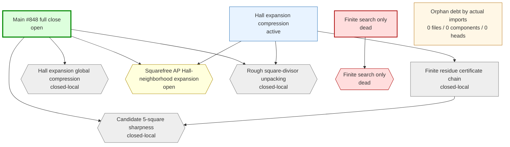
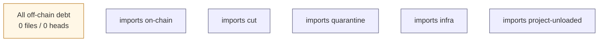

# Erdos848 -- research map

Audit-generated route map overlaid on the automatic endpoint-closure audit.  The infra output is the single research truth source: use this report to distinguish the main chain, active exploration branches, named gaps, and dead or quarantined routes.

* research chains: **4**  *  named gaps: **5**  *  endpoint count: **1**  *  orphan debt files: **0**  *  taxonomy-labelled debt files: **0**  *  rule-labelled debt files: **0**  *  connectable debt files: **0**  *  build components: **0**  *  branch heads: **0**

## Decision Summary

This is the research base view.  Endpoint closure, route labels, and route states are generated by the audit infra from the Lean import graph, file content, file names, and the route taxonomy in the audit configuration.

Open mathematical cut(s):
- `Erdos848.finiteOffsetMiddleCompressionEighteenDecoderCut` at `Erdos848/Infrastructure/SquarefreeAP.lean`

Active route(s) to work on:
- `hall-expansion-compression` (active): gaps `G-squarefree-ap-hall-expansion`, `G-rough-square-divisor-unpacking`

Dead/quarantined route(s):
- `finite-search-only` (dead): gaps `D-finite-search-only`

## Route Graph

## Orphan Build Graph

This graph is derived from the actual Lean import graph restricted to off-chain debt files.  Each component is a connected build subgraph; files inside a component are listed chronologically in `orphan-debt.md`.  Owner edges are automatic route labels generated from imports, names, source text, and route taxonomy rules.

## Chains

| id | kind | status | gaps | file classes |
|----|------|--------|------|--------------|
| `main-full-close` | main | open | `G-hall-expansion-global`, `G-candidate-p5-sharpness`, `G-squarefree-ap-hall-expansion`, `G-rough-square-divisor-unpacking` | on-chain: 2 |
| `hall-expansion-compression` | replacement | active | `G-squarefree-ap-hall-expansion`, `G-rough-square-divisor-unpacking` | cut: 1, on-chain: 2 |
| `residue-certificate` | support | closed-local | `G-candidate-p5-sharpness` | on-chain: 1 |
| `finite-search-only` | dead | dead | `D-finite-search-only` | (none) |

## Gaps

| id | status | title | files |
|----|--------|-------|-------|
| `G-hall-expansion-global` | closed-local | Hall expansion global compression | on-chain: 3 |
| `G-candidate-p5-sharpness` | closed-local | Candidate 5-square sharpness | on-chain: 1 |
| `G-squarefree-ap-hall-expansion` | open | Squarefree AP Hall-neighborhood expansion | cut: 1 |
| `G-rough-square-divisor-unpacking` | closed-local | Rough square-divisor unpacking | on-chain: 1 |
| `D-finite-search-only` | dead | Finite search only | (none) |

## Off-Chain Split

Route-labelled off-chain files are assigned by the audit infra but are not consumed by an endpoint closure yet.  Unlabelled debt is grouped by actual Lean import connectivity in `orphan-debt.md`.

* taxonomy-entry off-chain files: **0**
* taxonomy-labelled debt files: **0**
* rule-labelled debt files: **0**
* unconnected debt files: **0**
* unlabelled off-chain debt files: **0**
* build-connected debt components: **0**

## Chain Details

### `main-full-close` -- Main #848 full close

Endpoint chain proving the exact extremal bound and sharpness of the `7 mod 25` and `18 mod 25` constructions.  The outer Hall compression is kernel-closed; the open endpoint input is the squarefree AP/Hall-neighborhood expansion.

Entry declarations:
- `Erdos848.erdos848_main`

Gaps: `G-hall-expansion-global`, `G-candidate-p5-sharpness`, `G-squarefree-ap-hall-expansion`, `G-rough-square-divisor-unpacking`

Files:
- `Erdos848/Basic.lean` -- on-chain
- `Erdos848/MainTheorem.lean` -- on-chain

### `hall-expansion-compression` -- Hall expansion compression

Compress any admissible set outside the `7 mod 25` candidate class back into that class.  The finite counting assembly is kernel-closed; the live obligation is nonnegative Hall defect for every compatible outside clique.

Entry declarations:
- `Erdos848.hallExpansionCut`
- `Erdos848.atMostCandidateBound_of_current_cuts`

Depends on: `residue-certificate`

Gaps: `G-squarefree-ap-hall-expansion`, `G-rough-square-divisor-unpacking`

Files:
- `Erdos848/Infrastructure/HallExpansion.lean` -- on-chain
- `Erdos848/Infrastructure/SquarefreeAP.lean` -- cut
- `Erdos848/Infrastructure/RoughSquareDivisors.lean` -- on-chain

### `residue-certificate` -- Finite residue certificate chain

Kernel-local `5^2` residue algebra proves candidate admissibility and records that the cross-pair candidate classes are not killed by the same `5^2` obstruction.  The broader Python `25*13^2` evidence remains diagnostic support for designing the Hall route, but the endpoint no longer consumes it as an axiom.

Entry declarations:
- `Erdos848.squareDivides_five_mul_add_one_of_candidate_seven`
- `Erdos848.squareDivides_five_mul_add_one_of_candidate_eighteen`
- `Erdos848.not_squareDivides_five_mul_add_one_of_candidate_seven_eighteen`
- `Erdos848.not_squareDivides_five_mul_add_one_of_candidate_eighteen_seven`
- `Erdos848.residueSecondLayer`
- `Erdos848.residueCandidateSharp`

Gaps: `G-candidate-p5-sharpness`

Files:
- `Erdos848/Infrastructure/ResidueCertificates.lean` -- on-chain

### `finite-search-only` -- Finite search only

Bounded exact clique/Hall checks are useful diagnostics but cannot close #848 without a certificate format and unbounded analytic tail.

Gaps: `D-finite-search-only`

## Gap Details

### `G-hall-expansion-global` -- Hall expansion global compression

Kernel-closed Hall assembly: the count-level outside-clique Hall-neighborhood expansion now implies `AtMostCandidateBound`; the remaining work is proving the AP/Hall expansion input itself.

Declarations:
- `Erdos848.hallExpansionCut`
- `Erdos848.atMostCandidateBound_of_current_cuts`
- `Erdos848.erdos848_main`

Files:
- `Erdos848/Basic.lean` -- on-chain
- `Erdos848/Infrastructure/HallExpansion.lean` -- on-chain
- `Erdos848/MainTheorem.lean` -- on-chain

### `G-candidate-p5-sharpness` -- Candidate 5-square sharpness

Kernel-checked residue algebra: if both factors lie in `7 mod 25` or both lie in `18 mod 25`, then `5^2` divides `a*b+1`; hence the two candidate classes are #848-admissible and the sharpness side is no longer an axiom.

Declarations:
- `Erdos848.squareDivides_five_mul_add_one_of_candidate_seven`
- `Erdos848.squareDivides_five_mul_add_one_of_candidate_eighteen`
- `Erdos848.not_squareDivides_five_mul_add_one_of_candidate_seven_eighteen`
- `Erdos848.not_squareDivides_five_mul_add_one_of_candidate_eighteen_seven`
- `Erdos848.residueSecondLayer`
- `Erdos848.residueCandidateSharp`

Files:
- `Erdos848/Infrastructure/ResidueCertificates.lean` -- on-chain

### `G-squarefree-ap-hall-expansion` -- Squarefree AP Hall-neighborhood expansion

Replace finite Hall checks by one explicit decoder-form `18 mod 25` finite-offset middle-compression cut for the endpoint-consumed `7 mod 25` progression: the opposite block supplies seven-offset target box/squarefree data plus a decoder left-inverse, while Lean derives pairwise injectivity, reattaches source box/residue facts, and derives the project-level opposite carrier, target `7 mod 25` residue, and the `86` value band; the strict middle is paid by the induced credit-capacity pool.

Declarations:
- `Erdos848.finiteOffsetMiddleCompressionEighteenDecoderCut`
- `Erdos848.finiteOffsetMiddleCompressionEighteenTargetCut`
- `Erdos848.globalFiniteOffsetMiddleCompressionEighteenTarget_of_decoder`
- `Erdos848.GlobalFiniteOffsetMiddleCompressionEighteenDecoderCertificate`
- `Erdos848.finiteOffsetEighteenTarget_injective_of_leftInverse`
- `Erdos848.GlobalFiniteOffsetEighteenTargetLeftInverse`
- `Erdos848.finiteOffsetMiddleCompressionEighteenCoreCut`
- `Erdos848.globalFiniteOffsetMiddleCompressionEighteenCore_of_target`
- `Erdos848.GlobalFiniteOffsetMiddleCompressionEighteenTargetCertificate`
- `Erdos848.globalOppositeFiniteOffsetEighteenSquarefreeNeighbor_of_target`
- `Erdos848.GlobalOppositeFiniteOffsetEighteenTargetNeighbor`
- `Erdos848.finiteOffsetMiddleCompressionSevenCoreCut`
- `Erdos848.globalFiniteOffsetMiddleCompressionSevenCore_of_eighteenCore`
- `Erdos848.GlobalFiniteOffsetMiddleCompressionEighteenCoreCertificate`
- `Erdos848.globalOppositeFiniteOffsetSevenSquarefreeNeighbor_of_eighteen`
- `Erdos848.GlobalOppositeFiniteOffsetEighteenSquarefreeNeighbor`
- `Erdos848.candidateCarrier_eighteen_of_oppositeCandidateCarrier_seven`
- `Erdos848.oppositeCandidateCarrier_seven_of_candidate_eighteen`
- `Erdos848.finiteOffsetMiddleCompressionCoreCut`
- `Erdos848.globalFiniteOffsetMiddleCompressionCore_of_sevenCore`
- `Erdos848.GlobalFiniteOffsetMiddleCompressionSevenCoreCertificate`
- `Erdos848.globalOppositeFiniteOffsetSquarefreeNeighbor_of_seven`
- `Erdos848.candidateCarrier_seven_of_oppositeFiniteOffsetValue`
- `Erdos848.GlobalOppositeFiniteOffsetSevenSquarefreeNeighbor`
- `Erdos848.finiteOffsetMiddleCompressedCapacityCut`
- `Erdos848.globalFiniteOffsetSplitCapacity_of_middleCompressionCore`
- `Erdos848.GlobalFiniteOffsetMiddleCompressionCoreCertificateForResidue`
- `Erdos848.globalOppositeFiniteOffsetNeighbor_of_squarefree`
- `Erdos848.GlobalOppositeFiniteOffsetSquarefreeNeighbor`
- `Erdos848.oppositeFiniteOffsetValue_band_eightySix`
- `Erdos848.partitionedSquarefreeAPCapacityCut`
- `Erdos848.partitionedSquarefreeAPCapacity_of_finiteOffsetSplitCapacity`
- `Erdos848.allocatedSplitIncrementalSquarefreeAPCapacity_of_finiteOffsetSplitCapacity`
- `Erdos848.partitionedSquarefreeAPCapacity_of_allocated`
- `Erdos848.oppositeSquarefreeAPAllocation_of_globalFiniteOffsetMatching`
- `Erdos848.oppositeSquarefreeAPAllocation_of_nearby`
- `Erdos848.incrementalPartitionedSquarefreeAPCapacity_of_partitionedCapacity`
- `Erdos848.incrementalPartitionedSquarefreeAPCapacityCut`
- `Erdos848.activeStrictMiddleIncrementalCapacityCut`
- `Erdos848.squarefreeAPHallCut`
- `Erdos848.PartitionedSquarefreeAPCapacityCertificate`
- `Erdos848.PartitionedSquarefreeAPCapacityCertificateForResidue`
- `Erdos848.PartitionedNeighborCapacity`
- `Erdos848.PartitionedNeighborUnion`
- `Erdos848.squarefreeAPHallCertificate_of_partitionedCapacity`
- `Erdos848.SquarefreeAPHallCertificate`
- `Erdos848.SquarefreeAPHallCertificateForResidue`
- `Erdos848.SquarefreeNeighborInCandidate`
- `Erdos848.APHallExpansionForOutsideSet`
- `Erdos848.OppositeOutsidePart`
- `Erdos848.StrictMiddlePart`
- `Erdos848.BoundedOutsideSet`
- `Erdos848.NonSquarefreeClique`
- `Erdos848.CandidateOutside`
- `Erdos848.OppositeCandidateCarrier`
- `Erdos848.StrictMiddleOutside`
- `Erdos848.GlobalFiniteOffsetPartitionedCapacityCertificateForResidue`
- `Erdos848.globalOppositeFiniteOffsetMatching_of_partitionedCapacity`
- `Erdos848.partitionedSquarefreeAPCapacity_of_finiteOffsetPartitionedCapacity`
- `Erdos848.GlobalFiniteOffsetSplitCapacityCertificateForResidue`
- `Erdos848.ActiveStrictMiddleCreditCapacity`
- `Erdos848.GlobalFiniteOffsetSplitCreditCertificateForResidue`
- `Erdos848.OppositeFiniteOffsetValue`
- `Erdos848.GlobalOppositeFiniteOffsetNeighbor`
- `Erdos848.GlobalOppositeFiniteOffsetMatchingImageAllocation`
- `Erdos848.GlobalOppositeFiniteOffsetMatchingAPCertificateForResidue`
- `Erdos848.globalOppositeFiniteOffsetMatching_of_splitCapacity`
- `Erdos848.globalOppositeFiniteOffsetMatching_of_splitCredit`
- `Erdos848.globalOppositeNearbyMatching_of_finiteOffset`
- `Erdos848.GlobalOppositeNearbyMatchingAPCertificateForResidue`
- `Erdos848.GlobalOppositeNearbyMatchingImageAllocation`
- `Erdos848.GlobalOppositeNearbyNeighbor`
- `Erdos848.oppositeNearbyMatchingAPCertificate_of_global`
- `Erdos848.activeStrictMiddleIncrementalCapacity_of_finiteOffsetSplitCapacity`
- `Erdos848.activeStrictMiddleIncrementalCapacity_of_finiteOffsetSplitCredit`
- `Erdos848.NearbyMatchedSplitIncrementalSquarefreeAPCapacityCertificate`
- `Erdos848.NearbyMatchedSplitIncrementalSquarefreeAPCapacityCertificateForResidue`
- `Erdos848.OppositeNearbyMatchingAPCertificateForResidue`
- `Erdos848.OppositeNearbyMatchingImageAllocation`
- `Erdos848.OppositeMatchingImage`
- `Erdos848.oppositeNearbyNeighborAllocation_of_matchingImage`
- `Erdos848.oppositeNearbyAPAllocationCertificate_of_matching`
- `Erdos848.nearbyAllocatedSplitIncrementalSquarefreeAPCapacity_of_matched`
- `Erdos848.ActiveStrictMiddleNewNeighborAllocationCertificateForResidue`
- `Erdos848.ActiveStrictMiddleNewNeighborAllocation`
- `Erdos848.activeStrictMiddleIncrementalCapacity_of_newNeighborAllocation`
- `Erdos848.ActiveStrictMiddleCreditMatchingCertificateForResidue`
- `Erdos848.GlobalActiveStrictMiddleCreditMatchingCertificateForResidue`
- `Erdos848.ActiveStrictMiddleCreditMatching`
- `Erdos848.ActiveStrictMiddleCreditImage`
- `Erdos848.ActiveStrictMiddleCreditTarget`
- `Erdos848.activeStrictMiddleIncrementalCapacity_of_creditMatchingFor`
- `Erdos848.activeStrictMiddleIncrementalCapacity_of_creditMatching`
- `Erdos848.activeStrictMiddleIncrementalCapacity_of_globalCreditMatching`
- `Erdos848.NearbyAllocatedSplitIncrementalSquarefreeAPCapacityCertificate`
- `Erdos848.NearbyAllocatedSplitIncrementalSquarefreeAPCapacityCertificateForResidue`
- `Erdos848.OppositeNearbyAPAllocationCertificateForResidue`
- `Erdos848.OppositeNearbyNeighborAllocation`
- `Erdos848.OppositeNearbyNeighbor`
- `Erdos848.oppositeNeighborAllocation_of_nearby`
- `Erdos848.allocatedSplitIncrementalSquarefreeAPCapacity_of_nearby`
- `Erdos848.AllocatedSplitIncrementalSquarefreeAPCapacityCertificate`
- `Erdos848.AllocatedSplitIncrementalSquarefreeAPCapacityCertificateForResidue`
- `Erdos848.OppositeSquarefreeAPAllocationCertificateForResidue`
- `Erdos848.OppositeNeighborAllocation`
- `Erdos848.oppositeNeighborExpansion_of_allocation`
- `Erdos848.splitIncrementalSquarefreeAPCapacity_of_allocated`
- `Erdos848.SplitIncrementalSquarefreeAPCapacityCertificate`
- `Erdos848.SplitIncrementalSquarefreeAPCapacityCertificateForResidue`
- `Erdos848.OppositeSquarefreeAPCapacityCertificateForResidue`
- `Erdos848.ActiveStrictMiddleIncrementalCapacityCertificateForResidue`
- `Erdos848.OppositeNeighborExpansion`
- `Erdos848.incrementalPartitionedSquarefreeAPCapacity_of_split`
- `Erdos848.IncrementalPartitionedSquarefreeAPCapacityCertificate`
- `Erdos848.IncrementalPartitionedSquarefreeAPCapacityCertificateForResidue`
- `Erdos848.PartitionedIncrementalCapacity`
- `Erdos848.IncrementalStrictMiddleNeighbor`
- `Erdos848.partitionedSquarefreeAPCapacity_of_incremental`
- `Erdos848.PartitionedSquarefreeAPHallCertificate`
- `Erdos848.PartitionedSquarefreeAPHallCertificateForResidue`
- `Erdos848.PartitionedNeighborAllocation`
- `Erdos848.squarefreeAPHallCertificate_of_partitioned`
- `Erdos848.StrictMiddleAPHallCertificateForResidue`
- `Erdos848.CandidateResidueSquarefreeAPHallCertificate`
- `Erdos848.squarefreeAPHallCertificate_of_candidateResidues`
- `Erdos848.BoundedOutsidePart`
- `Erdos848.BoundedStrictMiddlePart`
- `Erdos848.boundedOutsidePart_boundedOutsideSet`
- `Erdos848.boundedOutsidePart_nonSquarefreeClique_of_admissible`
- `Erdos848.boundedStrictMiddlePart_boundedOutsideSet`
- `Erdos848.boundedStrictMiddlePart_nonSquarefreeClique_of_admissible`
- `Erdos848.outside_candidate_seven_of_squarefree_edge`
- `Erdos848.outside_candidate_eighteen_of_squarefree_edge`

Files:
- `Erdos848/Infrastructure/SquarefreeAP.lean` -- cut

### `G-rough-square-divisor-unpacking` -- Rough square-divisor unpacking

Kernel-checked classical unpacking: from `Not (Squarefree (a*b+1))` extract a prime-square witness in the project's `SquareDivides` form.  The real future rough-prime work must strengthen this with range and size constraints; the current endpoint no longer treats the definitional bridge as an axiom.

Declarations:
- `Erdos848.roughSquareDivisor`
- `Erdos848.RoughSquareDivisorCertificate`

Files:
- `Erdos848/Infrastructure/RoughSquareDivisors.lean` -- on-chain

### `D-finite-search-only` -- Finite search only

Exact checks for bounded `N` and local residue graphs are useful evidence, but they do not close the unbounded theorem unless promoted into a certificate plus analytic tail.  Do not treat brute force alone as the proof route.
